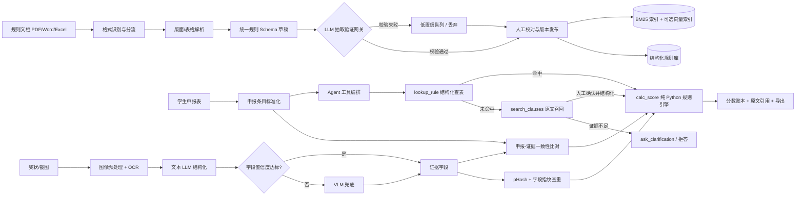
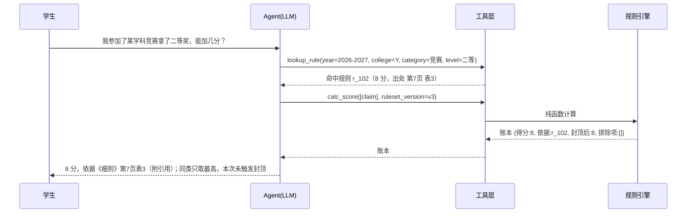

# 综测加分智能核算系统完整项目计划书 V2.0

> 项目代号：ScoreProof
> 文档版本：V2.0（执行基线稿）
> 修订日期：2026-09-11
> 前序版本：V1.0（2026-09-11）
> 项目性质：个人主导的真实业务工具 / AI 应用开发作品
> 计划容量：完整交付约 95 人日，最小可交付子集约 52 人日
> 工期折算：全职（每周 5 人日）完整约 19 周、子集约 11 周；课余（每周 20～25 小时 ≈ 2.5～3 人日）完整约 32～38 周、子集约 18～21 周

---

## 0. 文档说明

### 0.1 本计划书的编制依据

1. 《综测加分智能核算系统·项目总结与规划》；
2. 简历中的四组项目要点：离线索引优化、多模态材料审核、在线检索与确定性计算、测评与工程优化；
3. 当前 `scoreproof` 仓库的代码、README、依赖与测试现状。

### 0.2 事实、目标与占位符的区分

为保证项目和简历可核验，本文统一使用以下标记：

- **当前事实**：已通过代码、测试或现有材料确认；
- **目标值**：项目完成前必须按本文口径实测，未实测前不能作为既成成果表述；
- **待回填**：依赖真实运营数据，当前不得虚构。

截至 2026-09-11，当前仓库基线为：

| 项目 | 状态 | 说明 |
|---|---|---|
| P0 方案设计 | 已完成 | 已形成总体架构、核心数据模型与指标框架 |
| P1 工程骨架 | 已完成 | 已有 Excel/PDF/Word 接入、规则存储、计算、检索、评测、API/CLI 等模块 |
| 图像前置处理与 OCR | 已完成 | 质量检测、预处理、RapidOCR 识别、感知哈希查重已落地 |
| 自动化测试 | 已验证 | 全量 **206 项**通过；计算引擎测试文件收集到 **41 项**用例 |
| 静态检查 | 已验证 | `ruff check src tests` 通过 |
| P2 多模态闭环 | 待完成 | 文本 LLM 字段抽取、VLM 兜底、一致性审核与人工复核仍需工程化 |
| LLM 抽取验证网关 | 待完成 | 当前仅有提示词约束，缺少代码级校验 |
| Agent 工具编排 | 待完成 | 当前仅有意图路由骨架，未使用 Function Calling |
| 稠密向量与 Rerank | 待决策 | 需先跑 BM25 基线，按实验结论决定是否引入（见 5.8） |
| Web 前端与真实运营 | 待完成 | 后端已具备基础接口，前端及班级实际使用待完成 |
| 91%、96%、96.2%、18→2 分钟 | 验收目标 | 必须按第 13 节定义的评测集和统计口径复现后才能写入最终成果 |
| 累计服务人数 | 待回填 | 以去重后的真实使用人员为准，记为 `N`，不得写“XX”或估算值 |

### 0.3 V2.0 相对 V1.0 的变更摘要

| 序号 | 变更 | 位置 | 理由 |
|---:|---|---|---|
| 1 | 新增「LLM 抽取验证网关」 | 5.2 | 提示词约束不等于代码保证，防幻觉需独立工程层 |
| 2 | 新增「Agent 工具编排与 Function Calling」 | 5.7 | 原「问题路由」仅做意图分类，无法在物理上阻止模型给出数值 |
| 3 | 新增「成本与 Token 控制设计」 | 7.2 | 原第 17 节只有记账表，缺少优化设计 |
| 4 | 检索链路改为「基线优先、按证据升级」 | 5.8、11 | 向量通道在本场景不可用于计分（见 14 节风险表），应据实验决定投入 |
| 5 | 拒答指标改为「正确拒答率 + 误拒答率」并列 | 2.2、13.5 | 单侧指标会激励过度拒答 |
| 6 | 检索与评测指标强制报告样本量与置信区间 | 2.2、13.1、13.5 | 100 条样本上 89% 与 85% 可能无统计显著差异 |
| 7 | RAGAS 限定为「规则解释」子任务 | 13.5 | 本系统生成面极窄，原定位与实际链路不匹配 |
| 8 | 52 人回测增加「无业务裁决」降级方案 | 13.6 | ground truth 依赖外部人裁决，个人项目可能拿不到 |
| 9 | 评测集规模下调至可完成量，标注工时显式计入 WBS | 8.1、11 | 原清单要求 100+ 图片/100 对样本，却只给 6 人日 |
| 10 | 演示优先级改为「学生端」优先 | 5.10、19 | 审核工作台是 CRUD 队列，体现不出 AI 能力 |
| 11 | 进度表改为相对周次，并与人日容量对齐 | 10、11 | 原 12 周与 64 人日的口径需与课余折算方式讲清 |
| 12 | 角色依赖降级，增加单人可执行方案 | 3 | 原计划要求「业务负责人裁决」「第二人抽样复核」，个人项目难以获得 |
| 13 | 验收标准分层（核心可交付 / 完整交付） | 18 | 单一全量 DoD 会导致长期无法结项 |
| 14 | 补充无 Function Calling 能力时的降级路径 | 5.7 | 功能可用性不应依赖单一模型能力 |
| 15 | **编排层改用 LangChain / LangGraph 实现** | 5.7.5、7.1、7.4 | 放弃自研轻量工具层；框架在状态持久化、中断澄清与可观测性上更有价值，且与既有技术栈一致 |
| 16 | 编排与验证网关纳入最小可交付子集 | 11、18 | 原 MVP 未含 4.4，与 18.1 核心可交付定义矛盾 |

---

## 1. 项目概述

### 1.1 项目背景

高校综合测评加分核算通常同时依赖学校细则、学院补充通知、认可赛事目录、学生申报 Excel、奖状照片与公示截图。现有人工流程存在四类核心问题：

1. 规则分散且格式复杂，跨页表格、多栏 PDF、Word 表格和 Excel 合并单元格容易造成漏读或错读；
2. 同一奖项存在别名、缩写和口径差异，人工匹配规则耗时且结果不稳定；
3. 证书内容、申报描述和适用规则需要反复核对，还需识别重复申报；
4. 大模型可以辅助理解文本，但直接让模型计算分数会引入不可复现、不可测试和无法审计的问题。

### 1.2 一句话定义

ScoreProof 是面向高校综测场景的异构文档智能核算系统：将 PDF、Word、Excel 与图片中的规则和材料结构化，采用“结构化查表优先 + 混合检索兜底 + 未命中拒答”定位规则，再由纯 Python 规则引擎完成确定性算分，并让每项结果可追溯至文档、页码、表格或条款。

系统的技术命题是：**在不能出错的业务场景里，如何让大模型可信地参与，同时不让它掌握最终裁决权。**

### 1.3 核心原则

- 大模型只参与抽取、归一化建议、查询理解、条款定位与结果解释；
- 所有分值、封顶、互斥、去重、折算、有效期判断均由代码执行；
- **模型的一切结构化输出默认不可信**，必须通过代码级验证网关（5.2）方可入库；
- 结构化规则是唯一可自动计分的数据来源，检索兜底结果不得直接入分；
- 低置信结果进入人工复核，而不是以“全自动”为目标；
- 原始个人材料默认本地保存、最小化采集、脱敏使用、禁止进入公开仓库；
- 所有简历数字均由固定评测集或运营日志产生，可复跑、可解释。

---

## 2. 项目目标与边界

### 2.1 建设目标

1. 建立统一规则库，覆盖 PDF、Word、Excel 规则文档，并保留学年、学院、版本和原文定位；
2. 建立基于文档 Hash 的增量索引，使新增、修改、删除细则可快速同步；
3. 建立 **LLM 抽取验证网关**，使模型抽取结果在入库前经过代码级校验；
4. 建立 OCR + 文本大模型结构化 + 低置信 VLM 兜底的证书理解链路；
5. 建立 pHash 与字段指纹联合查重，并自动核对申报描述和证书内容；
6. 建立 **Agent 工具编排链路**：以 Function Calling 调度确定性工具，模型不得生成或修改任何数值；
7. 建立确定性规则引擎，完整覆盖同类取最高、封顶、团队折算、互斥和学年过滤；
8. 建立检索、生成、抽取、查重和真实历史数据回测的评测体系，并强制报告样本量与置信区间；
9. 建立面向学生自助申报与班委批量复核的 Web 服务和审计链路；
10. 建立成本可观测与可优化的模型调用策略（缓存、分级、增量）。

### 2.2 量化成功标准

| 维度 | 指标 | 结项目标 | 样本量要求 | 是否可直接写入简历 |
|---|---|---|---:|---|
| 规则抽取 | 规则字段完全正确率 | ≥ 96% | n ≥ 50 条 | 通过冻结评测集后可以 |
| 抽取网关 | 原文不一致条目拦截率 | ≥ 99% | n ≥ 30 条构造负例 | 复跑后可以 |
| 图像抽取 | 奖状字段级 micro-F1 | ≥ 91% | n ≥ 30 张 | 通过独立测试集后可以 |
| 查重 | 重复申报 Recall | ≥ 96% | n ≥ 50 对 | 同时披露 Precision/F1 后可以 |
| 查重 | 重复申报 Precision | ≥ 95% | 同上 | 与 Recall 并列披露 |
| 检索 | Hit@5 | 基线优先，目标 89% | n ≥ 100，报 95% CI | 固定查询集复跑后可以 |
| 检索 | MRR@10 | ≥ 0.80，或较 BM25 基线提升 ≥ 10% | 同上 | 复跑后可以 |
| 引用 | 引用定位正确率 | ≥ 95% | 人工抽样 n ≥ 100 | 复跑后可以 |
| 拒答 | 应拒答样本正确拒答率 | 100% 目标，最低验收 98% | n ≥ 50 条应拒答样本 | 复跑后可以 |
| 拒答 | **有答案样本误拒答率** | ≤ 5% | n ≥ 100 条有答案样本 | 与上项并列披露 |
| 计算 | 52 人往年数据逐项核算准确率 | ≥ 96.2% | 52 人全量 | 真实、脱敏数据回测后可以 |
| 效率 | 单人端到端核算时长 | 从约 18 分钟降至 ≤ 2 分钟 | 同口径计时，报中位数与 P90 | 同口径计时后可以 |
| 成本 | VLM 触发率 | ≤ 15% | 全部图像样本 | 复跑后可以 |
| 成本 | 每 100 份材料平均模型成本 | 记录实测值 | 全部样本 | 复跑后可以 |
| 质量 | 计算边界测试 | ≥ 40 项，关键规则 100% 通过 | — | 当前已有 41 项，可表述 |
| 工程 | 全量测试、静态检查 | 主分支持续通过 | — | 当前 206 项与 Ruff 已通过 |
| 运营 | 累计服务人数 | `N` 名去重真实用户 | — | 仅上线后按日志回填 |

> **拒答指标必须成对考核。** 若只考核“应拒答正确拒答率”，系统可通过“一律拒答”取得 100%，因此误拒答率是同等的验收门槛。

> **比例型指标必须附样本量与 95% 置信区间**（比例用 Wilson 区间，均值用 bootstrap）。禁止只报点估计。

### 2.3 项目范围

范围内：

- 学校/学院综测加分规则的采集、解析、结构化、版本化和检索；
- 学生申报表解析、证书图片抽取、重复检测、一致性审核；
- 确定性核算、逐项解释、引用溯源、批量导入导出；
- LLM 抽取验证、工具编排与调用审计；
- 离线评测、历史回测、Web 服务、权限和审计；
- 单机或小规模服务器部署，适配班级/学院规模。

范围外：

- 自动替代辅导员或评审老师作出最终行政决定；
- 对细则未规定事项擅自推断分值；
- 对学生身份真实性、证书法律效力作司法级鉴定；
- 未经授权接入教务系统、公开真实学生数据或跨学院共享个人材料；
- 第一版即支持所有高校、所有表格模板和所有手写材料；
- 训练或微调自有模型（本项目只做模型应用与编排，不做模型训练）。

---

## 3. 角色与职责

### 3.1 角色表

| 角色 | 主要职责 | 关键产出 | 单人项目可行性 |
|---|---|---|---|
| 项目负责人/开发者 | 需求、架构、编码、评测、部署与文档 | 可运行系统、评测报告、演示材料 | 必需 |
| 业务口径确认人（班委/辅导员） | 确认规则解释、优先级、异常处理口径 | 规则口径确认单 | **尽力争取，非阻塞** |
| 规则标注员 | 标注细则条款和规则字段 | 规则 Gold Set | 开发者兼任 |
| 证书标注员 | 标注证书字段、重复对和一致性标签 | 多模态 Gold Set | 开发者兼任 |
| 复核员 | 处理低置信、冲突和未命中条目 | 复核记录、修正数据 | 开发者兼任 |
| 试用学生 | 验证上传、反馈和结果解释是否易用 | UAT 反馈、耗时数据 | 必需（真实用户） |

### 3.2 单人项目的现实约束与降级方案

本计划按个人主导设计，因此**不得把外部人员配合设为任何里程碑的退出条件**。具体降级：

1. **业务口径无法获得外部裁决时**：以“规则原文 + 显式优先级规则”为准，所有歧义条目记录为 `ambiguous` 状态并**排除在自动计分之外**，进入人工复核队列。不依赖外部签字。
2. **评测集无法获得第二人复核时**：明确标注“单人标注”，并在报告中披露标注一致性无法评估；作为补偿，采用**双次独立标注**（隔日重标同一批样本，报告自身一致率）来估计标注稳定性。
3. **52 人回测无法获得裁决真值时**：切换到 13.6 的降级方案，报告“差异分析”而非“准确率”。
4. **试用学生数量不足时**：如实记录实际人数，不估算、不外推。

---

## 4. 总体业务流程



**流程约束**：Agent 编排中的任何工具调用都不得修改数值；最终输出中的每个数字必须可回溯到 `calc_score` 返回的账本（见 5.7）。

---

## 5. 功能需求

### 5.1 离线规则接入与统一结构化

#### PDF

- 判断文本型 PDF、扫描型 PDF 和混合型 PDF；
- 按页保留文字块坐标、页码、阅读顺序和表格区域；
- 针对多栏页面按版面坐标重排阅读顺序，避免跨栏串行；
- 针对跨页表格识别重复表头、续表标志和列结构，将连续页拼接为同一逻辑表；
- 同时保存原始文本、表格单元格、截图区域和解析器元数据；
- 低质量页触发 OCR 或人工复核，不静默丢失。

#### Word

- 保序解析段落、标题、编号列表和表格；
- 识别页眉页脚、批注/修订痕迹、合并单元格和嵌套表格；
- 保留章节、条款号、表格序号和文档名定位；
- 学院补充通知与校级规则发生冲突时，依据显式优先级规则处理。

#### Excel

- 识别标题行、空白分隔行、多工作表和隐藏列；
- 对合并单元格执行受控 fill-down，只填充合并区域或指定层级列，避免污染真实空值；
- 统一日期、百分比、数字、布尔值和中文等级格式；
- 对缺列、错列、重复表头和公式单元格输出校验报告；
- 学生申报数据只进入结构化存储，不进入向量索引。

#### 统一规则 Schema

每条规则至少包含：

| 字段组 | 字段 |
|---|---|
| 适用范围 | `academic_year`、`college`、`major`（可选）、`effective_from/to` |
| 规则主体 | `category`、`item_name`、`level`、`rank`、`score` |
| 约束 | `dedup_group`、`cap`、`team_factor`、`exclusive_group`、`require_catalog` |
| 归一化 | `synonyms`、规范化名称、枚举编码 |
| 来源 | `doc_id`、`doc_name`、`doc_hash`、`page`、`table`、`clause`、`bbox`、`char_start`、`char_end` |
| 版本 | `version`、`status`、`supersedes`、`created_at`、`reviewed_by` |
| 质量 | `parser`、`extract_confidence`、`manual_verified`、`validation_errors`、`ambiguity_flag` |

---

### 5.2 LLM 抽取验证网关 ★V2.0 新增

#### 5.2.1 设计动机

提示词中写明“score 必须是原文出现的数字，禁止推算、禁止补全”只是**对模型的请求，不是对系统的保证**。模型仍可能给出原文不存在的分值、张冠李戴的等级或虚构的适用条件。

因此必须建立独立的代码级验证层：**LLM 的结构化输出默认不可信，只有通过全部网关才能进入规则库。**

#### 5.2.2 六层验证网关

```
                    LLM 抽取原始输出（JSON 数组）
                              │
        ① Schema 校验 ────────┤ 字段缺失 / 类型错误 / 多余字段 → 整条丢弃
                              │
        ② 原文一致性校验 ─────┤ score / level 必须逐字出现在 evidence_quote 中
                              │
        ③ 溯源定位校验 ───────┤ evidence_quote 必须能在原文块中定位到字符偏移
                              │
        ④ 数值与枚举边界校验 ─┤ 分值范围、等级枚举、日期格式、学年合法性
                              │
        ⑤ 双次独立抽取交叉验证 ┤ 两次结果不一致 → 降级为低置信
                              │
        ⑥ 规则冲突门禁 ───────┤ 同适用范围+类别+等级出现多个分值 → 阻止发布
                              │
                              ▼
                    待人工校对队列 → 确认 → 发布
```

**逐层规则**

| 层 | 校验内容 | 失败处置 |
|---:|---|---|
| ① | Pydantic 严格模式（`extra="forbid"`） | 整条丢弃并计入 `schema_error` |
| ② | 归一化后子串匹配：`"8"` / `"8.0"` / `"八"` 均视为命中 `"加8分"` | `extract_confidence=0`，禁止自动计分 |
| ③ | 计算 `char_start/char_end`，用于引用面板高亮 | 定位失败 → 降级为低置信 |
| ④ | `0 < score ≤ 100`、等级在枚举内、日期可解析且在学年范围内 | 标记 `validation_errors` |
| ⑤ | 同文本用两种提示（直接抽 JSON / 先列条款再抽字段）或温度 0 与 0.3 各抽一次 | 不一致 → `ambiguity_flag=True` |
| ⑥ | 同 `(year, college, category, level, rank)` 下分值唯一 | 冲突 → 阻止发布批次 |

#### 5.2.3 成本控制

第 ⑤ 层的双次抽取会使 LLM 调用翻倍。控制策略：

- 第一次结果按 `chunk_hash` 缓存；
- 仅对**低置信或高风险条目**（如来源为跨页表格、扫描 OCR 页）触发第二次抽取；
- 目标：二次抽取比例 ≤ 20%。

#### 5.2.4 网关自身产出的指标（可作为简历指标）

| 指标 | 定义 |
|---|---|
| 拦截率 | 被网关拦下的抽取条目 / 全部抽取条目 |
| 拦截原因分布 | schema / 原文不一致 / 定位失败 / 数值越界 / 双次冲突 / 规则冲突 |
| 人工修正率 | 进入校对队列后被人工改动的条目比例 |
| 构造负例检出率 | 人工注入“原文不存在的分值”样本，被 ② 层拦下的比例（目标 ≥ 99%） |

---

### 5.3 基于文档 Hash 的增量索引

为避免细则每次修订都全量重建，建立“文档—逻辑块—索引条目”三级 Hash：

1. 对原始文件字节计算 `document_hash`，判断文件是否完全未变化；
2. 对规范化后的页/章节/表格计算 `chunk_hash`，忽略不影响语义的空白和页眉页脚变化；
3. 以 `doc_id + chunk_hash + embedding_model_version` 生成索引键；
4. 新增块执行插入，变更块执行替换，删除块写入 tombstone 并从在线索引移除；
5. 规则抽取结果、BM25 文档和向量记录在同一批次号下原子发布；
6. 发布失败时保留上一稳定版本，可一键回滚；
7. 记录新增、更新、删除、跳过数量以及耗时，形成同步报告。

**复用**：同一套 `document_hash` / `chunk_hash` 直接作为 **LLM 抽取结果缓存键**与 **Embedding 缓存键**，避免重复调用外部模型（见 7.2）。

增量同步验收：

- 相同文档重复导入不产生重复规则和重复向量；
- 修改单页时只重建受影响的逻辑块及其下游规则；
- 删除旧文档后线上不可再检索到旧条款；
- 新旧版本查询可按学年/学院隔离；
- 规则、BM25、向量索引之间不存在半发布状态。

---

### 5.4 多模态材料审核

处理链路：

1. 图像预处理：EXIF 旋转、清晰度评估、裁边、去噪、透视矫正、对比度增强；
2. OCR：输出文字、坐标、行块和字符/文本行置信度；
3. 文本大模型结构化：抽取姓名、赛事、级别、奖项/名次、日期、颁发单位、团队属性；
4. 字段级校验：日期范围、姓名匹配、词典映射、枚举合法性和字段间逻辑；
5. VLM 兜底：**仅将低置信字段及必要图像区域**发送给视觉模型；
6. 结果融合：规则校验优先，OCR 与 VLM 冲突时进入人工复核；
7. 人工校对：图片与字段并排展示，保留修改前后值和操作人；
8. 将人工修正回流为后续评测样本和词典候选，不自动污染生产规则。

字段置信度不能只采用模型自报分数，应组合：OCR 置信度、字段格式校验、词典匹配、OCR/VLM 一致性、历史纠错频率。阈值在验证集上选择，并固定到版本配置中。

**结构化输出的验证**：文本 LLM 与 VLM 的字段输出同样受 5.2 的 ①②③④ 层校验（姓名须出现在 OCR 文本中、日期须可解析、等级须在枚举内），不通过者置空而非猜测。

---

### 5.5 重复申报检测

采用三层策略：

- 文件级：SHA-256 识别完全相同文件；
- 图像级：pHash/dHash 的汉明距离识别裁剪、压缩、亮度变化后的相似图片；
- 语义级：规范化后的“姓名 + 赛事 + 等级/名次 + 获奖时间”生成字段指纹。

输出分为“确定重复、疑似重复、非重复”，并展示触发原因。重复检测只拦截或送审，不自动删除材料。阈值必须同时评估 Recall、Precision 和误伤案例，避免为了 96% Recall 大量误报。

---

### 5.6 申报与证据一致性审核

至少比对：

- 申报人姓名与证书姓名；
- 赛事名称及规范化别名；
- 赛事级别、奖项等级或名次；
- 获奖日期是否落在申报学年；
- 个人/团队属性；
- 颁发单位与赛事目录要求；
- 申报类别与规则类别。

结果分为：一致、可归一化一致、不一致、信息不足。所有不一致项需给出字段级差异，**不让 LLM 直接作最终通过/驳回决定**。

---

### 5.7 Agent 工具编排与 Function Calling ★V2.0 新增

#### 5.7.1 设计动机

原方案中的“问题路由”只做意图分类，随后由同一模型继续生成回答。这留下一个结构性风险：**模型仍可能在自己的回答里给出一个未经计算的分数。**

把链路改为**工具调用**后，模型的职责被限制为“选择工具 + 填充参数”。数值只能由工具返回，模型在物理上没有生成数值的通路。

#### 5.7.2 工具集定义

| 工具 | 入参 | 出参 | 是否确定性 |
|---|---|---|---|
| `lookup_rule` | `academic_year`, `college`, `category`, `level`, `rank?`, `item_name?` | `Rule[]`（含 doc/page/clause/bbox） | 是（SQL 精确查询） |
| `search_clauses` | `query`, `filters{year,college}`, `top_k` | `Clause[]`（含页码/bbox） | 是（BM25，可选向量） |
| `calc_score` | `claims[]`, `ruleset_version`, `student_id` | `ScoreLedger`（逐项账本 + 排除原因 + 引用） | **是（纯函数，无 LLM）** |
| `check_evidence` | `claim`, `evidence_fields` | `FieldDiff[]` | 是（规则比对） |
| `ask_clarification` | `missing_fields`, `question` | — | 交互（不产生分值） |

五个工具均以 `langchain_core.tools.@tool` 装饰器注册，模型侧通过 `bind_tools` 获取工具签名，入参 schema 由 Pydantic 模型生成。其中 `calc_score` 的 Pydantic 模型刻意声明为严格类型（`int` / `float` / `Literal` / `UUID`），**在工具 schema 层就无法接收自然语言**（对应 5.7.4 第 1 条）。

#### 5.7.3 典型编排序列



#### 5.7.4 强制纪律（代码级约束）

1. `calc_score` 的入参必须是数值或枚举类型，**由 Pydantic 严格类型在工具 schema 层强制**，接口层面不接受自然语言；
2. Agent 最终回答中出现的**任何数字**必须在账本中可查——由图中的 `verify_numbers` 节点实现，校验失败则回退到重新生成或直接输出账本摘要；
3. 工具返回空结果时，**必须**走 `ask_clarification` 或拒答路径，**不允许模型用先验知识补答**——由条件边强制，不交给模型自由决策；
4. 每次工具调用记录 `{工具名, 入参, 返回摘要, 耗时, 模型版本, 时间戳}` 到审计日志（LangChain callback + 自研 `tool_calls` 表双写）；
5. 同一会话内的规则版本锁定，防止中途规则漂移导致同一问题两次答案不同——由 checkpointer 持久化的会话状态承载。

#### 5.7.5 编排层技术选型：LangGraph + LangChain

编排层采用 **LangGraph**（状态图）+ **LangChain**（工具与模型接入）实现，**不自研轻量工具层**。

**选型理由**

1. **状态与持久化是刚需**：本项目需要「提问 → 查表 → 算分 → 校验 → 回答」的多步状态流转，且必须承载会话级规则版本锁定（5.7.4 第 5 条）与人工澄清中断（`ask_clarification`）。LangGraph 的 checkpointer 与 `interrupt` 原生支持这两件事，自研需另造一套状态机。
2. **可观测性直接复用**：LangChain callback 与 LangSmith 可采集工具调用链、Prompt 版本与 token 明细，正好满足 7.2.2 的成本可观测要求，无需自建埋点。
3. **护栏可被显式建模**：把「数字校验」「空结果必澄清」写成图中的独立节点与条件边，护栏成为**结构的一部分**，而不是散落在调用代码里的 `if`。这比自研更不容易漏。
4. **与技术栈一致**：项目另一侧（CoreCoder）已在用 LangGraph，两处同栈便于经验迁移；LangChain / LangGraph 也是 AI 应用开发岗位的高频要求。
5. **省样板代码**：消息类型、工具 schema 生成、重试、流式输出与结构化输出解析均为现成能力。

**框架边界（哪些仍然自研）**

| 层 | 归属 | 说明 |
|---|---|---|
| 复杂 PDF/Excel/Word 解析 | **自研** | 多栏重排、跨页表格拼接、受控 fill-down 是核心资产，通用 loader 无法替代 |
| 抽取验证网关（5.2） | **自研** | 仅第 ① 层 schema 校验复用 Pydantic / structured output |
| 数字拦截器（5.7.4 第 2 条） | **自研** | 跑在图的外层与 `verify_numbers` 节点内，不依赖框架的 output parser |
| 降级路由（5.7.7） | **自研** | 框架整体不可用时的逃生通道 |
| 确定性计算引擎（5.9） | **纯 Python，不用框架** | 无 LLM、无 IO，加框架是污染，且必须可独立单测 |
| 工具层 / 模型接入 / 状态图 | **用 LangChain / LangGraph** | 框架主场 |

> **不引入的边界**：不使用 LangChain 的 document loaders 替换自研解析器；不使用任何框架提供的「自动计分」或「自动裁决」抽象。框架只负责编排与接入，**不参与任何数值决策**。

#### 5.7.6 依赖与版本策略

| 依赖 | 用途 | 引入阶段 |
|---|---|---|
| `langgraph` | 状态图编排、checkpointer 持久化、interrupt 澄清 | 阶段 5 |
| `langchain-core` | `@tool`、消息类型、callback、结构化输出接口 | 阶段 5 |
| `langchain-openai` | DeepSeek（OpenAI 兼容接口）模型接入 | 阶段 3 |
| `langchain-chroma` | 向量检索集成（**条件性**，见 5.8.2） | 阶段 4（仅在 L2 启用时） |
| `pydantic` | 工具 schema、抽取结果校验 | 已在用 |

**版本策略**：LangChain 生态 API 变动频繁（0.1 → 0.2 → 0.3 存在破坏性变更），因此：

1. `pyproject.toml` 中钉住版本（`~=` 或精确版本），禁止裸 `>=` 约束；
2. 框架版本升级视为**可追踪版本变更**（对应 7.4 第 7 条），需重跑冻结评测集并记录指标变化；
3. 核心测试（抽取网关、工具、计算引擎）**只测自己的函数契约，不依赖框架内部实现**，避免框架升级导致测试大面积失效。

#### 5.7.7 降级路径

模型不支持 function calling、调用失败、超时，或编排图执行异常（含超出递归/轮数上限）：

- 回退到**规则路由**（关键词 + 正则 + 学年/学院正则解析）直接调度工具，绕过模型与图；
- **功能可用性不依赖模型与框架**，降级后仍能完成查表与算分，只是失去自然语言对话体验；
- 降级事件写入审计日志，并计入“模型可用性”与“编排可用性”观测指标。

---

### 5.8 检索链路：基线优先、按证据升级 ★V2.0 修订

原方案默认实现“BM25 + 稠密向量 + RRF 融合 + Rerank”。本版改为**先建立基线，再依据实验结论决定是否引入重工程**。

#### 5.8.1 分级定义

| 级别 | 组成 | 定位 | 何时启用 |
|---|---|---|---|
| L0 结构化通道 | 按学年/学院/类别/等级精确查表 | **计分唯一来源** | 始终启用 |
| L1 词法兜底 | BM25 单路召回 | 原文溯源与候选条款 | 始终启用 |
| L2 语义兜底 | BM25 + 稠密向量 + RRF | 提升召回 | 仅当 L1 基线明显不达标时 |
| L3 精排 | Rerank 模型 | 提升排序 | 仅当 L2 后仍未达标且收益经实测确认时 |

#### 5.8.2 决策规则

1. 先按第 13.5 节口径，用固定查询集跑 **L0 + L1 基线**，记录 Hit@5 / MRR@10 及置信区间；
2. 若基线已达到目标（Hit@5 ≥ 89%、MRR@10 ≥ 0.80）→ **不引入 L2/L3**，向量通道仅作为可选实验保留；
3. 若基线未达标 → 引入 L2，再次测量并报告增量收益与成本；
4. 引入 L2 后仍不达标 → 再评估 L3。

**该决策本身即为可写入简历的工程结论**：以数据说明为何选择或不选择某条技术路线，优于默认堆叠全部组件。

#### 5.8.3 为什么向量通道不参与计分

向量检索在本场景存在结构性缺陷：**语义相近的数值条件会被互相召回**（“二等奖 8 分”与“三等奖 5 分”向量距离极近），且表格中的数值关系不是语义关系。因此：

- 结构化命中才可自动计分；
- 仅文本命中时给出候选条款并要求人工确认；
- 无充分证据时拒答。

---

### 5.9 确定性计算引擎

规则引擎采用纯函数和明确的数据输入输出，执行顺序固定为：

1. 学年、学院和规则版本过滤；
2. 申报与规则匹配；
3. 资格条件/认可目录验证；
4. 团队系数及其他折算；
5. 同类项目去重取最高；
6. 互斥组裁决；
7. 单项、单类与总分封顶；
8. 金额/分数精度与舍入；
9. 生成逐项账本、排除原因和原文引用。

任何计算都不得读取自然语言回答中的数字。输入必须是通过 Schema 校验且处于“已发布”状态的结构化规则。

**接口约束**：`calc_score` 的函数签名只接受结构化类型；对自然语言输入的解析职责在工具层之前完成（见 5.7.4 第 1 条）。

---

### 5.10 服务端与前端

**演示优先级（V2.0 调整）**：**学生端优先于审核端**。理由：学生端链路包含图片上传、OCR、字段抽取、逐字段置信度、VLM 触发标记、与申报描述的差异对比，能够直观展示 AI 能力；审核端本质是 CRUD 队列，展示价值低。

学生端（优先）：

- 上传申报表和证明材料；
- 查看自动抽取字段、**逐字段置信度**与 VLM 触发标记；
- 查看预计得分、未计分原因和规则引用（引用可高亮到原文位置）；
- 对不确定项补充材料或发起复核。

审核端（其次）：

- 批量导入学生名单和申报；
- 查看低置信、疑似重复、不一致和未命中队列；
- 图片与抽取字段并排校对；
- 批量核算、锁定版本、导出结果；
- 查看规则版本、操作日志和回滚记录。

管理端（最后）：

- 上传和发布规则文档；
- 查看增量索引差异；
- 维护同义词、赛事目录和规则优先级；
- 查看评测报告、运行指标和审计日志。

---

## 6. 非功能需求

| 类别 | 要求 |
|---|---|
| 正确性 | 计算结果必须确定、可复跑；同输入、同规则版本得到同输出 |
| 可追溯 | 每个计分/不计分结论可定位到规则版本、文档、页码/条款及证据材料 |
| 性能 | 单条结构化查询 P95 < 300 ms；含 Rerank 的检索 P95 < 2 s（不含外部模型拥塞） |
| 批处理 | 52 人规模批量核算可在 5 分钟内完成，不含人工复核等待 |
| 可用性 | 生产演示期核心 API 可用性目标 ≥ 99%，失败任务可重试 |
| **模型独立性** | 外部模型不可用时，结构化查表与算分链路仍须可用（见 5.7.7 降级路径） |
| 可维护 | 解析器、模型、向量库和 LLM/VLM 通过接口解耦，可替换 |
| 安全 | 最小权限、密钥环境变量化、上传白名单、文件大小限制、审计日志 |
| 隐私 | 原图和身份数据不进入 Git；评测和演示使用脱敏或合成数据 |
| 成本 | OCR 优先本地执行；仅低置信样本调用 VLM；记录单文档/单图片调用成本 |
| 可观测 | 记录解析失败率、低置信率、召回结果、拒答率、耗时、模型版本和发布批次 |

---

## 7. 技术架构与选型

### 7.1 分层架构

| 层 | 主要组件 | 建议实现 |
|---|---|---|
| 接入层 | 文件类型检测、上传、任务队列 | FastAPI、MIME/魔数校验 |
| 解析层 | Excel/PDF/Word/Image 解析器 | pandas/openpyxl、PyMuPDF、pdfplumber、python-docx、OCR |
| 结构化层 | Schema、抽取、归一化、**验证网关**、人工校对 | Pydantic、LangChain structured output、可配置 LLM/VLM、词典规则 |
| 编排层 | **LangGraph 状态图、工具调用、数字拦截、降级路由** | **LangGraph + langchain-core（`@tool` / `bind_tools`）** |
| 存储层 | 规则、证据、申报、版本、审计 | SQLite（单机）或 PostgreSQL（多人） |
| 索引层 | BM25、向量（可选）、增量索引 | rank-bm25/FTS + langchain-chroma（条件性，见 5.8.2） |
| 检索层 | 召回、融合、Rerank（可选）、引用核查 | LangChain retriever 接口 + 自研 RRF 融合与引用核查 |
| 计算层 | 规则匹配、约束、账本 | 纯 Python 函数与不可变输入 |
| 服务层 | REST/SSE、批任务、导出 | FastAPI、Uvicorn |
| 表现层 | 学生端、审核端、管理端 | 轻量 Web 前端；**演示优先学生端** |
| 评测层 | 数据集、离线实验、回归门禁 | pytest、自建评测脚本、RAGAS（仅规则解释子任务） |

### 7.2 成本与 Token 控制设计 ★V2.0 新增

#### 7.2.1 控制手段矩阵

| 环节 | 控制手段 | 目标 |
|---|---|---|
| 规则抽取 | `document_hash` / `chunk_hash` 命中则跳过；LLM 结果按块缓存 | 细则修订后只重抽变更块 |
| 抽取验证 | 仅对低置信条目做双次抽取（5.2.3） | 二次调用比例 ≤ 20% |
| 模型分级 | 简单表格用轻量模型，复杂跨页表/扫描页用强模型 | 强模型调用占比 ≤ 30% |
| OCR | 本地推理；限制长边分辨率；批量处理 | 云端 OCR 调用 = 0 |
| VLM 兜底 | 只发低置信字段的**裁剪区域**，不发整图 | **VLM 触发率 ≤ 15%** |
| Embedding | 只对新增/变更块计算；批量请求；按 `chunk_hash` 缓存 | 增量重建耗时 < 全量重建的 20% |
| 检索 | 结构化命中则不做向量召回 | 结构化命中率目标 ≥ 70% |
| 生成/解释 | 解释文本限长；相同「规则+等级+约束」的解释结果缓存复用 | 解释生成缓存命中率 ≥ 50% |
| Agent 编排 | 单次请求限制工具调用轮数上限 | 单请求工具调用 ≤ 4 轮 |

#### 7.2.2 成本可观测

每次外部模型调用记录一条成本事件：

```
{模型, 用途, 输入token, 输出token, 文档ID/图片ID, 批次号, 时间戳, 是否缓存命中}
```

结项报告必须给出：

- 每 100 份材料的平均模型成本；
- 每名学生平均核算成本；
- VLM 实际触发率及其带来的 F1 增益（对应第 22 节复盘问题 3）；
- 缓存命中率与增量重建节省的调用量。

工具调用链与 token 明细通过 **LangChain callback + LangSmith** 采集（或落库到 `tool_calls` / `cost_events`），支持按会话回放与失败重放。

> 只报总费用无比较价值；应报「单位材料成本」与「单位学生成本」。

### 7.3 存储建议

MVP 可使用 SQLite + 本地文件系统，结项演示或多人并发阶段再迁移 PostgreSQL + 对象存储。核心表建议包括：

- `documents`：文档身份、Hash、适用范围、版本、状态；
- `document_chunks`：逻辑块、定位、文本、chunk_hash；
- `rules`：结构化可执行规则；
- `rule_versions`：发布批次、差异、回滚信息；
- `extraction_audits`：**抽取网关校验结果、拦截原因、双次抽取差异**；
- `claims`：学生申报条目；
- `evidence`：证据字段、OCR 文本、图片 Hash；
- `review_tasks`：低置信/冲突/未命中复核任务；
- `score_runs` 与 `score_items`：每次核算及逐项账本；
- `tool_calls`：**Agent 工具调用审计记录**；
- `cost_events`：**模型调用成本事件**；
- `index_manifest`：索引键、模型版本、状态；
- `audit_logs`：关键操作、操作人、时间和前后值；
- `evaluation_runs`：数据集版本、配置、指标与产物地址。

### 7.4 关键设计决策

1. Excel 结构化数据不进入向量库；
2. 自动计分只接受已审核、已发布的结构化规则；
3. PDF 跨页表格先做逻辑拼接，再做规则抽取；
4. 文档版本优先级显式化：学院补充规则、校级通用规则、新旧版本不得靠检索分数隐式决定；
5. OCR/VLM 输出保留原值、置信度、定位和模型版本；
6. 人工校对是正式流程节点，修正必须审计；
7. 模型升级、提示词变化和索引参数变化都视为可追踪版本变更；
8. **模型输出必须经验证网关方可入库，提示词约束不能替代代码校验**；
9. **数值只能由 `calc_score` 产生，Agent 不得生成或修改任何数字**；
10. **检索链路分级建设，是否引入向量与 Rerank 由基线实验结果决定，而非默认全量实现**；
11. **编排层使用 LangGraph + LangChain，但解析层、验证网关、数字拦截、降级路由与计算引擎保持自研或纯 Python，框架不参与任何数值决策**（见 5.7.5）。

---

## 8. 数据准备与治理计划

### 8.1 数据清单（V2.0 规模下调并显式计入工时）

> V1.0 清单要求 100+ 张奖状、100 对重复样本，却只分配 6 人日标注工时，严重低估。本版将规模下调至单人可完成的量级，并在 WBS 中显式计入标注时间。**指标可信度取决于标注质量，不取决于样本量级。**

| 优先级 | 数据 | 最低数量/范围 | 用途 | 预估工时 |
|---:|---|---|---|---:|
| P0 | 当前学年校级与学院细则 | 全量 | 规则库主数据 | — |
| P0 | 加分矩阵、认可赛事目录 | 全量 | 精确匹配与资格校验 | — |
| P0 | 往年 52 人申报明细与最终结果 | 1 个完整学年 | 回测参照 | — |
| P0 | 规则 Gold Set | 50～80 条 | 规则抽取评测 | 4 人日 |
| P1 | 真实规则问法 | 100～150 条 | Hit/MRR/拒答/误拒答评测 | 3 人日 |
| P1 | 真实奖状图片 | 30～50 张，覆盖常见噪声 | 字段 F1 评测 | 4 人日 |
| P1 | 重复/近重复图片对 | 50 对，正负样本平衡 | 查重阈值评测 | 2 人日 |
| P1 | 申报-证据一致性样本 | 60～100 条 | 一致性评测 | 2 人日 |
| P1 | 抽取网关构造负例 | ≥ 30 条（人工注入原文不存在的分值） | 网关检出率 | 1 人日 |
| P2 | 扫描件、跨页表格、多栏 PDF | 每类 ≥ 10 份 | 复杂解析回归 | 2 人日 |
| | | | **合计** | **18 人日** |

### 8.2 数据划分

- 训练/开发集：用于词典、提示词和阈值调优；
- 验证集：用于选择 OCR/VLM 阈值、融合权重和 Rerank 参数；
- 测试集：冻结后只用于阶段验收，不针对测试错误反复调参；
- 历史回测集：52 人数据按真实业务口径逐人逐项对账；
- 负例集：专门覆盖规则不存在、学年不符、学院不符、材料缺失和对抗性问法。

同一证书的原图、裁剪图、压缩图必须进入同一数据划分，避免数据泄漏导致查重指标虚高。

### 8.3 标注规范

- 规则标注采用**双次独立标注**（隔日重标同批样本）以估计自身一致率；若有第二人参与则采用双人抽样复核；
- 奖状字段明确“原文值”和“规范值”，不把归一化正确当作 OCR 正确；
- 查重以“是否代表同一获奖事实”为标签，不只看图片是否相同；
- 回测按“学生—申报项”记录预期得分、实际得分和误差原因；
- 数据集、标注规范和规则版本一并编号，保证指标可复现；
- 标注过程记录耗时，作为 8.1 工时的实测依据。

### 8.4 隐私与留存

- 采集真实材料前取得授权，明确用途、保存期限和可撤回方式；
- 学号、姓名等标识字段以不可逆或受控映射脱敏；
- 原图与脱敏评测数据分目录保存，最小权限访问；
- 日志不记录证书全文、API 密钥和不必要的个人信息；
- 项目结束后按授权约定删除或归档真实材料，并保留删除记录。

---

## 9. 实施路线

### 阶段 0：立项与口径冻结（W1）

任务：

- 梳理当前人工流程、输入输出和异常口径；
- 收集规则文档、申报模板、往年结果和典型证书；
- 明确学年、学院、规则优先级、计算顺序和人工裁决边界；
- 输出产品需求文档、数据字典、风险清单和验收标准；
- 建立代码规范、分支策略、Issue 模板和隐私红线。

交付物：需求基线、样本清单、规则口径确认单、项目排期。
退出条件：所有必须字段、计算规则、评测口径均有**书面记录**（不要求外部签字，见 3.2）。

### 阶段 1：工程底座与统一 Schema（W1～W2）

任务：

- 初始化 Python 项目、配置、CLI/API、日志、异常和测试框架；
- 建立 Rule、Claim、Evidence、ScoreBreakdown、Document、Chunk 模型；
- 建立 SQLite 数据库、迁移策略和演示数据生成器；
- 完成隐私目录隔离、`.gitignore`、环境变量模板；
- 建立 CI：单测、静态检查、敏感信息扫描。

交付物：可安装工程、Schema、数据库、开发说明、CI。
退出条件：示例数据可完整写入/读出，测试和静态检查通过。

### 阶段 2：异构文档解析与规则库（W2～W4）

任务：

- Excel：多表、表头识别、合并单元格 fill-down、类型规范化；
- PDF：文本块、多栏阅读顺序、表格抽取、跨页表格拼接、扫描页检测；
- Word：正文与表格保序、标题/条款定位；
- 建立规则抽取、同义词归一化、字段校验与人工确认清单；
- 建立文档/页码/表格/条款/bbox/**字符偏移**多级溯源；
- 建立规则冲突检测和发布前校验。

交付物：统一规则库、解析报告、规则 Gold Set、复杂版面回归样本。
退出条件：目标文档全部可导入；错误不会静默；规则抽取完全正确率达到阶段门槛。

### 阶段 3：LLM 抽取验证网关（W4～W5）★V2.0 新增

任务：

- 实现 5.2 的六层校验，逐层可独立测试；
- 实现原文一致性校验与字符偏移定位；
- 实现双次独立抽取与差异比对，接入 `chunk_hash` 缓存；
- 构造 ≥ 30 条负例（原文不存在的分值）并验证检出率；
- 建立 `extraction_audits` 表与拦截原因统计；
- 输出网关指标：拦截率、原因分布、人工修正率。

交付物：验证网关模块、负例集、网关指标报告。
退出条件：负例检出率 ≥ 99%；所有入库规则均带 `char_start/char_end`；网关单元测试覆盖六层。

### 阶段 4：增量索引与检索基线（W5～W7）

任务：

- 实现文档 Hash、逻辑块 Hash、索引 manifest 和差异计算；
- 建立 BM25 索引（L1）；
- 实现查询清洗、学年/学院/类别正则解析；
- **跑通 L0 + L1 基线实验**，按 13.5 口径记录 Hit@5/MRR@10 及置信区间；
- 依据 5.8.2 决策规则判断是否引入向量（L2）与 Rerank（L3）；
- 实现引用核查与拒答阈值。

交付物：增量索引命令、同步报告、检索 API、**基线实验报告与升级决策记录**。
退出条件：同文档幂等、变更局部更新、删除生效；基线指标有报告；升级决策有数据支撑。

### 阶段 5：Agent 工具编排（W7～W8）★V2.0 新增

任务：

- 以 `@tool` 实现 5.7.2 的五个工具及其独立单元测试（工具本身不依赖框架，可单独测试）；
- 用 **LangGraph** 搭建状态图：意图识别 → 工具调用 → 数字校验 → 回答/澄清/拒答；
- 接入 checkpointer 实现会话状态持久化与规则版本锁定；
- 实现 5.7.4 的强制纪律，特别是图中的 `verify_numbers` 数字校验节点；
- 实现 5.7.7 的降级路由，并验证模型与编排图均不可用时链路仍可用；
- 建立 `tool_calls` 审计表，接入 LangSmith 或 callback 埋点；
- 用 mock 模型对编排图做端到端测试（含数字编造、空结果、超轮数三类用例）。

交付物：工具层、LangGraph 状态图、checkpointer、降级路由、审计记录、编排测试集。
退出条件：模型不可用时查表与算分仍可用；构造测试中模型编造的数字 100% 被拦截；单请求工具调用轮数受控；框架钉版且升级有回归记录。

### 阶段 6：确定性计算与历史回测（W8～W10）

任务：

- 实现学年/学院过滤、目录资格、团队折算、同类取最高、互斥、封顶和舍入；
- 输出逐项账本、排除原因和引用；
- 补齐 40+ 边界用例及属性/组合测试；
- 对 52 人历史数据逐人逐项回测，形成误差分类；
- **按 13.6 判断是否有业务裁决，选择标准口径或降级差异分析口径**；
- 修正规则抽取或业务口径问题，不使用 LLM 修改最终分数；
- 建立回归基线，规则或代码修改后自动复跑。

交付物：规则引擎、测试报告、52 人回测/差异分析报告、误差清单。
退出条件：计算准确率达到 ≥ 96.2%（标准口径）或差异分析完成且全部差异可归因（降级口径）。

### 阶段 7：多模态证据链路（W10～W12）

任务：

- 建立清晰度检测、旋转/透视矫正、OCR 与坐标保留（**已完成**）；
- 建立文本 LLM 结构化 Schema 和字段校验器；
- 设计字段级置信度与 VLM 触发阈值；
- 实现 VLM 区域兜底、结果融合和人工校对队列；
- 实现文件 Hash、pHash/dHash、字段指纹联合查重（**部分已完成**）；
- 实现申报—证据字段差异展示；
- 在冻结测试集上测字段 F1、查重 Recall/Precision 和一致性准确率；
- 测量 VLM 触发率并验证 ≤ 15% 目标。

交付物：多模态流水线、复核队列、评测报告、失败案例集、VLM 触发率报告。
退出条件：字段 F1 ≥ 91%，查重 Recall ≥ 96% 且 Precision ≥ 95%，VLM 触发率 ≤ 15%。

### 阶段 8：学生端演示闭环与批量工作流（W12～W14）★V2.0 调整优先级

任务：

- **优先**完成学生上传 → 抽取字段 + 逐字段置信度 + VLM 标记 → 得分与引用高亮的闭环；
- 完成审核队列、批量导入、任务状态、SSE 进度和导出；
- 增加角色权限、审计日志、文件校验和限流；
- 优化图片/字段并排校对与键盘操作；
- 建立本地/服务器部署脚本与运行手册。

交付物：可演示 Web 系统（学生端优先）、部署包、用户手册。
退出条件：学生端核心流程可在无开发者介入下由试用用户完成。

### 阶段 9：联合评测、UAT 与性能成本优化（W14～W16）

任务：

- 冻结候选版本和所有评测配置；
- 运行规则抽取、抽取网关、图像字段、查重、检索、引用、拒答/误拒答和计算全量评测；
- 所有比例指标报告样本量与 95% 置信区间；
- RAGAS **仅用于规则解释子任务**，样本不足 50 条时仅作参考；
- 进行 52 人批量回测和端到端计时；
- 邀请真实用户执行 UAT，记录操作错误和人工复核时间；
- 进行性能剖析、缓存、批量 embedding、数据库索引和 VLM 调用比例优化；
- 汇总成本指标：每 100 份材料成本、每名学生成本、缓存命中率。

交付物：评测报告、UAT 报告、性能与成本报告、问题关闭清单。
退出条件：所有 P0/P1 缺陷关闭，关键指标达到结项门槛，成本指标有实测值。

### 阶段 10：上线、试运行与结项（W16～W18）

任务：

- 备份数据，执行生产部署和烟雾测试；
- 导入已确认规则版本并锁定索引批次；
- 开展试用，保留人工复核和回滚方案；
- 统计去重用户数、申报数、自动通过率、复核率和耗时；
- 完成项目总结、架构图、演示视频、答辩材料和简历表述；
- 整理已知限制、后续路线和运维交接。

交付物：发布包、上线记录、运营数据、结项报告、演示材料。
退出条件：验收清单签署、数据备份可恢复、文档齐全、指标可复跑。

---

## 10. 进度表

> 按**相对周次**编排，全职口径约 19 周（95 人日）；课余（每周 20～25 小时 ≈ 2.5～3 人日）应扩展至约 32～38 周；若仅做 11 节的「最小可交付子集」（52 人日，含抽取验证网关与工具编排），全职约 11 周。启动后按实际日期填入。
>
> V1.0 的 12 周排期与其 WBS 容量口径不一致，且 V1.0 自报的「合计 64 人日」经复核实为 **72 人日**（原表各行求和有误）。本版统一为与人日容量对齐的相对周次，并修正该算术错误。

| 周次 | 阶段 | 主任务 | 里程碑/输出 |
|---:|---|---|---|
| W1 | 阶段 0 | 口径冻结、数据清单、工程基线 | M0 立项通过 |
| W2 | 阶段 1～2 | Schema、Excel/Word 解析 | 基础规则可导入 |
| W3 | 阶段 2 | PDF 多栏、表格、跨页拼接 | 复杂 PDF 解析报告 |
| W4 | 阶段 2～3 | 规则抽取、校对、Hash/manifest | M1 统一规则库 |
| W5 | 阶段 3～4 | **抽取验证网关**、BM25 建索引 | M2 抽取网关可用 |
| W6 | 阶段 4 | 查询解析、**L0+L1 基线实验** | 基线实验报告 |
| W7 | 阶段 4～5 | 引用核查、拒答、**工具层与编排** | M3 检索与编排就绪 |
| W8 | 阶段 5～6 | 降级路由、审计、计算引擎补齐 | M4 Agent 链路可用 |
| W9 | 阶段 6 | 52 人回测/差异分析、误差分类 | 回测报告 |
| W10 | 阶段 6～7 | 回归基线、图像预处理与 OCR 对接 | M5 确定性核算 |
| W11 | 阶段 7 | LLM 字段结构化、VLM 兜底、置信度 | 图像字段链路 |
| W12 | 阶段 7 | pHash/字段指纹、一致性、校对页 | M6 多模态审核 |
| W13 | 阶段 8 | **学生端演示闭环** | 可演示学生端 |
| W14 | 阶段 8 | 审核队列、批量、权限、审计、导出 | M7 可用产品 |
| W15 | 阶段 9 | 全量评测（含置信区间） | RC 候选版本 |
| W16 | 阶段 9 | UAT、性能与成本优化 | 评测与成本报告 |
| W17 | 阶段 10 | 试运行、运营统计 | 运营数据 |
| W18 | 阶段 10 | 验收、结项、演示材料 | V1.0 发布 |

**关键依赖关系**：规则口径冻结 → 规则库 → 抽取网关 → 结构化查表；Gold Set → 阈值调优 → 冻结测试；检索基线 → 升级决策 → 后续索引投入；工具层 → Agent 编排 → 降级路由；稳定 API → 学生端与 UAT。

**范围裁剪建议**：若需压缩至 11 周（即 11 节的最小可交付子集），削减顺序为 → 管理端页面 → Rerank（L3）→ 向量通道（L2）→ 审核端高级功能 → 学生端页面美化。**不可削减**：抽取验证网关、Agent 工具编排、计算引擎测试、评测集。

---

## 11. 工作分解结构（WBS）

| 编号 | 工作包 | 主要产出 | 预计人日 | V1.0 | 变更说明 |
|---|---|---|---:|---:|---|
| 1.1 | 需求与口径冻结 | PRD、流程图、异常清单 | 2 | 2 | — |
| 1.2 | 数据收集与授权 | 数据台账、授权记录 | 3 | 2 | +1 真实材料收集比预想耗时 |
| 2.1 | Schema/数据库/配置 | 模型、表结构、迁移 | 3 | 3 | — |
| 2.2 | 工程质量基线 | CI、日志、测试、规范 | 2 | 2 | — |
| 3.1 | Excel/Word 解析 | loader、回归样本 | 3 | 3 | — |
| 3.2 | PDF 版面与表格解析 | 多栏/跨页解析器 | 5 | 5 | — |
| 3.3 | 规则抽取与校对 | 规则库、校验报告 | 4 | 4 | — |
| **3.4** | **LLM 抽取验证网关** | **六层校验、负例集、指标** | **3** | — | **新增（缺口 2）** |
| 4.1 | 文档/块 Hash 与增量同步 | manifest、diff、回滚 | 3 | 4 | −1 简化 tombstone 与发布流程 |
| **4.2** | **检索基线实验（L0+L1）** | **基线报告、升级决策记录** | **2** | — | **新增（缺口：先基线）** |
| 4.3 | 向量与 Rerank（条件性） | 混合检索服务 | 3 | 5 | −2 仅在基线不达标时执行 |
| **4.4** | **Agent 工具编排（LangGraph + LangChain）** | **工具层、状态图、checkpointer、降级、审计** | **5** | — | **新增（缺口 1）；+1 为 LangGraph 状态设计与检查点持久化** |
| 4.5 | 引用核查与拒答 | 在线链路 | 2 | 3 | −1 与编排合并 |
| 5.1 | 确定性计算引擎 | 规则函数、账本 | 4 | 4 | — |
| 5.2 | 52 人回测与误差修复 | 回测/差异报告 | 4 | 3 | +1 增加降级口径工作量 |
| 6.1 | 图像预处理与 OCR | OCR 管线 | 3 | 3 | 已完成 |
| 6.2 | LLM/VLM 抽取与融合 | 字段抽取服务 | 5 | 5 | — |
| 6.3 | 查重与一致性 | 风险标签、差异报告 | 4 | 4 | — |
| 7.1 | **学生端演示闭环** | 上传—抽取—核对页面 | 4 | 6 | −2 优先级调整至学生端 |
| 7.2 | 审核队列与批量导出 | 管理功能 | 3 | 3 | — |
| 7.3 | 权限与审计 | 权限、日志 | 2 | — | +2 自 7.2 拆分（原 7.2「权限、审计、导出」合计 3） |
| **8.1** | **数据标注与评测集建设** | **Gold Set、评测集、负例集** | **18** | 6 | **+12 显式计入标注工时（见 8.1）** |
| 8.2 | 评测执行与实验追踪 | 评测报告、实验表 | 4 | — | 从 8.1 拆出 |
| 8.3 | 部署、UAT 与结项 | 发布包、手册、总结 | 4 | 5 | −1 |
| | **合计** | | **95** | **72** | **+23** |

**关于总量增长**：V2.0 比 V1.0 增加 23 人日，其中 **12 人日来自把评测集标注工时如实计入**（V1.0 严重低估），5 人日来自 Agent 工具编排（含 LangGraph 状态设计与检查点持久化），3 人日来自抽取验证网关，4 人日来自从 8.1 拆出的评测执行工作包，其余为小幅调整。总量增长主要反映**原估算的缺口被显式化**，而非范围扩张。

**关于 V1.0 的合计**：V1.0 表内自报「合计 64 人日」，但按各行数值求和实际为 **72 人日**，原表存在算术错误。本版已修正，并以 72 作为对照基数。

**最小可交付子集（约 52 人日）**：1.1(2)、2.1(3)、2.2(2)、3.1(3)、3.2(5)、3.3(4)、3.4(3)、**4.4(5)**、5.1(4)、6.2(5)、6.3(4)、8.1（缩减至 8）、8.2(4)。该子集可实现「抽取验证网关 + Agent 工具编排 + 多模态字段抽取 + 确定性计算 + 可复跑评测」。V2.0 初稿的 MVP 清单遗漏 4.4，与 18.1 的核心可交付定义矛盾，此处已修正。

---

## 12. 测试计划

### 12.1 测试分层

| 层级 | 覆盖内容 | 示例 |
|---|---|---|
| 单元测试 | 归一化、Hash、计算函数、阈值判断 | 同类取最高、团队折算后封顶 |
| **网关测试** | **六层校验逐层验证 + 构造负例** | **原文不存在的分值被拦截** |
| **工具测试** | **每个工具独立测试 + 编排层 mock 模型测试** | **模型编造数字被拦截** |
| 解析回归 | 各格式与复杂版面固定样本 | 合并单元格、多栏、跨页表格 |
| 集成测试 | 导入→规则库→索引→检索→计算 | 修改细则后增量同步 |
| API 测试 | 鉴权、上传、错误码、幂等、SSE | 重复请求不重复入库 |
| 模型评测 | OCR/LLM/VLM 字段、引用、拒答 | 印章遮挡、模糊、别名 |
| 端到端测试 | 学生上传到结果导出 | 典型用户旅程 |
| 安全测试 | 文件类型、路径、敏感日志、越权 | 伪装扩展名、超大文件 |
| UAT | 真实用户任务完成度与耗时 | 班委批量复核 52 人 |

### 12.2 计算引擎必测边界

- 同类多个奖项只取最高；
- 不同类别可累加；
- 团队折算发生在封顶前；
- 单项封顶、单类封顶、总分封顶；
- 恰好等于上限、超过上限、小数舍入；
- 学年开始/结束边界、跨年日期；
- 学院规则覆盖校级规则；
- 新旧版本生效日切换；
- 互斥组内单条与组合的最优选择；
- 缺失目录资格、缺失证据、低置信证据；
- 同一证书多次申报；
- 未命中不得计分；
- 空输入、重复输入、非法分值和未知枚举；
- 输出顺序、账本总分与逐项求和一致。

当前 `tests/test_calc.py` 已收集 41 项用例，后续新增逻辑必须保持或提高覆盖，不能以总测试数量替代关键业务分支覆盖。

### 12.3 编排与网关专项测试

**抽取验证网关（6 层各需独立用例）**：

- ① 缺字段 / 类型错误 / 多余字段 → 整条丢弃；
- ② 分值不在 `evidence_quote` 中 → 拦截（构造负例）；
- ③ `evidence_quote` 无法定位 → 降级；
- ④ 分值越界、等级不在枚举、日期非法 → 标记；
- ⑤ 两次抽取结果不一致 → 置 `ambiguity_flag`；
- ⑥ 同条件多分值 → 阻止发布。

**Agent 编排**：

- 模型返回的文本含账本外的数字 → 拦截并重新生成；
- 工具返回空 → 必须走澄清或拒答，不得凭先验作答；
- 模型不支持 function calling → 降级路由仍能完成查表算分；
- 单请求工具调用轮数超限 → 中断并返回部分结果；
- 同会话内规则版本被锁定，规则更新不影响进行中的会话。

### 12.4 发布门禁

- 全量单测和静态检查通过；
- 关键计算分支测试 100% 通过；
- **抽取网关六层各有覆盖用例，负例检出率 ≥ 99%**；
- **编排层「编造数字拦截」测试 100% 通过**；
- 数据迁移和索引回滚演练通过；
- 冻结评测集指标不得低于上一稳定版本设定的容差；
- P0/P1 缺陷为 0；
- 无高危隐私泄漏、越权和任意文件访问问题；
- 可从备份恢复规则库、索引 manifest 和核算账本。

---

## 13. 评测方案与指标口径

### 13.1 通用要求（V2.0 新增）

所有比例型指标必须报告：

1. 样本量 `n`；
2. 点估计值与 **95% 置信区间**（比例用 Wilson 区间，均值用 bootstrap 或 t 区间）；
3. 数据集版本号与配置哈希。

> 在 100 条样本上，89% 与 85% 的差异很可能不具统计显著性。只报点估计而不报区间，会掩盖评测集规模不足的问题。

### 13.2 规则抽取与抽取网关

**规则抽取**：

- 样本：人工标注 50～80 条规则，覆盖正文、矩阵表、跨页表和补充通知；
- 严格正确：适用范围、类别、等级、分值、约束和来源定位全部正确才计 1；
- 同时报告字段级 Precision/Recall/F1 与规则完全匹配率；
- 目标：规则完全正确率 ≥ 96%。

**抽取网关**：

- 构造负例 ≥ 30 条（人工注入原文不存在的分值、张冠李戴的等级）；
- 报告 ② 层检出率（目标 ≥ 99%）、各层拦截原因分布；
- 报告人工修正率（进入校对队列后被改动的比例）。

### 13.3 奖状字段抽取

- 字段：姓名、赛事、级别、奖项/名次、时间、颁发单位、团队属性；
- 主指标：字段级 micro-F1；辅指标：各字段 F1、整张证书完全正确率、**VLM 触发率**；
- 原文值和规范值分别评测；
- 目标：字段级 micro-F1 ≥ 91%（n ≥ 30）；不得只挑容易字段报告。

### 13.4 重复申报

- 正样本包括完全重复、压缩、旋转、裁剪、截图和同一获奖事实的不同图片；
- 负样本包括同赛事不同人、同人不同届、同等级不同赛事等高难负例；
- **必须同时报告 Recall、Precision、F1、阈值和混淆矩阵**；
- 目标：Recall ≥ 96% 且 Precision ≥ 95%（n ≥ 50 对）。

### 13.5 检索与生成

**检索指标**：

- Hit@K：前 K 个候选是否包含正确条款；
- MRR@10：正确条款首次出现位置的倒数均值；
- nDCG@10：存在多个相关条款时衡量整体排序；
- 全部报告样本量与 95% 置信区间。

**基线优先原则**：

1. 先只用 L0（结构化）+ L1（BM25）跑基线，记录指标；
2. 只有在基线明显低于目标时才引入 L2（向量/RRF）与 L3（Rerank）；
3. 引入前后必须报告**对照结果与成本差**；
4. **若基线已达标，则明确记录「不引入向量通道」的决策及其数据依据**——该结论本身即为有效工程产出。

**引用正确率**：

- 定义：回答引用的页码/条款确实包含支撑该结论的原文；
- 判定：人工抽样，样本 ≥ 100，报告一致率与判定分歧；
- 目标 ≥ 95%。

**拒答（必须成对报告）**：

- 应拒答样本正确拒答率：目标 ≥ 98%（n ≥ 50 条应拒答样本）；
- **有答案样本误拒答率：目标 ≤ 5%（n ≥ 100 条有答案样本）**；
- 两项必须并列，任何单项达标均不视为通过。

**RAGAS（V2.0 收窄适用范围）**：

- 本系统的计分链路无生成环节，输出为结构化账本，因此 RAGAS **仅用于「规则解释」子任务**（上下文相关性、答案忠实性）；
- 若规则解释评测样本不足 50 条，RAGAS 结果仅作参考，不作为结论写入报告或简历；
- RAGAS **不得**替代确定性检索指标。

**实验纪律**：必须固定数据集版本、切分策略、Embedding 版本、Top-K、融合方式、Reranker、提示词与随机参数。每次只改变一个主要变量，并保存实验表。

### 13.6 52 人真实数据回测（V2.0 增加降级方案）

**标准口径（可获得业务裁决时）**

1. **逐项准确率** = 得分完全一致的申报项 / 全部可判定申报项；
2. **逐人总分准确率** = 总分完全一致的学生数 / 52；
3. 另报告平均绝对误差、最大误差、错误来源分布；
4. 争议规则由业务口径确认人裁决后冻结 ground truth。

不能只用“50/52 人一致”推导逐项准确率，也不能把人工原结果未经复核就视为绝对真值。

**降级口径（无法获得业务裁决时）**

以人工历史结果为**参照**而非真值，报告：

- 逐项一致率与逐人一致率；
- **完整差异清单**：学生 × 申报项 × 系统值 × 历史值 × 差异原因分类；
- **人工结果疑似错误的条目**（分歧不等于系统错误，应双向归因）；
- 定义域明确为「**与人工结果的差异分析**」，而非「准确率」。

**简历表述相应调整**：不得写“计算准确率 96.2%”，应写“与人工历史结果差异率 X%，其中 Y% 经复核归因于人工口径差异”。

### 13.7 效率测量

人工与系统必须使用同一批材料、同一输出要求和同等复核标准。计时从材料齐备开始，到可提交的核算结果和引用完成为止：

- 人工组：查细则、核材料、计算、复核、汇总；
- 系统组：上传、自动处理、人工复核异常、导出；
- 报告中位数、P90 和样本量，目标为单人约 18 分钟降至 ≤ 2 分钟。

### 13.8 成本测量（V2.0 新增）

- 每 100 份材料的平均模型成本；
- 每名学生平均核算成本；
- VLM 触发率及其 F1 增益；
- 缓存命中率与增量重建节省的调用量；
- 强模型调用占比、二次抽取比例。

### 13.9 累计服务人数

定义：至少完成一次有效核算并生成结果的去重学生数。测试账号、重复提交和仅访问页面者不计入。最终简历将 `XX` 替换为系统日志统计的 `N`；**在没有真实运营记录前删除该句，而不是保留占位符**。

---

## 14. 风险与应对

| 风险 | 概率/影响 | 预警信号 | 应对措施 |
|---|---|---|---|
| 细则口径存在歧义 | 高/高 | 同一条款多人解释不同 | 建立业务裁决表；争议项标记 `ambiguous` 且不自动计分（3.2） |
| PDF 跨页表格解析错误 | 高/高 | 行列数突变、表头重复 | 结构校验、页面截图复核、失败转人工 |
| Excel fill-down 污染空值 | 中/高 | 非合并区域出现异常继承 | 仅在合并范围/层级列受控填充 |
| 规则版本冲突 | 中/高 | 同条件出现多个分值 | 显式优先级、生效日期、发布前冲突门禁（5.2 第 ⑥ 层） |
| **LLM 编造原文不存在的分值** | **高/高** | **分值无法在原文定位** | **抽取验证网关 ② ③ 层代码级拦截；负例集验证检出率** |
| **Agent 在回答中给出未计算的分值** | **中/高** | **回答数字不在账本中** | **编排层数字拦截器；数值只能来自 `calc_score`** |
| **模型 API 不可用或能力变更** | **中/中** | **function calling 失败率上升** | **规则路由降级路径（5.7.7），核心功能不依赖模型** |
| OCR 对印章/反光不稳 | 高/中 | 低置信率升高 | 预处理、局部 VLM、重拍提示、人工校对 |
| VLM/LLM 幻觉 | 中/高 | 生成原文不存在字段 | Schema+原文证据校验；无法支持则置空 |
| **VLM 成本失控** | **中/中** | **触发率超过 15%** | **只发裁剪区域、阈值调优、触发率设为目标值监控** |
| 查重误伤 | 中/高 | 同赛事不同人被判重复 | 字段联合验证；疑似项只送审不自动拒绝 |
| 向量检索混淆数字等级 | 高/高 | 二等奖/三等奖互召回 | 结构化查表为主，数字条件过滤，文本结果不自动计分 |
| **评测集规模不足导致指标无统计意义** | **中/高** | **置信区间过宽** | **强制报告 n 与 95% CI；规模不足时下调结论强度** |
| **评测集标注工作量被低估** | **高/中** | **进度持续落后于 WBS** | **已显式计入 18 人日（8.1）；必要时缩减样本量而非压缩标注质量** |
| **无法获得业务裁决真值** | **中/高** | **争议规则无人确认** | **切换到 13.6 降级口径，报告差异分析而非准确率** |
| 测试集泄漏 | 中/中 | 指标高但真实样本下降 | 按证书族分组切分，冻结测试集 |
| 指标无法复现 | 中/高 | 配置/模型版本缺失 | 记录数据、代码、模型、提示词和索引版本 |
| 隐私泄漏 | 低/极高 | Git/日志出现姓名证书 | 本地隔离、脱敏、权限、扫描和删除机制 |
| 外部模型不可用/费用上涨 | 中/中 | 超时、配额不足 | 提供商适配层、重试/降级、VLM 只兜底、预算告警 |
| 单人开发延期 | 高/中 | 连续两周未达里程碑 | 按 11 节「最小可交付子集」收缩范围，优先保网关+多模态+计算 |

---

## 15. 安全、合规与审计

1. 上传文件按魔数和 MIME 双重检查，限制后缀、大小、页数和像素；
2. 文件名改为服务端生成 ID，禁止用户路径参与磁盘拼接；
3. 原始文件、数据库、导出文件和备份分权保存；
4. API 密钥仅从环境变量或秘密管理服务读取；
5. 关键操作记录用户、时间、对象、前后值和原因；
6. 核算批次锁定规则版本与索引版本，防止复核期间规则漂移；
7. 导出数据默认最小字段集，对公开演示数据做彻底脱敏；
8. 为数据访问、更正、撤回和删除建立流程；
9. 外部 LLM/VLM 调用前评估数据传输范围，优先发送裁剪后的必要区域和脱敏文本；
10. **Agent 工具调用全部留痕**（`tool_calls` 表），包含入参、返回摘要、耗时与模型版本，用于事后审计与复现；
11. 真实上线前由业务口径确认人确认校内制度与个人信息处理要求。

---

## 16. 部署、运维与可观测性

### 16.1 环境

- 开发环境：本地 SQLite、本地文件、合成数据；
- 测试环境：脱敏数据、独立数据库和索引；
- 生产/演示环境：固定版本容器、持久卷、访问控制和定期备份；
- 模型与索引版本不得跨环境隐式共享。

### 16.2 监控指标

- 文档解析成功率、扫描页比例、结构校验失败率；
- 增量索引新增/更新/删除/跳过数及耗时；
- **抽取网关拦截率与拦截原因分布**；
- **Agent 工具调用成功率、轮数、降级触发次数**；
- 结构化命中率、BM25/向量召回率、Rerank 延迟、拒答率与**误拒答率**；
- OCR 平均置信度、**VLM 触发率**、人工修正率；
- 重复/不一致告警率及人工确认率；
- 计算任务成功率、单人处理时长、批任务耗时；
- 外部模型调用量、失败率、重试次数、**缓存命中率**和估算成本；
- 活跃用户、去重服务人数、申报数和复核积压量。

### 16.3 备份与恢复

- 每次规则发布前备份数据库和索引 manifest；
- 每日备份生产数据库，按授权期限保留；
- 原始文件备份加密并限制访问；
- 每个候选版本至少演练一次从备份恢复；
- 设定 RPO ≤ 24 小时、RTO ≤ 4 小时（班级规模目标）。

---

## 17. 成本与资源估算

成本分为：开发时间、存储、服务器、Embedding/Rerank、文本 LLM、VLM 和人工标注/复核。**优化设计见 7.2**，本节只记录预算方法。

| 成本项 | 计量单位 | 预算方法 | 优化手段 |
|---|---|---|---|
| OCR | 图片数 | 本地推理机器时间 | 批处理、分辨率上限 |
| 文本 LLM | 输入/输出 Token | 抽取样本数 × 单价 | Hash 缓存、Schema 压缩、只处理新增块、模型分级 |
| 抽取二次验证 | 输入/输出 Token | 低置信比例 × 单价 | 仅低置信触发（5.2.3），目标 ≤ 20% |
| VLM | 图片/Token | 低置信比例 × 单价 | **局部裁剪、阈值调优、触发率目标 ≤ 15%** |
| Embedding | 文本块数 | 新增/变更块 × 单价 | Hash 增量、批量请求、缓存 |
| Rerank | 候选对数 | 查询量 × 候选数 | 先过滤再精排、动态 Top-K |
| 存储 | GB/月 | 原图+索引+备份 | 生命周期管理、去重 |
| 人工复核 | 分钟/条 | 低置信与冲突数量 | 优化阈值、键盘工作流、批量确认 |
| **数据标注** | **人日** | **按 8.1 显式计入** | **缩减样本量而非降低标注质量** |

结项报告应给出“每 100 份材料的平均模型成本”和“每人平均人工复核时长”，比单纯报总费用更可比较。

---

## 18. 验收与完成定义（Definition of Done）

V2.0 将验收分为两层，避免单一全量标准导致长期无法结项。

### 18.1 核心可交付（V0.9，对应 11 节「最小可交付子集」）

- 目标 PDF/Word/Excel 规则文档可稳定导入，复杂版面失败可见且可复核；
- 规则库具备学年、学院、版本和文档/页码/条款/字符偏移定位；
- **LLM 抽取验证网关六层可运行，负例检出率 ≥ 99%**；
- **LangGraph 编排可运行，模型编造数字 100% 被拦截，模型或编排图不可用时降级可用**；
- 规则引擎不依赖模型计算，41 项及后续关键计算测试全部通过；
- 抽取网关、多模态字段、计算三类评测报告可复跑，且报告样本量与置信区间；
- 真实数据不在公开仓库。

### 18.2 完整交付（V1.0）

在 18.1 基础上追加：

- 文档 Hash 增量同步、删除和回滚测试通过；
- 检索链路按 5.8 决策完成，基线实验报告与升级决策记录齐全；
- OCR + LLM + 低置信 VLM 兜底闭环可运行，VLM 触发率 ≤ 15%；
- pHash + 字段指纹查重和申报一致性审核可解释，Recall/Precision 双达标；
- 52 人回测（标准或降级口径）与效率、成本报告可复跑；
- 学生端核心流程通过 UAT；权限、审计、备份和恢复可用；
- P0/P1 缺陷关闭，已知限制写入发布说明；
- 简历指标与运营人数有证据来源，无占位符；
- README、部署手册、用户手册、评测报告、演示视频和结项总结齐全。

---

## 19. 当前仓库承接计划

当前代码不需要从头重写，应在已有模块上迭代：

| 现有模块 | 当前作用 | 下一阶段重点 |
|---|---|---|
| `ingest/excel_loader.py` | Excel 导入与 fill-down 基础 | 加强真实模板、异常报告、回归样本 |
| `ingest/pdf_loader.py` | PDF 文本/表格解析基础 | 多栏阅读顺序、跨页表格、bbox 与扫描页 OCR |
| `ingest/docx_loader.py` | Word 正文/表格解析基础 | 保序、条款定位、修订/复杂表格 |
| `ingest/image_loader.py` | 预处理 + OCR + pHash 已落地 | 文本 LLM 字段抽取、字段置信度、VLM 兜底 |
| `rules/extractor.py` | 规则抽取基础（含提示词与 Schema） | **接入真实调用 + 实现 5.2 验证网关** |
| `rules/store.py` | SQLite 规则存储 | 文档/规则版本、事务发布、回滚、审计 |
| `retrieval/router.py` | 结构化/BM25 路由基础 | **L0+L1 基线实验**；向量与 Rerank 按结论决定；引用核查 |
| **新增 `agent/tools.py`** | — | **五个工具的 `@tool` 注册与实现（5.7.2），不依赖框架，可独立单测** |
| **新增 `agent/graph.py`** | — | **LangGraph 状态图：意图 → 工具 → 数字校验 → 回答/澄清/拒答，含 checkpointer** |
| **新增 `agent/fallback.py`** | — | **降级规则路由（5.7.7）：模型或编排图不可用时直接调度工具** |
| `calc/engine.py` | 确定性计算核心 | 对齐真实细则、属性测试、回测误差修复 |
| `eval/backtest.py` | 回测骨架 | 逐项指标、误差分类、实验追踪、置信区间 |
| `api/app.py` | FastAPI 接口基础 | 鉴权、任务队列、SSE、批量流程、审计 |
| `web/` | 前端占位 | **学生端演示闭环优先**，审核端其次 |

**迭代建议（按价值排序）**：

1. **迭代 A（2 周）**：`rules/extractor.py` 真实调用 + **抽取验证网关** + 负例集；
2. **迭代 B（1 周）**：**L0+L1 检索基线实验** + 升级决策记录；
3. **迭代 C（2～3 周）**：**LangGraph 状态图 + 工具层** + checkpointer + 降级路由 + 数字拦截测试；
4. **迭代 D（2 周）**：文本 LLM 字段抽取 + VLM 兜底 + 置信度 + 校对页；
5. **迭代 E（2 周）**：学生端演示闭环。

每个迭代都应产出可运行功能、固定测试和指标对比，不把评测集中拖到最后。

---

## 20. 最终交付物清单

### 代码与部署

- 完整源代码、锁定依赖、配置模板；
- 数据库 Schema 和迁移脚本；
- 本地/服务器部署说明；
- 示例数据和一键演示脚本；
- CI 配置、测试报告和发布包；
- **抽取验证网关模块与负例集**；
- **Agent 工具层、编排层与降级路由**。

### 数据与评测

- 脱敏规则 Gold Set；
- 奖状字段、查重和一致性评测集；
- 检索查询集、负例集和相关性标注；
- **抽取网关构造负例集**；
- 52 人脱敏回测集（不进入公开仓库）；
- 规则抽取、网关、多模态、检索、计算、效率和**成本**评测报告（含样本量与置信区间）。

### 产品与文档

- 学生端、审核端和规则管理端；
- 用户手册、管理员手册、复核操作手册；
- 架构图、数据字典、API 文档、故障处理手册；
- 隐私说明、数据授权/删除记录模板；
- 演示视频、项目总结和答辩 PPT 素材。

---

## 21. 简历指标回填与最终表述模板

### 21.1 回填表

| 简历字段 | 数据来源 | 当前处理 |
|---|---|---|
| 字段级 F1 91% | 固定奖状测试集评测报告（n ≥ 30） | 达标后填写实测值 |
| 查重召回 96% | 重复对测试集与混淆矩阵 | **同时报 Precision/F1** |
| 计算准确率 96.2% | 52 人逐项/逐人回测报告 | **明确是哪一种准确率；无裁决时改口径（13.6）** |
| 18 分钟→2 分钟 | 同批材料对照计时 | 报样本量和中位数 |
| Hit@5 提升 | 固定检索集实验表（含 95% CI） | 写基线、最终值和配置；**若选择不引入向量，写决策依据** |
| 40+ 边界用例 | 自动化测试收集结果 | 当前计算测试 41 项，全量 206 项 |
| **抽取网关负例检出率** | **构造负例集** | **达标后填写实测值** |
| **VLM 触发率** | **图像样本全量统计** | **达标后填写实测值** |
| 累计服务 N 名 | 生产日志去重统计 | 上线后回填，不估算 |

### 21.2 达标后的简历版本（V2.0 修订）

> **修订说明**：V1.0 表述高度依赖混合检索/RRF/Rerank/RAGAS 等检索侧术语。本版调整为以「**LLM 抽取可信化 + LangGraph 工具编排 + 多模态证据理解**」为主线，检索侧表述按 5.8 的实际决策结果填写。这样表述与项目真实技术贡献一致，也更能体现强约束场景下的 AI 工程能力。

> 独立设计并实现高校综测加分智能核算系统：按格式分流解析复杂 PDF、Word 与 Excel 综测表，将规则统一抽取为带学年、学院、版本及文档/页码/条款/**字符偏移**定位的可执行规则库；基于文档与逻辑块 Hash 实现增量索引，支持细则修订的局部同步与回滚。
>
> **构建 LLM 抽取验证网关，以 schema 校验、原文逐字一致性、字符级溯源定位、双次独立抽取交叉验证与规则冲突门禁五道代码级校验兜住模型幻觉，负例检出率达到 `[实测值]`——提示词约束不作为系统保证，所有入库规则均须通过代码验证。**
>
> 构建 OCR + 文本大模型结构化 + 低置信 VLM 兜底的证书审核链路，字段级 F1 达到 `[实测值]`，VLM 触发率控制在 `[实测值]` 以内；结合感知哈希与“赛事+等级+时间+姓名”字段指纹检测重复申报，Recall/Precision 分别达到 `[实测值]` / `[实测值]`。
>
> **以 LangGraph 编排 `lookup_rule` / `calc_score` / `check_evidence` 等确定性工具（Function Calling），模型只负责选择工具与填充参数；把「数字校验」「空结果必澄清」建模为图中的独立节点与条件边，使护栏成为编排结构的一部分；所有分值由纯 Python 规则引擎计算，覆盖同类取最高、封顶、团队折算、互斥和学年过滤；回答中出现的每个数字均可回溯到计算账本，模型编造数值 100% 被拦截，且模型或编排图不可用时降级为规则路由仍可完成核算。**
>
> 基于 `[查询数]` 条检索集与 52 人往年真实数据完成联合回测，Hit@5/MRR@10 达到 `[实测值]` / `[实测值]`（n=`[样本量]`，95% CI `[区间]`），逐项核算准确率 `[实测值]`，单人核算中位时长由 `[人工值]` 分钟降至 `[系统值]` 分钟；上线后累计服务 `[N]` 名同学。

若某项未完成或未复现，直接删除对应数字和成果句，不使用“目标值”冒充结果。

---

## 22. 项目结束后的复盘框架

结项后一周内完成复盘，回答：

1. 哪些错误来自解析、规则抽取、抽取网关、检索、证据识别、规则计算或业务口径？
2. 结构化通道覆盖了多少请求，多少请求需要检索兜底或人工复核？
3. VLM 实际触发比例、单位成本和带来的 F1 增益分别是多少？
4. 增量索引相较全量重建节省了多少时间和模型调用？缓存命中率是多少？
5. **抽取验证网关拦截了多少条目？拦截原因分布如何？人工修正率是多少？**
6. **Agent 工具调用的平均轮数、降级触发次数、数字拦截次数分别是多少？**
7. 52 人回测中剩余误差是否都可解释，人工原始结果是否也存在错误？
8. 查重 `[实测 Recall]` 对应的 Precision 和复核负担是否可接受？
9. 检索基线实验的结论是什么？引入或不引入向量通道的决定是否有数据支撑？
10. 用户最常卡在哪一步，2 分钟目标是否包含全部必要复核？
11. 哪些模块应保留自研，哪些可替换为成熟组件？
12. 真实服务人数、活跃率和复用率是否支持继续投入？
13. 下一版本应优先扩展学院规模、更多材料类型，还是提升规则运营效率？

复盘产出进入 V1.1 路线，而 V1.0 保持可重复部署、可复跑评测和可审计，不因继续开发而丢失稳定基线。

---

## 附录 A：V1.0 → V2.0 变更对照表

| 节 | V1.0 | V2.0 |
|---|---|---|
| 0 | 三态标记、185 项基线 | 三态标记保留、206 项基线、**新增变更摘要（16 项）** |
| 1.2 | 一句话定义 | **追加技术命题：让模型可信参与但不掌握裁决权** |
| 1.3 | 核心原则 6 条 | **追加：模型输出默认不可信，须过验证网关** |
| 2.2 | 12 项指标，拒答单侧 | **指标增至 18 项；拒答改为成对；全部附样本量要求** |
| 3 | 6 角色，依赖外部裁决 | **新增 3.2 单人项目降级方案，外部配合不设为退出条件** |
| 4 | 业务流程图 | **流程图加入验证网关与工具编排** |
| 5.2 | （原为增量索引） | **新增「LLM 抽取验证网关」六层设计** |
| 5.3–5.6 | 顺序顺延 | 内容基本保留，多模态增加结构化输出校验 |
| 5.7 | （原为确定性计算引擎） | **新增「Agent 工具编排与 Function Calling」；编排层改用 LangGraph + LangChain，并补依赖与版本策略（5.7.6）** |
| 5.8 | （原为服务端与前端） | **改为「检索链路：基线优先、按证据升级」** |
| 5.10 | 审核端优先 | **改为学生端优先** |
| 6 | 非功能需求 | **新增「模型独立性」要求** |
| 7.1 | 分层架构 | **新增编排层；编排/结构化/索引/检索层改为 LangChain / LangGraph 生态实现** |
| 7.2 | （原为存储建议） | **新增「成本与 Token 控制设计」** |
| 7.4 | 关键决策 7 条 | **增至 11 条（新增框架边界）** |
| 8.1 | 规模大、工时未计 | **规模下调，标注工时显式计入（18 人日）** |
| 8.3 | 双人复核 | **改为双次独立标注（单人可执行）** |
| 9 | 阶段 0–8 | **增至阶段 0–10，新增网关阶段与编排阶段** |
| 10 | 12 周绝对日期 | **相对周次 W1–W18，与人日容量对齐，附裁剪顺序与课余折算** |
| 11 | 自报 64 人日（实为 72） | **95 人日，含变更列与最小可交付子集；修正求和算术错误；MVP 补入 4.4** |
| 12 | 测试分层 | **新增网关与编排专项测试、发布门禁扩充** |
| 13.1 | — | **新增「通用要求」：强制样本量与置信区间** |
| 13.4 → 13.5 | RAGAS 列为主线评测 | **章节后移；RAGAS 收窄至规则解释子任务** |
| 13.5 → 13.6 | 52 人回测单一口径 | **章节后移；新增无业务裁决的降级口径** |
| 13.8 | — | **新增成本测量** |
| 14 | 风险表 | **新增 6 条风险（模型幻觉、编排、降级、成本、评测规模、无裁决）** |
| 15 | 安全 10 条 | **新增工具调用留痕** |
| 16.2 | 监控指标 | **新增网关、编排、缓存、误拒答指标** |
| 18 | 单一 DoD 12 条 | **拆为核心可交付（V0.9）与完整交付（V1.0）** |
| 19 | 模块承接表 | **新增 agent/ 两个模块与 5 个迭代建议** |
| 21.2 | 以检索术语为主线 | **改为以「可信抽取 + LangGraph 工具编排 + 多模态」为主线** |
| 22 | 10 个复盘问题 | **增至 13 个，新增网关、编排、检索决策问题** |
