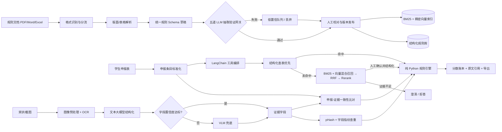
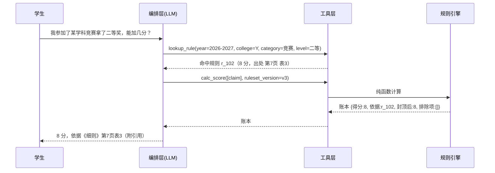

# 综测加分智能核算系统完整项目计划书 V3.0（简历驱动版）

> 项目代号：ScoreProof
> 文档版本：V3.0（执行基线稿）
> 修订日期：2026-09-14
> 前序版本：V2.0（2026-09-11）、V1.0（2026-09-11）
> 项目性质：个人主导的真实业务工具 / AI 应用开发作品
> 计划容量：P0 约 59 人日，P0+P1 约 85 人日（P2 延后，不计入）

---

## 0. 文档说明

### 0.1 编制依据与版本定位

**V3.0 的核心变化：以《许崇亮-AI应用开发-简历-一页版》作为项目的验收契约。**

V2.0 按"完整产品"规划（含 Web 三端、部署运维、安全合规完整版、97 人日）。V3.0 改为按"简历承诺"规划：**凡是简历里写了的，必须有工作包和验收标准支撑；凡是简历没写、且不影响简历数字成立的，一律降级为 P2 延后。**

这样做的理由：简历投出去就是对用人方的承诺，计划书必须能证明每一条承诺都会被兑现，而不是描述一个做不完的理想系统。

### 0.2 事实、目标与占位符的区分

- **当前事实**：已通过代码、测试或现有材料确认；
- **目标值**：项目完成前必须实测，未实测前不能作为既成成果表述；
- **待回填**：依赖真实运营数据，当前不得虚构。

当前仓库基线：

| 项目 | 状态 | 说明 |
|---|---|---|
| P0 方案设计 | 已完成 | 总体架构、数据模型与指标框架 |
| P1 工程骨架 | 已完成 | Excel/PDF/Word 接入、规则存储、计算、检索、评测、API/CLI |
| 图像前置处理与 OCR | 已完成 | 质量检测、预处理、RapidOCR 识别、感知哈希查重 |
| 抽取验证网关 | 已完成 | `rules/gateway.py` 已实现五道校验与独立发布冲突门禁；**分层负例评测 100/100 检出** |
| LangChain 模型接入 | 已完成 | `langchain-openai` 锁定 `==1.6.2`；`reports/deepseek-smoke-v1.json` 记录两次真实 DeepSeek 调用与 4 条结构化结果 |
| 自动化测试 | **已验证** | 全量 **366 项通过**；`ruff check src tests scripts` 与 `mypy src` 通过；计算引擎 41 项、回测层 40 项、奖状字段链路 15 项用例 |
| 双级 Hash 与 manifest | 已完成 | `indexing/manifest.py` 与 `indexing/hybrid.py` 已实现双级 Hash、diff、幂等、删除/回滚及 BM25/Chroma 同批快照 |
| 混合召回（向量 + RRF） | 已完成 | `BAAI/bge-small-zh-v1.5` + BM25 + RRF 已接入；冻结测试集 n=100 的 Hit@5=98%（95% CI 93.0%–99.4%） |
| LangChain 工具编排 | **已完成** | 五个 `@tool`、`bind_tools`、显式状态机、数字拦截、空结果澄清、规则降级、会话版本锁与 `tool_calls` 审计均已落地；真实 CLI/API/DeepSeek 主链路通过，见 `reports/orchestration-guardrails-v1.json` |
| 引用核查与拒答 | **已完成** | 结构化账本规则/分值/出处逐项校验，文本命中仅进人工确认；引用 98%（n=100）、应拒答 100%（n=50）、误拒答 0%（n=100），见 `reports/citation-refusal-v1.json` |
| 52 人回测工具链 | **部分完成** | 逐人/逐项指标、标准/降级双口径、完整差异、输入 Hash 与样本完整性门禁已实现；5 人合成 Excel/CSV 真实 CLI 通过，52 人脱敏历史数据尚未提供，阶段 5 不得判定完成 |
| LLM 字段抽取与 VLM 兜底 | **部分完成** | 七字段严格 Schema、原文/日期/枚举校验、多信号置信度、局部 VLM 触发决策与人工复核状态已落地；真实 RapidOCR + DeepSeek CLI/Uvicorn API 烟雾通过；视觉模型尚未调用，正式评测集仍缺 |
| 网关负例评测 | **已完成** | `reports/gateway-negative-v2.json`：n=100，检出 100，检出率 **100%**，Wilson 95% CI 96.3%–100%；覆盖五道校验与发布冲突门禁 |
| 其余评测集与指标 | 部分完成 | 三档检索消融及引用/拒答成对评测已完成；5 张合成奖状只完成烟雾评测，正式字段 F1、查重及 52 人回测评测集仍待建 |
| Web 端 | 延后（P2） | 简历未承诺 |

### 0.3 V3.0 相对 V2.0 的变更摘要

| # | 变更 | 位置 | 理由 |
|---:|---|---|---|
| 1 | **新增「简历承诺 ↔ 工作包 ↔ 验收标准」追溯矩阵** | 0.4 | 使每条简历表述可被证明兑现 |
| 2 | 范围重分为 P0 / P1 / P2 | 2.3、9～11 | P0 = 简历承诺；P2 延后 |
| 3 | **Web 三端（学生端/审核端/管理端）降级为 P2** | 原 5.10、原 7.1 | 简历未承诺任何前端能力 |
| 4 | **部署运维、备份演练、RPO/RTO 降级为 P2** | 原第 16 节 | 简历未承诺运维能力 |
| 5 | **安全合规由 10 条精简为红线清单** | 15 | 保留不可让步项，删除完整制度设计 |
| 6 | **编排层口径与简历对齐：LangChain 工具调用为主** | 5.5、7.2 | 简历表述为 `@tool` / `bind_tools`；LangGraph 降为可选增强 |
| 7 | 移除独立的「效果与工程」工作包，数字并入概述口径 | 11 | 与简历结构一致 |
| 8 | WBS 由 97 人日重算为 P0 59 + P1 26 = 85 人日 | 11 | 剔除 P2 工作包 |
| 9 | 进度表按 P0 优先重排 | 10 | 先兑现简历承诺 |
| 10 | **DoD 改为「简历承诺达成度」驱动** | 16 | 验收标准与对外承诺一致 |
| 11 | 简历模板同步为当前实际投递版 | 18 | 消除计划与简历的措辞漂移 |
| 12 | **新增「简历一致性检查表」** | 附录 A | 投递前逐条自检 |
| 13 | 仓库状态更新：测试已转绿（366 项） | 0.2、12.5 | 网关、manifest、预训练混合检索、Rerank、工具编排、引用/拒答、逐项回测与奖状字段链路均有专项测试和真实入口测试 |

### 0.4 简历承诺 ↔ 工作包 ↔ 验收标准 追溯矩阵 ★V3.0 核心

简历中每条表述都必须能在本表中找到对应工作包与验收方式。**找不到对应项的简历表述必须删除，而不是保留。**

| # | 简历表述（原文摘要） | 对应工作包 | 验收方式 | 验收标准 |
|---:|---|---|---|---|
| 1 | 分流解析复杂 PDF（跨页表格、多栏重排） | 3.2 | 复杂版面回归集 | 每类 ≥ 10 份样本解析成功率 ≥ 95%，失败可见 |
| 2 | Excel 合并单元格受控 fill-down | 3.1 | 解析回归 | 不污染真实空值 |
| 3 | **LangChain 接入 DeepSeek 结构化抽取** | 3.3 | 集成测试 | **✅ 已达标**：真实调用 2 次，各返回 4 条；无 Key 时显式失败，见 `reports/deepseek-smoke-v1.json` |
| 4 | **五道代码级验证网关** | 3.4 | 网关负例集 | **✅ 已达标**：n=100，检出 100，检出率 100%，Wilson 95% CI 96.3%–100%；另测发布冲突门禁 |
| 5 | 条目带条款与**字符偏移**定位 | 3.3、3.4 | 定位校验 | 每条入库规则带 `char_start/char_end` |
| 6 | 双级 Hash 增量索引 | 4.1 | 集成测试 | **✅ 已达标**：相同真实 PDF 二次同步零重建；改单页仅调用一次新 Embedding；删除、回滚、失败回滚及 BM25/向量同批发布均有测试 |
| 7 | 查询改写 → 路由 → 结构化查表优先 | 4.2 | 集成测试 | **✅ 已达标**：规范词扩展只作用于 BM25；结构化命中仍不做向量召回 |
| 8 | **BM25 + 稠密向量并行召回** | 4.2 | 单元 + 集成 | **✅ 已达标**：预训练 BGE + BM25 + RRF 在冻结集 n=100 上 Hit@5=98%（95% CI 93.0%–99.4%），较 BM25 +2 个百分点 |
| 9 | **RRF 融合 + Rerank 精排** | 4.2、4.3 | 检索评测 | **✅ 已达标**：BGE Reranker 实际处理 2,000 对；MRR@10=0.915（95% CI 0.868–0.955），稳定运行 P95=1.139 秒；真实 CLI/API Top-1 命中精确表格行。API 冷启动 4.84 秒、缓存后 1.02 秒，部署需预热 |
| 10 | 引用核查、证据不足即拒答 | 4.5 | 拒答评测 | **✅ 已达标**：引用 98%（98/100，95% CI 93.0%–99.4%）；应拒答 100%（50/50，95% CI 92.9%–100%）；误拒答 0%（0/100，95% CI 0%–3.7%） |
| 11 | **LangChain `@tool` / `bind_tools` 编排确定性工具** | 4.4 | 编排测试 | **✅ 已达标**：五工具独立测试与 mock 编排通过；真实 DeepSeek 连续调用 `lookup_rule`、`calc_score`，未降级 |
| 12 | **「数字校验」「空结果必澄清」建成独立节点与条件分支** | 4.4 | 编排测试 | **✅ 已达标**：账本外伪造数字 100/100 被拦截；空结果强制调用 `ask_clarification` |
| 13 | 护栏成为编排结构的一部分 | 4.4 | 代码审查 + 测试 | **✅ 已达标**：数字校验与空结果分支位于显式状态机，未仅依赖提示词 |
| 14 | **算分由纯 Python 规则引擎完成，LLM 不参与数值计算** | 5.1 | 单元测试 | 计算引擎不依赖任何模型输出格式；41 项边界用例 |
| 15 | 同类取最高、封顶、团队折算、互斥、学年过滤 | 5.1 | 边界测试 | 关键分支 100% 通过 |
| 16 | 编排不可用时降级为规则路由 | 4.4 | 降级测试 | **✅ 已达标**：超时异常与禁用模型均仍执行 `lookup_rule → calc_score`；真实 CLI/API 降级入口通过 |
| 17 | **OCR + 大模型结构化 + 低置信 VLM 兜底** | 6.1、6.2 | 多模态评测 | **🟡 部分实现、未达标**：OCR→DeepSeek→代码校验链路及局部 VLM 决策可运行；无 VLM 配置明确转人工。尚无真实 VLM 调用及 n≥30 正式评测，不能写完成 |
| 18 | 字段置信度由多信号组合得出 | 6.2 | 单元测试 | **✅ 代码口径已落地**：组合 OCR 行置信度、原文支持、格式、词典与启发式/模型多来源一致性；模型输出 Schema 不含 confidence |
| 19 | pHash + 字段指纹查重 | 6.3 | 查重评测 | Recall / Precision 双报 |
| 20 | **三档消融量化各档增量与成本** | 4.3 | 消融实验 | **✅ 已达标**：`reports/retrieval-ablation-v1.json` 记录 A/B/C 指标、95% CI、调用量、候选对与延迟；Rerank 的零/微小增量未隐藏 |
| 21 | 52 人回测逐项准确率 | 5.2 | 历史回测 | **🟡 工具已就绪、真实数据待提供**：标准口径或降级差异分析口径；当前 5 人合成样例结果不得写入简历 |
| 22 | 单人核算 `[人工值]` → `[系统值]` 分钟 | 5.2 | 同口径计时 | 报中位数与 P90 |
| 23 | 243 项以上测试通过 | 12 | CI | **✅ 已达标**：当前全量 366 项通过，ruff 与 mypy 通过 |
| 24 | 服务 `[N]` 名同学 | 7.1 + 运营 | 使用日志 | 去重真实用户；无记录则删除该表述 |

> **本表是投递前的最低门槛。** 任何一行未达标，对应简历表述必须删除或改为定性表述。

---

## 1. 项目概述

### 1.1 项目背景

高校综合测评加分核算同时依赖学校细则、学院补充通知、认可赛事目录、学生申报 Excel、奖状照片与公示截图。现有人工流程存在四类问题：

1. 规则分散且格式复杂，跨页表格、多栏 PDF、Word 表格和 Excel 合并单元格容易漏读错读；
2. 同一奖项存在别名、口径差异，人工匹配耗时且结果不稳定；
3. 证书内容、申报描述与适用规则需反复核对，还需识别重复申报；
4. 大模型可辅助理解文本，但直接让模型算分会引入不可复现、不可测试、无法审计的问题。

### 1.2 一句话定义

ScoreProof 是面向高校综测的异构文档 + 多模态 RAG 系统：把 PDF / Word / Excel 细则与奖状图片索引为**带条款级出处的可执行规则库**，在线定位条款并生成带引用的解释；再由纯 Python 规则引擎完成确定性算分，每条结果可追溯至文档、页码、条款与字符偏移。

### 1.3 核心原则

- 大模型只参与抽取、归一化建议、查询理解、条款定位与结果解释；
- **模型的一切结构化输出默认不可信**，必须通过代码级验证网关（5.2）方可入库；
- 所有分值、封顶、互斥、去重、折算、有效期判断均由代码执行；
- 结构化规则是唯一可自动计分的数据来源，检索兜底结果不得直接入分；
- 低置信结果进入人工复核，不以"全自动"为目标；
- 原始个人材料默认本地保存、最小化采集、脱敏使用、禁止进入公开仓库；
- **简历中的每个数字都必须由固定评测集或真实日志产生，可复跑、可解释**。

---

## 2. 项目目标与边界

### 2.1 建设目标（P0）

1. 建立统一规则库，覆盖 PDF / Word / Excel，保留学年、学院、版本与原文定位；
2. 建立 **LLM 抽取验证网关**，使模型抽取结果入库前经过代码级校验；
3. 建立基于文档 Hash 的增量索引，细则修订只重建受影响块；
4. 建立 **BM25 + 稠密向量混合召回 + RRF 融合 + Rerank 精排**的在线检索链路；
5. 建立 **LangChain 工具编排**：以 `@tool` / `bind_tools` 调度确定性工具，模型不得生成或修改任何数值；
6. 建立确定性规则引擎，覆盖同类取最高、封顶、团队折算、互斥与学年过滤；
7. 建立 OCR + 文本大模型结构化 + 低置信 VLM 兜底的证书理解链路，含 pHash 与字段指纹查重；
8. 建立三档消融实验与完整评测体系，所有比例指标报告样本量与 95% 置信区间。

### 2.2 量化成功标准

| 维度 | 指标 | 目标 | 样本量要求 | 可写入简历的条件 |
|---|---|---|---:|---|
| 解析 | 复杂 PDF（跨页/多栏）解析成功率 | ≥ 95% | 每类 ≥ 10 份 | 回归集复跑后可写 |
| 规则抽取 | 规则字段完全正确率 | ≥ 96% | n ≥ 50 | 冻结评测集后可写 |
| **抽取网关** | **原文不一致条目检出率** | **≥ 99%** | **n ≥ 30 条构造负例** | **优先跑，工作量最小** |
| 图像抽取 | 奖状字段级 micro-F1 | ≥ 91% | n ≥ 30 张 | 独立测试集后可写 |
| 查重 | 重复申报 Recall | ≥ 96% | n ≥ 50 对 | 同时披露 Precision |
| 查重 | 重复申报 Precision | ≥ 95% | 同上 | 与 Recall 并列 |
| 检索 | Hit@5（混合召回） | ≥ 89%，且必须报 BM25 基线 | n ≥ 100，报 95% CI | 三档消融复跑后可写 |
| 检索 | MRR@10（含 Rerank） | ≥ 0.80 或较基线提升 ≥ 10% | 同上 | 复跑后可写 |
| 检索 | 向量通道增量 | 如实报告，不设下限 | 同上 | 消融实验后可写 |
| 引用 | 引用定位正确率 | ≥ 95% | 人工抽样 n ≥ 100 | 复跑后可写 |
| 拒答 | 应拒答样本正确拒答率 | ≥ 98% | n ≥ 50 | 成对报告 |
| 拒答 | **有答案样本误拒答率** | **≤ 5%** | n ≥ 100 | 成对报告 |
| 计算 | 52 人回测逐项准确率 | ≥ 96.2% | 52 人全量 | 见 13.5 口径 |
| 效率 | 单人核算时长 | 18 → ≤ 2 分钟 | 同口径计时 | 报中位数与 P90 |
| 成本 | VLM 触发率 | ≤ 15% | 全量图像样本 | 复跑后可写 |
| 质量 | 计算边界测试 | ≥ 40 项 | — | 当前已有 41 项 |
| 工程 | 全量测试与静态检查 | 主干持续通过 | — | **✅ 已达标：366 项 + ruff + mypy 通过** |

> 拒答必须成对考核。只考核"应拒答正确率"可通过一律拒答取得 100%。
> 比例型指标必须附样本量与 95% 置信区间（比例用 Wilson 区间）。

### 2.3 项目范围：P0 / P1 / P2

**P0 —— 简历承诺，必须交付**

- 异构文档解析与统一规则库（含字符偏移定位、双级 Hash 增量）；
- LLM 抽取验证网关（五道代码级校验）；
- LangChain 接入 DeepSeek 结构化抽取；
- 在线检索链路（改写、路由、结构化查表优先、混合召回、RRF、Rerank、引用核查、拒答）；
- LangChain 工具编排与确定性计算引擎；
- 多模态材料审核（OCR + LLM 结构化 + VLM 兜底 + 字段置信度 + pHash / 字段指纹查重）；
- 最小演示端（CLI / API，足以支撑真实用户使用与回测）。

**P1 —— 支撑简历数字的可信度**

- 评测集建设与标注；
- 三档消融实验执行与实验追踪；
- 52 人历史回测与误差分类；
- 效率与成本测量。

**P2 —— 简历未承诺，延后执行**

- 学生端 / 审核端 / 管理端完整 Web 界面；
- 部署运维体系（容器编排、备份恢复演练、RPO / RTO）；
- 安全合规完整制度设计（保留 15 节红线清单）；
- PostgreSQL 迁移与多人并发；
- 角色权限矩阵、审计工作台、灰度发布与运营面板。

> **范围内的判定规则**：一项能力若不影响 0.4 节追溯矩阵中任何一行，即归入 P2。

---

## 3. 角色与职责

| 角色 | 主要职责 | 单人项目可行性 |
|---|---|---|
| 项目负责人 / 开发者 | 需求、架构、编码、评测、文档 | 必需 |
| 业务口径确认人（班委 / 辅导员） | 确认规则解释与异常口径 | **尽力争取，非阻塞** |
| 标注员 | 规则、证书字段、重复对、一致性标注 | 开发者兼任 |
| 试用用户 | 验证上传、反馈与结果解释 | 必需（真实用户） |

**单人项目的降级方案**（不得把外部配合设为任何里程碑的退出条件）：

1. **无外部裁决时**：以规则原文 + 显式优先级为准，歧义条目标记 `ambiguous` 并排除在自动计分之外；
2. **无第二人复核时**：采用**双次独立标注**（隔日重标同批样本）估计自身一致率，并在报告中披露；
3. **52 人回测无裁决真值时**：切换至 13.5 降级口径，报告差异分析而非准确率；
4. **试用用户不足时**：如实记录实际人数，不估算、不外推。

---

## 4. 总体业务流程



**流程约束**：编排层任何工具调用都不得修改数值；最终输出中每个数字必须可回溯到计算账本（见 5.5）。

---

## 5. 功能需求

### 5.1 离线规则接入与统一结构化

#### PDF

- 判断文本型 / 扫描型 / 混合型 PDF；
- 按页保留文字块坐标、页码、阅读顺序与表格区域；
- **多栏页面按版面坐标重排阅读顺序**，避免跨栏串行；
- **跨页表格识别重复表头、续表标志与列结构**，拼接为同一逻辑表；
- 保存原始文本、表格单元格、截图区域与解析器元数据；
- 低质量页触发 OCR 或人工复核，不静默丢失。

#### Word

- 保序解析段落、标题、编号列表与表格；
- 识别页眉页脚、批注/修订痕迹、合并单元格与嵌套表格；
- 保留章节、条款号、表格序号与文档名定位；
- 学院补充通知与校级规则冲突时，依据显式优先级处理。

#### Excel

- 识别标题行、空白分隔行、多工作表与隐藏列；
- 对合并单元格执行**受控 fill-down**，只填充合并区域或指定层级列，避免污染真实空值；
- 统一日期、百分比、数字、布尔值与中文等级格式；
- 对缺列、错列、重复表头与公式单元格输出校验报告；
- 学生申报数据只进入结构化存储，不进入向量索引。

#### 统一规则 Schema

| 字段组 | 字段 |
|---|---|
| 适用范围 | `academic_year`、`college`、`major`、`effective_from/to` |
| 规则主体 | `category`、`item_name`、`level`、`rank`、`score` |
| 约束 | `dedup_group`、`cap`、`team_factor`、`exclusive_group`、`require_catalog` |
| 归一化 | `synonyms`、规范化名称、枚举编码 |
| 来源 | `doc_id`、`doc_name`、`doc_hash`、`page`、`table`、`clause`、`bbox`、**`char_start`**、**`char_end`** |
| 版本 | `version`、`status`、`supersedes`、`created_at`、`reviewed_by` |
| 质量 | `parser`、`extract_confidence`、`manual_verified`、`validation_errors`、`ambiguity_flag` |

### 5.2 五道 LLM 抽取验证网关 ★P0 核心

**设计动机**：提示词中写明"score 必须是原文出现的数字，禁止推算"只是**对模型的请求，不是对系统的保证**。模型仍可能给出原文不存在的分值、张冠李戴的等级。因此必须建立独立的代码级验证层。

#### 5.2.1 五道网关

```
                    LLM 抽取原始输出（JSON 数组）
                              │
        ① Schema 校验 ────────┤ 字段缺失 / 类型错误 → 整条丢弃
                              │
        ② 原文一致性校验 ─────┤ score / level 必须逐字出现在 evidence_quote 中
                              │
        ③ 溯源定位校验 ───────┤ evidence_quote 必须能定位到字符偏移
                              │
        ④ 数值与枚举边界校验 ─┤ 分值范围、等级枚举、日期格式、学年合法性
                              │
        ⑤ 双次独立抽取交叉验证 ┤ 两次结果不一致 → 降级为低置信
                              │
                     （发布前另有规则冲突门禁，见 5.2.3）
                              ▼
                    待人工校对队列 → 确认 → 发布
```

| 层 | 校验内容 | 失败处置 |
|---:|---|---|
| ① | Pydantic 严格模式（`extra="forbid"`） | 整条丢弃，计入 `schema_error` |
| ② | 归一化后子串匹配：`"8"` / `"8.0"` / `"八"` 均视为命中 `"加8分"` | `extract_confidence=0`，禁止自动计分 |
| ③ | 计算 `char_start` / `char_end`，用于引用高亮 | 定位失败 → 降级为低置信 |
| ④ | `0 < score ≤ 100`、等级在枚举内、日期可解析且在学年内 | 标记 `validation_errors` |
| ⑤ | 两种提示（直接抽 JSON / 先列条款再抽字段）或温度 0 与 0.3 各抽一次 | 不一致 → `ambiguity_flag=True` |

#### 5.2.2 成本控制

双次抽取会使调用翻倍。控制策略：第一次结果按 `chunk_hash` 缓存；仅对低置信或高风险条目（来源为跨页表格、扫描 OCR 页）触发第二次；**目标：二次抽取比例 ≤ 20%**。

#### 5.2.3 发布前规则冲突门禁

同 `(year, college, category, level, rank)` 下分值必须唯一；出现多个分值则阻止发布批次，并列出冲突条目。

#### 5.2.4 网关自身指标（可直接写入简历）

| 指标 | 定义 | 优先级 |
|---|---|---|
| 负例检出率 | 人工注入"原文不存在的分值"被 ② 层拦下的比例（目标 ≥ 99%） | **最高：工作量最小** |
| 拦截率 | 被拦下的条目 / 全部抽取条目 | 高 |
| 拦截原因分布 | schema / 原文不一致 / 定位失败 / 数值越界 / 双次冲突 / 规则冲突 | 高 |
| 人工修正率 | 进入校对队列后被改动的比例 | 中 |

### 5.3 基于文档 Hash 的增量索引

建立"文档—逻辑块—索引条目"三级 Hash：

1. 对原始文件字节计算 `document_hash`，判断文件是否未变化；
2. 对规范化后的页/章节/表格计算 `chunk_hash`，忽略不影响语义的空白与页眉页脚变化；
3. 以 `doc_id + chunk_hash + embedding_model_version` 生成索引键；
4. 新增块插入、变更块替换、删除块写 tombstone 并移出在线索引；
5. 规则抽取结果、BM25 文档与向量记录在同一批次号下原子发布；
6. 发布失败保留上一稳定版本，可一键回滚；
7. 记录新增/更新/删除/跳过数量与耗时，形成同步报告。

**复用**：同一套 Hash 直接作为 **LLM 抽取结果缓存键**与 **Embedding 缓存键**（见 7.3）。

验收：相同文档重复导入不产生重复规则与向量；修改单页只重建受影响块；删除旧文档后线上不可检索到旧条款；不存在半发布状态。

### 5.4 在线检索链路 ★P0 核心

#### 5.4.1 分级定义

| 级别 | 组成 | 定位 | 交付状态 |
|---|---|---|---|
| L0 结构化通道 | 按学年/学院/类别/等级精确查表 | **计分唯一来源** | 确定交付 |
| L1 词法召回 | BM25 单路 | 字面匹配与原文溯源 | 确定交付 |
| L2 稠密召回 | 稠密向量 + RRF 融合 | 语义召回、同义与口语化问法 | 确定交付 |
| L3 精排 | Rerank 模型 | 提升最终排序 | 确定交付 |

#### 5.4.2 为什么确定实现混合检索

1. **真实问法与规则表述存在系统性差异**：学生提问高度口语化（"我拿了个国二能加几分"），细则使用规范表述（"国家级二等奖"），词法召回对同义改写不敏感；
2. **规则跨文档表述不一致**：校级细则、学院补充通知、认可赛事目录对同一奖项措辞不同，仅靠字面匹配易漏召；
3. 但**语义相近的数值条件仍是向量检索的失效点**（"二等奖 8 分"与"三等奖 5 分"向量距离极近），因此混合召回只用于候选条款召回，**不参与计分**。

#### 5.4.3 三档消融实验设计

| 档位 | 组成 | 报告内容 |
|---|---|---|
| A（基线） | L0 + L1（BM25） | Hit@5 / MRR@10 / nDCG@10 + 95% CI + 单查询耗时 |
| B | A + L2（向量 + RRF） | 相对 A 的增量、融合权重敏感性、Embedding 调用量 |
| C | B + L3（Rerank） | 相对 B 的增量、Rerank 候选对数、延迟与成本 |

**报告纪律**：每档只改变一个主要变量；**增量必须如实报告，即使很小**；同步报告成本差，使"增量 vs 成本"可横向比较。

> 三档消融本身就是可写入简历的工程产出：能给出"向量召回把 Hit@5 从 X 提升到 Y"这类带对照的数字，比"我用了混合检索"有说服力得多。

#### 5.4.4 引用核查与拒答

- 结构化命中才可自动计分；
- 仅文本命中时给出候选条款并要求人工确认；
- 引用核查确认结论可被召回片段支撑，否则拦截；
- 证据不足即拒答，**不瞎给分**。

**已实现（2026-09-14）**：`retrieval/citation.py` 对结构化账本逐项核对 `rule_id`、结构化通道、规则原始分值与精确出处；模型最终答复还必须出现账本中的完整文档名及页码/条款/表格行，否则拦截并重试。文本通道要求领域与意图在范围内且精确出处可定位；混合检索入口还要求 BM25/向量双路共同支撑，兼容的纯词法入口则要求更强的字面重合。通过后也只返回 `manual_review`，不自动计分。`eval/citation.py` 将可回答与应拒答样本成对报告，避免一律拒答刷分。实测引用定位 98%（98/100）、正确拒答 100%（50/50）、误拒答 0%（0/100），均附 Wilson 95% 区间，详见 `reports/citation-refusal-v1.json`。

### 5.5 LangChain 工具编排与确定性计算 ★P0 核心

#### 5.5.1 设计动机

若"问题路由"只做意图分类、随后由同一模型继续生成回答，模型仍可能在自己的回答里给出一个未经计算的分数。改为**工具调用**后，模型职责被限制为"选择工具 + 填充参数"，数值只能由工具返回。

#### 5.5.2 工具集定义

| 工具 | 入参 | 出参 | 是否确定性 |
|---|---|---|---|
| `lookup_rule` | `academic_year`, `college`, `category`, `level`, `rank?`, `item_name?` | `Rule[]`（含 doc/page/clause/bbox） | 是（SQL 精确查询） |
| `search_clauses` | `query`, `filters`, `top_k` | `Clause[]`（含页码/bbox） | 是（BM25 + 向量） |
| `calc_score` | `claims[]`, `ruleset_version`, `student_id` | `ScoreLedger`（逐项账本 + 排除原因 + 引用） | **是（纯函数，无 LLM）** |
| `check_evidence` | `claim`, `evidence_fields` | `FieldDiff[]` | 是（规则比对） |
| `ask_clarification` | `missing_fields`, `question` | — | 交互（不产生分值） |

五个工具均以 `langchain_core.tools.@tool` 装饰器注册，模型侧通过 `bind_tools` 获取工具签名，入参 schema 由 Pydantic 生成。其中 `calc_score` 使用 `extra="forbid"` 与 `StrictStr` / `StrictBool` / 结构化列表约束，且不暴露任何“模型填写分值”字段，**工具 schema 只接收逐字段申报，无法把一整段自然语言直接当作核算入参**。

#### 5.5.3 典型编排序列



#### 5.5.4 强制纪律（代码级约束）

1. `calc_score` 入参必须是严格的结构化字段，禁止额外字段、布尔字符串强制转换与模型传入分值，**由 Pydantic 严格类型在工具 schema 层强制**；请求已经携带结构化申报时，编排层以用户字段覆盖模型生成的 `lookup_rule` / `calc_score` 参数，模型只能选择工具、不能改写类别或等级；
2. 最终回答中出现的**任何数字**必须在账本中可查，文档名与页码/条款/表格行也必须来自账本，否则拦截并重新生成——**实现为编排层的独立数字与引用校验节点**；
3. 工具返回空结果时，**必须**走 `ask_clarification` 或拒答路径，**不允许模型用先验知识补答**——**实现为条件分支强制，不交给模型自由决策**；
4. 每次工具调用记录 `{工具名, 入参, 返回摘要, 耗时, 模型版本, 时间戳}` 到审计日志；
5. 同一会话内的规则版本锁定，防止规则漂移导致同一问题两次答案不同。

> 第 2、3 条即简历中"把『数字校验』『空结果必澄清』建成独立节点与条件分支，使护栏成为编排结构的一部分"的确切含义。

#### 5.5.5 编排层技术选型（与简历口径一致）

**采用 LangChain 工具调用（`@tool` / `bind_tools`）+ 显式状态机实现编排，不将 LangGraph 作为 P0 依赖。**

| 层 | 归属 | 说明 |
|---|---|---|
| 工具定义与签名绑定 | **LangChain（`langchain-core`）** | `@tool` / `bind_tools`，Pydantic schema |
| 模型接入 | **LangChain（`langchain-openai`）** | DeepSeek（OpenAI 兼容） |
| 编排控制流 | **自研显式状态机** | "路由 → 工具调用 → 引用校验 → 数字校验 → 回答/澄清/拒答"的节点与条件分支 |
| 会话状态 | **自研轻量 session store** | 承载规则版本锁定；规模小，无需图框架 |
| 数字拦截器 | **自研** | 位于编排层外层与校验节点内 |
| 降级路由 | **自研** | 编排不可用时的逃生通道 |
| 确定性计算引擎 | **纯 Python，不用框架** | 无 LLM、无 IO，必须可独立单测 |

**关于 LangGraph 的说明**：V2.0 曾选定 LangGraph 承担编排与检查点持久化。V3.0 调整为可选增强（P2），理由有三：

1. **与简历口径一致**——简历将 LangGraph 标签保留给另一个项目（CoreCoder），本项目对外不主打该框架；
2. **需求规模不匹配**——本项目只有 5 个固定工具、单轮查表算分，会话状态仅需承载规则版本，自研 session store 足够；
3. **降低版本风险**——LangChain 生态 API 变动频繁，减少一层依赖即减少一处升级成本。

**若后续出现以下需求，再引入 LangGraph**：需要跨步骤人工审批中断（human-in-the-loop）、需要图级检查点回放、需要多 Agent 协作。届时按 7.5 第 7 条作为可追踪版本变更处理。

#### 5.5.6 依赖与版本策略

| 依赖 | 用途 | 引入阶段 |
|---|---|---|
| `langchain-core` | `@tool`、消息类型、结构化输出接口 | 阶段 4 |
| `langchain-openai` | DeepSeek（OpenAI 兼容）接入 | 阶段 2（**已锁定 `==1.6.2`**） |
| `langchain-chroma` | 向量检索集成 | 阶段 4 |
| `pydantic` | 工具 schema、抽取结果校验 | 已在用 |

**版本策略**：`pyproject.toml` 钉住版本（`~=` 或精确版本），禁止裸 `>=`；框架升级视为**可追踪版本变更**，需重跑冻结评测集并记录指标变化；核心测试**只测自己的函数契约，不依赖框架内部实现**。

#### 5.5.7 降级路径

模型不支持工具调用、调用失败、超时，或编排执行异常：

- 回退到**规则路由**（关键词 + 正则 + 学年/学院解析）直接调度工具，绕过模型；
- **功能可用性不依赖模型能力**，降级后仍能完成查表与算分；
- 降级事件写入审计日志，计入"模型可用性"与"编排可用性"观测指标。

### 5.6 确定性计算引擎

规则引擎采用纯函数与明确的数据输入输出，执行顺序固定为：

1. 学年、学院与规则版本过滤；
2. 申报与规则匹配；
3. 资格条件 / 认可目录验证；
4. 团队系数及其他折算；
5. 同类项目去重取最高；
6. 互斥组裁决；
7. 单项、单类与总分封顶；
8. 精度与舍入；
9. 生成逐项账本、排除原因与原文引用。

**任何计算都不得读取自然语言回答中的数字。** 输入必须是已通过 Schema 校验且处于"已发布"状态的结构化规则。

### 5.7 多模态材料审核

处理链路：

1. 图像预处理：EXIF 旋转、清晰度评估、裁边、去噪、透视矫正、对比度增强（**已完成**）；
2. OCR：输出文字、坐标、行块与置信度（**已完成**）；
3. 文本大模型结构化：抽取姓名、赛事、级别、奖项/名次、日期、颁发单位、团队属性；
4. 字段级校验：日期范围、姓名匹配、词典映射、枚举合法性与字段间逻辑；
5. **VLM 兜底：仅将低置信字段及必要图像区域**发送给视觉模型；
6. 结果融合：规则校验优先，OCR 与 VLM 冲突时进入人工复核；
7. 人工校对：图片与字段并排展示，保留修改前后值与操作人；
8. 人工修正回流为评测样本与词典候选，不自动污染生产规则。

**字段置信度不能只采用模型自报分数**，应组合：OCR 置信度、字段格式校验、词典匹配、OCR/VLM 一致性、历史纠错频率。阈值在验证集上选择并固定到版本配置。

**结构化输出同样受 5.2 的 ①②③④ 层校验**（姓名须出现在 OCR 文本中、日期可解析、等级在枚举内），不通过者置空而非猜测。

### 5.8 重复申报检测与一致性审核

**三层查重**：

- 文件级：SHA-256 识别完全相同文件；
- 图像级：pHash/dHash 汉明距离识别裁剪、压缩、亮度变化后的相似图片；
- 语义级：规范化后的"姓名 + 赛事 + 等级/名次 + 获奖时间"生成字段指纹。

输出分为"确定重复、疑似重复、非重复"，展示触发原因；只拦截或送审，不自动删除材料。**阈值必须同时评估 Recall、Precision 与误伤案例**，避免为 96% Recall 大量误报。

**一致性比对**至少覆盖：申报人姓名 vs 证书姓名、赛事名称与别名、级别/等级/名次、获奖日期是否落在申报学年、个人/团队属性、颁发单位与目录要求、申报类别与规则类别。结果分为一致、可归一化一致、不一致、信息不足；所有不一致项给出字段级差异，**不让 LLM 直接作最终通过/驳回决定**。

---

## 6. 非功能需求

| 类别 | 要求 |
|---|---|
| 正确性 | 计算结果确定、可复跑；同输入同规则版本得同输出 |
| 可追溯 | 每个计分/不计分结论可定位到规则版本、文档、页码/条款及**字符偏移** |
| 性能 | 单条结构化查询 P95 < 300 ms；含 Rerank 的检索 P95 < 2 s |
| 批处理 | 52 人规模批量核算 5 分钟内完成（不含人工复核等待） |
| **模型独立性** | 外部模型不可用时，结构化查表与算分链路仍须可用（见 5.5.7） |
| 可维护 | 解析器、模型、向量库、LLM/VLM 通过接口解耦，可替换 |
| 成本 | OCR 优先本地；仅低置信样本调用 VLM；记录单文档/单图片调用成本 |
| 可观测 | 记录解析失败率、低置信率、召回结果、拒答率、耗时、模型版本与发布批次 |
| 隐私 | 见第 15 节红线清单 |

---

## 7. 技术架构与选型

### 7.1 分层架构

| 层 | 主要组件 | 实现 |
|---|---|---|
| 接入层 | 文件类型检测、上传 | FastAPI、MIME / 魔数校验 |
| 解析层 | Excel / PDF / Word / Image 解析器 | **自研**：pandas/openpyxl、PyMuPDF、pdfplumber、python-docx、RapidOCR |
| 结构化层 | Schema、抽取、归一化、**验证网关**、人工校对 | LangChain structured output + Pydantic + 词典规则 |
| **编排层** | **工具注册、工具调用、数字拦截、降级路由** | **LangChain `@tool` / `bind_tools` + 自研显式状态机**（见 5.5.5） |
| 存储层 | 规则、证据、申报、版本、审计 | SQLite |
| 索引层 | BM25、稠密向量、增量索引 | rank-bm25/FTS + **langchain-chroma** |
| 检索层 | 召回、RRF 融合、Rerank、引用核查 | LangChain retriever 接口 + 自研融合与核查 |
| 计算层 | 规则匹配、约束、账本 | **纯 Python 函数，不可变输入，不用框架** |
| 服务层 | REST / SSE、批任务、导出 | FastAPI、Uvicorn |
| 评测层 | 数据集、离线实验、回归门禁 | pytest、自建评测脚本 |

### 7.2 编排层口径（与简历一致性说明）

| 概念 | 本项目采用 | 对简历的表述 |
|---|---|---|
| 工具定义 | LangChain `@tool` + Pydantic schema | 「LangChain（`@tool` / `bind_tools`）编排」 |
| 结构化参数 | 用户申报字段锁定并覆盖模型生成参数 | 「LLM 不参与数值计算与规则事实改写」 |
| 控制流 | 自研显式状态机（含引用/数字校验节点 + 条件分支） | 「建成独立节点与条件分支」 |
| 会话状态 | 自研轻量 session store | 「同一会话内规则版本锁定」 |
| 图框架 | LangGraph 列为 P2 可选增强 | **简历不写**（该标签保留给 CoreCoder） |

> 本表用于保证：**简历表述与实现选型永不冲突**。改动任一侧时必须同步更新本表。

### 7.3 成本与 Token 控制设计

| 环节 | 控制手段 | 目标 |
|---|---|---|
| 规则抽取 | `document_hash` / `chunk_hash` 命中则跳过；结果按块缓存 | 修订后只重抽变更块 |
| 抽取验证 | 仅低置信条目做双次抽取（5.2.2） | 二次调用比例 ≤ 20% |
| 模型分级 | 简单表格用轻量模型，复杂跨页表/扫描页用强模型 | 强模型占比 ≤ 30% |
| OCR | 本地推理；限制长边分辨率；批处理 | 云端 OCR 调用 = 0 |
| VLM 兜底 | 只发低置信字段**裁剪区域**，不发整图 | **VLM 触发率 ≤ 15%** |
| Embedding | 只对新增/变更块计算；批量；按 `chunk_hash` 缓存 | 增量重建 < 全量 20% |
| 检索 | 结构化命中则不做向量召回 | 结构化命中率 ≥ 70% |
| 生成/解释 | 限长；相同「规则+等级+约束」解释缓存复用 | 解释缓存命中率 ≥ 50% |
| 编排 | 单请求限制工具调用轮数 | ≤ 4 轮 |

**成本可观测**：每次外部模型调用记录 `{模型, 用途, 输入token, 输出token, 文档/图片ID, 批次号, 时间戳, 是否缓存命中}`。结项报告须给出：每 100 份材料平均成本、每名学生平均成本、VLM 触发率及其 F1 增益、缓存命中率。

### 7.4 存储建议

MVP 使用 SQLite + 本地文件系统。核心表：`documents`、`document_chunks`、`rules`、`rule_versions`、`extraction_audits`、`claims`、`evidence`、`review_tasks`、`score_runs` / `score_items`、`tool_calls`、`cost_events`、`index_manifest`、`audit_logs`、`evaluation_runs`。

### 7.5 关键设计决策

1. Excel 结构化数据不进入向量库；
2. 自动计分只接受已审核、已发布的结构化规则；
3. PDF 跨页表格先做逻辑拼接，再做规则抽取；
4. 文档版本优先级显式化，不靠检索分数隐式决定；
5. OCR / VLM 输出保留原值、置信度、定位与模型版本；
6. 人工校对是正式流程节点，修正必须审计；
7. 模型升级、提示词变化与索引参数变化均视为**可追踪版本变更**；
8. **模型输出必须经验证网关方可入库，提示词约束不能替代代码校验**；
9. **数值只能由 `calc_score` 产生，编排层不得生成或修改任何数字**；
10. **解析层、验证网关、数字拦截、降级路由与计算引擎保持自研或纯 Python，框架不参与任何数值决策**；
11. **检索链路实现混合召回与 Rerank，并以三档消融实验量化各档增量；不得只报最终档位而省略基线**。

---

## 8. 数据准备与评测集

### 8.1 数据清单（规模按单人可完成设定，工时显式计入）

| 优先级 | 数据 | 最低数量 | 用途 | 工时 |
|---:|---|---:|---|---:|
| P0 | 当前学年校级与学院细则 | 全量 | 规则库主数据 | — |
| P0 | 加分矩阵、认可赛事目录 | 全量 | 精确匹配与资格校验 | — |
| P0 | 往年 52 人申报明细与最终结果 | 1 学年 | 回测参照 | — |
| P0 | 规则 Gold Set | 50～80 条 | 规则抽取评测 | 4 人日 |
| P0 | **抽取网关构造负例** | **≥ 30 条** | **网关检出率** | **1 人日** |
| P1 | 真实规则问法 | 100～150 条 | Hit / MRR / 拒答评测 | 3 人日 |
| P1 | 真实奖状图片 | 30～50 张 | 字段 F1 评测 | 4 人日 |
| P1 | 重复 / 近重复图片对 | 50 对 | 查重阈值评测 | 2 人日 |
| P1 | 申报-证据一致性样本 | 60～100 条 | 一致性评测 | 2 人日 |
| P1 | 扫描件、跨页表格、多栏 PDF | 每类 ≥ 10 份 | 复杂解析回归 | 2 人日 |
| | | | **合计** | **18 人日** |

### 8.2 数据划分

- 开发集：调词典、提示词与阈值；
- 验证集：选 OCR/VLM 阈值、融合权重与 Rerank 参数；
- 测试集：冻结后只用于阶段验收，**不针对测试错误反复调参**；
- 历史回测集：52 人逐人逐项对账；
- 负例集：规则不存在、学年不符、学院不符、材料缺失、对抗性问法。

**同一证书的原图、裁剪图、压缩图必须进入同一数据划分**，避免泄漏导致查重指标虚高。

### 8.3 标注规范

- 规则标注采用**双次独立标注**（隔日重标）估计自身一致率；
- 奖状字段区分"原文值"与"规范值"，不把归一化正确当作 OCR 正确；
- 查重以"是否代表同一获奖事实"为标签，不只看图片是否相同；
- 回测按"学生—申报项"记录预期得分、实际得分与误差原因；
- 数据集、标注规范与规则版本一并编号；
- **标注过程记录耗时**，作为 8.1 工时的实测依据。

---

## 9. 实施路线（按 P0 优先）

### 阶段 0：口径冻结与数据准备（W1）

- 梳理人工流程与异常口径；收集规则文档、申报模板、往年结果与典型证书；
- 明确学年、学院、规则优先级、计算顺序与人工裁决边界；
- 输出需求文档、数据字典、风险清单与验收标准；
- 保持测试绿灯（**已完成：全量 366 项通过**）。

交付物：需求基线、样本清单、口径确认单。
退出条件：必须字段、计算规则、评测口径均有书面记录；测试与静态检查通过。

### 阶段 1：工程底座与统一 Schema（W1～W2）

- 建立 Rule / Claim / Evidence / ScoreBreakdown / Document / Chunk 模型；
- 建立 SQLite 数据库与演示数据生成器；
- 完成隐私目录隔离、`.gitignore`、环境变量模板；
- CI：单测、静态检查、敏感信息扫描。

退出条件：示例数据可完整写入/读出；测试与静态检查通过。

### 阶段 2：异构文档解析与 LangChain 抽取（W2～W4）

- Excel：多表、表头识别、合并单元格 fill-down、类型规范化；
- PDF：文本块、多栏阅读顺序、表格抽取、跨页表格拼接、扫描页检测；
- Word：正文与表格保序、标题/条款定位；
- **LangChain（`ChatOpenAI`）接入 DeepSeek 结构化抽取**；
- 建立文档 / 页码 / 表格 / 条款 / bbox / **字符偏移**多级溯源。

退出条件：目标文档全部可导入；错误不静默；抽取可复跑。

### 阶段 3：五道抽取验证网关（W4～W5）★P0 核心

- 实现 5.2 的五层校验，逐层可独立测试；
- 实现原文一致性校验与字符偏移定位；
- 实现双次独立抽取与差异比对，接入 `chunk_hash` 缓存；
- 实现发布前规则冲突门禁；
- 构造 ≥ 30 条负例并验证检出率；
- 建立 `extraction_audits` 表与拦截原因统计。

交付物：验证网关、负例集、网关指标报告。
退出条件：**负例检出率 ≥ 99%**；所有入库规则带 `char_start/char_end`；五层各有覆盖用例。

### 阶段 4：增量索引、混合检索与 LangChain 工具编排（W5～W8）★P0 核心

- 实现文档 Hash / 逻辑块 Hash / manifest / 差异计算与原子发布；
- 建立 BM25 索引与稠密向量索引（langchain-chroma），实现 RRF 融合；
- 实现查询清洗、改写、学年/学院/类别解析与问题路由；
- 实现 Rerank 精排，保留模型版本与分数；
- 以 `@tool` 实现五个工具及其独立单元测试；
- 实现编排状态机：路由 → 工具调用 → **数字校验节点** → 回答/澄清/拒答（**条件分支强制**）；
- 实现结构化账本与最终答复的代码级引用门禁，并建立引用/拒答成对评测；
- 实现 5.5.7 降级路由；
- 建立 `tool_calls` 审计表。

交付物：增量索引命令、检索 API、工具层、编排层、引用门禁、成对拒答报告、降级路由。
退出条件：同文档幂等、变更局部更新、删除生效；**模型编造数字 100% 被拦截**；引用定位 ≥ 95%、正确拒答 ≥ 98% 且误拒答 ≤ 5%；编排不可用时查表与算分仍可用。

**阶段 4.4 实测记录（2026-09-14）**：五工具、状态机、会话版本锁、`tool_calls` 审计及规则降级已落地；账本外数字 100/100 被拦截。仓库规则库副本的真实 CLI、真实 Uvicorn `/api/agent` 和真实 DeepSeek `bind_tools` 主链路均通过，DeepSeek 未降级并连续调用 `lookup_rule → calc_score`。学生身份在模型侧统一替换为 `CURRENT_STUDENT`，复测只使用本地合成身份与仓库示例规则；该记录仅覆盖字段完整的单项目核算，引用与拒答结果见后续 4.5 记录。详见 `reports/orchestration-guardrails-v1.json`。

**阶段 4.5 实测记录（2026-09-14）**：使用真实公开文件 `fzu_ccds_2026_recommendation_score_rules.pdf` 建立 176 个 BM25/Chroma 同批块，以本地 `BAAI/bge-small-zh-v1.5` 对 100 条可回答冻结问法与 50 条人工域外负例成对复跑；引用定位 98%（95% CI 93.0%–99.4%），正确拒答 100%（95% CI 92.9%–100%），误拒答 0%（95% CI 0%–3.7%）。真实 Uvicorn `/api/citation-check` 验证可回答问题只返回人工确认候选，含“论文”但询问打印收费的混淆问题被拒答；`/api/agent` 规则降级入口完成 12 分核算并引用 `rules_sample.xlsx / 加分标准表 / 第 5 行`。真实 DeepSeek 初测暴露冗余空查询和 `item_name` 误填后，已增加“结构化申报字段锁定”及单申报冗余空查询隔离；最终以公开合成规则完成 `lookup_rule → search_clauses（空但不覆盖成功命中）→ calc_score`，输出 12 分及表名/第 5 行引用，`degraded=false`、引用与数字校验均通过。评测基于一份公开 PDF 与人工问法，不是生产用户日志；两条引用失败保留在报告中。详见 `reports/citation-refusal-v1.json`。

### 阶段 5：确定性计算与 52 人回测（W8～W10）

- 实现学年/学院过滤、目录资格、团队折算、同类取最高、互斥、封顶与舍入；
- 输出逐项账本、排除原因与引用；
- 补齐 40+ 边界用例及属性测试；
- 对 52 人历史数据逐人逐项回测，形成误差分类；
- 按 13.5 判断口径（标准 / 降级差异分析）；
- 建立回归基线。

退出条件：关键计算分支 100% 通过；回测报告或差异分析完成且差异可归因。

**阶段 5 工具链记录（2026-09-14，未完成阶段验收）**：`eval/backtest.py` 已支持逐人总分、逐项最终计入分、MAE、最大误差、完整差异与错误来源分布；历史人工结果使用 `historical_reference` 一致率口径，只有逐项均经业务确认才允许 `adjudicated_truth` 准确率口径。CLI 新增逐项模板导出、输入 SHA-256、差异 CSV 和 `--required-students 52` 完整性门禁。使用仓库 5 人合成 `.xlsx/.csv` 经真实 CLI 建库与回测，13 条申报中 12 条与合成历史参照一致，1 条无明确等级的“参加了数学建模比赛”保持人工复核并完成双向归因；该结果仅验证工具主链路，不是 52 人历史业务结论，不得用于简历定量表述。正式退出仍缺 `data/eval/` 下的 52 人脱敏申报明细、汇总参照和逐项参照/裁决数据。

### 阶段 6：多模态证据链路（W10～W12）

- 图像预处理与 OCR 对接（**已完成，需补测试**）；
- 文本 LLM 结构化 Schema 与字段校验器；
- 字段级置信度与 VLM 触发阈值设计；
- VLM 区域兜底、结果融合、人工校对队列；
- pHash + 字段指纹联合查重；
- 申报—证据字段差异展示；
- 测量字段 F1、查重 Recall/Precision、一致性与 **VLM 触发率**。

退出条件：字段 F1 ≥ 91%；查重 Recall ≥ 96% 且 Precision ≥ 95%；VLM 触发率 ≤ 15%。

**阶段 6.1～6.2 工具链记录（2026-09-15，未完成阶段验收）**：新增严格奖状字段草稿 Schema（禁止额外字段），覆盖姓名、赛事名称、级别、奖项/名次、获奖日期、颁发单位、团队属性；模型只可返回 OCR 原始值、证据片段与行号，代码负责规范化、字符偏移/bbox 定位、日期/枚举/原文校验和无依据字段清空。字段置信度组合 OCR 行置信度、原文支持、格式校验、等级/奖项词典与启发式/模型多来源一致性，模型不得自报分数。低置信字段只生成必要 bbox 的 VLM 决策；缺 provider、缺 Key 或无安全裁剪区域时明确进入人工复核，不发送整图。真实合成图片已通过 RapidOCR、真实 `extract-certificate` CLI、真实 DeepSeek 文本 API 与真实 Uvicorn 上传接口；5 张合成烟雾集规范值 micro-F1=0.8788、整证 1/5、VLM 决策触发 4/5、实际调用 0/5，见 `reports/certificate-fields-smoke-v1.json`。该结果只证明工程主链路可运行；数据为合成、n=5，且 raw 字段标签缺失，**不得用于正式字段 F1/VLM 触发率验收或简历数字**。阶段 6 仍缺 n≥30 独立真实脱敏图片、真实 VLM 调用与 n≥50 对查重评测，因此明确为**未完成**。

### 阶段 7：三档消融、评测与结项（W12～W15）

- 冻结候选版本与全部评测配置；
- **执行三档消融实验**，记录指标、置信区间与各档成本；
- 运行规则抽取、网关、字段、查重、检索、引用、拒答/误拒答全量评测；
- **所有比例指标报告样本量与 95% 置信区间**；
- 52 人批量回测与端到端计时；
- **最小演示端**（CLI/API）与真实用户试用；
- 汇总成本指标；
- 完成评测报告、演示材料与简历数字回填。

退出条件：P0 全部达成；简历 0.4 节追溯矩阵**每一行**均有验收结论。

---

## 10. 进度表

> 按相对周次编排。**P0（59 人日）全职约 12 周，课余（每周 20～25 小时 ≈ 2.5～3 人日）约 20～24 周**；P0+P1（85 人日）全职约 17 周，课余约 29～34 周。

| 周次 | 阶段 | 主任务 | 里程碑 |
|---:|---|---|---|
| W1 | 0～1 | 口径冻结、Schema/工程基线 | M0 立项通过（测试绿灯已达成，366 项） |
| W2 | 2 | Excel/Word 解析、LangChain 抽取接入 | 基础规则可导入 |
| W3 | 2 | PDF 多栏、表格、跨页拼接 | 复杂 PDF 解析报告 |
| W4 | 2～3 | 规则抽取校对、**五道验证网关** | M1 统一规则库 + 网关可用 |
| W5 | 3～4 | 网关负例集、Hash/manifest、BM25 索引 | **网关检出率达标** |
| W6 | 4 | 向量索引、RRF 融合、查询改写与路由 | 混合召回可用 |
| W7 | 4 | **LangChain 工具层 + 编排状态机** | M2 编排可用 |
| W8 | 4～5 | 数字校验节点、降级路由、Rerank 精排 | M3 护栏与精排就绪 |
| W9 | 5 | 计算引擎补齐、52 人回测 | 回测报告 |
| W10 | 5～6 | 回归基线、图像预处理与 OCR 补测 | M4 确定性核算 |
| W11 | 6 | LLM 字段结构化、VLM 兜底、置信度 | 图像字段链路 |
| W12 | 6～7 | pHash/字段指纹、一致性、校对页 | M5 多模态审核 |
| W13 | 7 | 三档消融实验 | 消融报告 |
| W14 | 7 | 全量评测（含置信区间）、最小演示端 | RC 候选版本 |
| W15 | 7 | 真实用户试用、成本测量、结项与简历回填 | V1.0 发布 |

**关键依赖**：口径冻结 → 规则库 → 抽取网关 → 结构化查表；Gold Set → 阈值调优 → 冻结测试；索引构建 → 混合召回 → 三档消融；工具层 → 编排 → 降级路由。

**范围裁剪**：P0 内不可削减项为 **抽取验证网关、LangChain 工具编排与数字拦截、确定性计算引擎、三档消融实验**（四项直接对应简历最核心的表述）。若需进一步压缩，削减顺序为：最小演示端 → Rerank → 一致性比对 → 扫描件回归集。

---

## 11. 工作分解结构（WBS）

### 11.1 P0（简历承诺，59 人日）

| 编号 | 工作包 | 产出 | 人日 |
|---|---|---|---:|
| 1.1 | 口径冻结与需求基线 | PRD、异常清单 | 2 |
| 1.2 | 数据收集与授权 | 数据台账 | 3 |
| 2.1 | Schema / 数据库 / 配置 | 模型、表结构 | 3 |
| 2.2 | 工程质量基线 | CI、日志、测试框架 | 2 |
| 3.1 | Excel / Word 解析 | loader、回归样本 | 3 |
| 3.2 | PDF 版面与表格解析 | 多栏 / 跨页解析器 | 5 |
| 3.3 | 规则抽取与校对 | 规则库、校验报告 | 4 |
| 3.4 | **五道抽取验证网关** | 网关、负例集、指标 | 3 |
| 4.1 | 文档 / 块 Hash 与增量同步 | manifest、diff、回滚 | 3 |
| 4.2 | 混合召回（BM25 + 向量 + RRF） | 向量索引、融合、检索 API | 4 |
| 4.3 | Rerank 精排与三档消融实验 | 精排服务、消融报告 | 3 |
| 4.4 | **LangChain 工具层与编排状态机** | 工具、状态机、数字拦截、降级、审计 | 4 |
| 4.5 | 引用核查与拒答 | 在线链路 | 2 |
| 5.1 | 确定性计算引擎 | 规则函数、账本 | 4 |
| 6.1 | 图像预处理与 OCR 补测 | OCR 管线 | 3 |
| 6.2 | LLM / VLM 抽取与融合 | 字段抽取服务、置信度 | 5 |
| 6.3 | 查重与一致性 | 风险标签、差异报告 | 4 |
| 7.1 | 最小演示端（CLI / API） | 可演示接口 | 2 |
| | **P0 合计** | | **59** |

### 11.2 P1（支撑简历数字，26 人日）

| 编号 | 工作包 | 产出 | 人日 |
|---|---|---|---:|
| 5.2 | 52 人回测与误差修复 | 回测 / 差异报告 | 4 |
| 8.1 | 数据标注与评测集建设 | Gold Set、评测集、负例集 | 18 |
| 8.2 | 评测执行与实验追踪 | 评测报告、实验表 | 4 |
| | **P1 合计** | | **26** |

### 11.3 总量

| 项 | 人日 |
|---|---:|
| P0 | 59 |
| P1 | 26 |
| **P0 + P1** | **85** |
| P2（延后，不计入） | Web 三端 9 + 部署运维 4 + 安全合规完整版 3 + PostgreSQL 迁移 2 ≈ 18 |

**V2.0 → V3.0 变化**：V2.0 为 97 人日（含 P2 内容）。V3.0 剔除非简历承诺的 Web 三端、部署运维与安全合规完整版，并将「效果与工程」工作包合并入计算与评测，总量降至 85。

---

## 12. 测试计划

### 12.1 测试分层

| 层级 | 覆盖内容 | 示例 |
|---|---|---|
| 单元测试 | 归一化、Hash、计算函数、阈值 | 同类取最高、团队折算后封顶 |
| **网关测试** | **五层校验逐层验证 + 构造负例** | **原文不存在的分值被拦截** |
| **编排测试** | **每个工具独立测试 + 编排层 mock 模型测试** | **模型编造数字被拦截** |
| 解析回归 | 各格式与复杂版面固定样本 | 合并单元格、多栏、跨页表格 |
| 集成测试 | 导入→规则库→索引→检索→计算 | 修改细则后增量同步 |
| API 测试 | 鉴权、上传、错误码、幂等 | 重复请求不重复入库 |
| 模型评测 | OCR / LLM / VLM 字段、引用、拒答 | 印章遮挡、模糊、别名 |
| 安全测试 | 文件类型、路径、敏感日志 | 伪装扩展名、超大文件 |

### 12.2 计算引擎必测边界

同类多奖项只取最高；不同类别可累加；团队折算发生在封顶前；单项/单类/总分封顶；恰好等于上限、超过上限、小数舍入；学年开始/结束边界与跨年日期；学院规则覆盖校级规则；新旧版本生效日切换；互斥组内单条与组合的最优选择；缺失目录资格、缺失证据、低置信证据；同一证书多次申报；未命中不得计分；空输入、重复输入、非法分值与未知枚举；输出顺序与账本总分等于逐项求和。

当前 `tests/test_calc.py` 已收集 **41 项**用例，后续新增逻辑必须保持或提高覆盖，**不能以总测试数量替代关键业务分支覆盖**。

### 12.3 网关与编排专项测试

**验证网关（五层各需独立用例）**：① 缺字段/类型错误 → 整条丢弃；② 分值不在 `evidence_quote` 中 → 拦截；③ `evidence_quote` 无法定位 → 降级；④ 分值越界、等级不在枚举、日期非法 → 标记；⑤ 两次抽取不一致 → 置 `ambiguity_flag`；发布前同条件多分值 → 阻止发布。

**编排层**：回答含账本外数字 → 拦截并重新生成；工具返回空 → 必须走澄清或拒答；模型不支持工具调用 → 降级路由仍能查表算分；单请求工具轮数超限 → 中断并返回部分结果；同会话规则版本被锁定。

### 12.4 发布门禁

- 全量单测与静态检查通过；
- 关键计算分支 100% 通过；
- **网关五层各有覆盖用例，负例检出率 ≥ 99%**；
- **编排层「编造数字拦截」测试 100% 通过**；
- 索引回滚演练通过；
- 冻结评测集指标不低于上一稳定版本设定的容差；
- P0/P1 缺陷为 0；
- 无高危隐私泄漏与越权问题。

### 12.5 当前状态（阻塞已解除）

`tests/test_gateway.py:155` 的语法错误已修复。当前基线：

- **全量 366 项测试通过**（`test_calc.py` 41 / `test_gateway.py` 41 / `test_hybrid_retrieval.py` 22 / `test_retrieval_eval.py` 17 / `test_indexing.py` 15 / `test_normalize.py` 37 / `test_ingest.py` 38 / `test_image_ingest.py` 21 / `test_certificate.py` 15 / `test_retrieval.py` 21 / `test_eval.py` 40 / `test_api.py` 21 / `test_store.py` 14 / `test_agent.py` 16 / `test_citation.py` 7）；
- `ruff check src tests` 通过；
- 抽取网关分层负例评测已产出 `reports/gateway-negative-v2.json`。

后续每次提交前必须保持该基线。**不得以总测试数量替代关键业务分支覆盖**：`test_calc.py` 的 41 项必须在新增计算逻辑时同步增加。

---

## 13. 评测方案与指标口径

### 13.1 通用要求

所有比例型指标必须报告：① 样本量 `n`；② 点估计值与 **95% 置信区间**（比例用 Wilson 区间，均值用 bootstrap）；③ 数据集版本号与配置哈希。

> 100 条样本上，89% 与 85% 的差异很可能不具统计显著性。只报点估计会掩盖评测集规模不足。

### 13.2 规则抽取与抽取网关

**规则抽取**：样本 50～80 条，覆盖正文、矩阵表、跨页表与补充通知；适用范围、类别、等级、分值、约束与来源定位全部正确才计 1；同时报告字段级 P/R/F1 与规则完全匹配率；目标 ≥ 96%。

**抽取网关**：构造负例 ≥ 30 条；报告 ② 层检出率（目标 ≥ 99%）、各层拦截原因分布、人工修正率。

**第二轮分层实测结果**（`reports/gateway-negative-v2.json`，数据集 `gateway-negatives-v2`，`config_hash` `2cd6b3f3…`）：

| 项 | 值 |
|---|---|
| 样本量 n | 100 |
| 检出数 | 100 |
| 检出率 | **100%** |
| Wilson 95% CI | **96.3% – 100%** |
| 目标分布 | ①层 10 / ②层 30 / ③层 15 / ④层 25 / ⑤层 10 / 发布冲突门禁 10 |
| 漏检数 | 0 |

> **口径提醒**：100/100 的点估计为 100%，但 Wilson 下界仍只有 96.3%。报告与简历中**必须同时给出区间**，不得只写“100%”并声称真实检出率已在统计上显著超过 99%。各分层样本量较小，分层区间同样必须随报告披露。

### 13.3 奖状字段抽取

字段：姓名、赛事、级别、奖项/名次、时间、颁发单位、团队属性；主指标字段级 micro-F1；辅指标各字段 F1、整张证书完全正确率、**VLM 触发率**；原文值与规范值分别评测；目标 ≥ 91%（n ≥ 30）；**不得只挑容易字段报告**。

### 13.4 重复申报

正样本含完全重复、压缩、旋转、裁剪、截图与同一获奖事实的不同图片；负样本含同赛事不同人、同人不同届、同等级不同赛事等高难负例；**必须同时报告 Recall、Precision、F1、阈值与混淆矩阵**；目标 Recall ≥ 96% 且 Precision ≥ 95%（n ≥ 50 对）。

### 13.5 检索与生成

**检索指标**：Hit@K、MRR@10、nDCG@10，全部报告样本量与 95% 置信区间。

**三档消融要求**（对应 5.4.3）：必须报告三档对照（A = BM25 单路；B = A + 向量 + RRF；C = B + Rerank）；每档记录指标与置信区间、Embedding 调用量、Rerank 候选对数、单查询耗时；**增量必须如实报告，即使低于预期**；不得只报最终档位而省略基线。

**引用正确率**：回答引用的页码/条款确实包含支撑该结论的原文；人工抽样 n ≥ 100；目标 ≥ 95%。

**拒答（必须成对）**：应拒答正确拒答率 ≥ 98%（n ≥ 50）；**有答案样本误拒答率 ≤ 5%（n ≥ 100）**；两项并列，单项达标不算通过。

**RAGAS（收窄适用范围）**：本系统计分链路无生成环节，RAGAS **仅用于「规则解释」子任务**；若规则解释样本不足 50 条，结果仅作参考，不写入报告或简历；RAGAS 不得替代确定性检索指标。

**实验纪律**：固定数据集版本、切分策略、Embedding 版本、Top-K、融合方式、Reranker、提示词与随机参数；每次只改变一个主要变量，保存实验表。

### 13.6 52 人真实数据回测

**标准口径（可获得业务裁决时）**：① 逐项准确率 = 得分完全一致的申报项 / 全部可判定申报项；② 逐人总分准确率 = 总分完全一致的学生数 / 52；另报平均绝对误差、最大误差与错误来源分布；争议规则由业务口径确认人裁决后冻结 ground truth。

不能只用"50/52 人一致"推导逐项准确率，也不能把人工原结果未经复核就视为绝对真值。

**降级口径（无法获得业务裁决时）**：以人工历史结果为**参照**而非真值，报告：逐项一致率与逐人一致率；**完整差异清单**（学生 × 申报项 × 系统值 × 历史值 × 差异原因分类）；**人工结果疑似错误的条目**（分歧不等于系统错误，应双向归因）。定义域明确为"**与人工结果的差异分析**"。

> 简历表述相应调整：不得写"计算准确率 96.2%"，应写"与人工历史结果差异率 X%，其中 Y% 经复核归因于人工口径差异"。

### 13.7 效率与成本测量

**效率**：人工与系统使用同批材料、同一输出要求与同等复核标准；计时从材料齐备到可提交结果与引用完成；报告中位数、P90 与样本量；目标 18 → ≤ 2 分钟。

**成本**：每 100 份材料平均模型成本；每名学生平均核算成本；VLM 触发率及其 F1 增益；缓存命中率与增量重建节省的调用量；强模型占比与二次抽取比例。

### 13.8 累计服务人数

定义：至少完成一次有效核算并生成结果的去重学生数。测试账号、重复提交与仅访问页面者不计入。**在没有真实运营记录前删除该句简历表述，而不是保留占位符。**

---

## 14. 风险与应对

| 风险 | 概率/影响 | 预警信号 | 应对措施 |
|---|---|---|---|
| 细则口径存在歧义 | 高/高 | 同一条款多人解释不同 | 标记 `ambiguous` 且不自动计分（3 节降级方案） |
| PDF 跨页表格解析错误 | 高/高 | 行列数突变、表头重复 | 结构校验、截图复核、失败转人工 |
| Excel fill-down 污染空值 | 中/高 | 非合并区域异常继承 | 仅在合并范围/层级列受控填充 |
| 规则版本冲突 | 中/高 | 同条件出现多个分值 | 显式优先级 + 发布前冲突门禁（5.2.3） |
| **LLM 编造原文不存在的分值** | 高/高 | 分值无法在原文定位 | 网关 ②③ 层代码级拦截；负例集验证检出率 |
| **编排层在回答中给出未计算的分值** | 中/高 | 回答数字不在账本中 | 数字拦截节点；数值只能来自 `calc_score` |
| **模型 API 不可用或能力变更** | 中/中 | 工具调用失败率上升 | 规则路由降级（5.5.7），核心功能不依赖模型 |
| OCR 对印章/反光不稳 | 高/中 | 低置信率升高 | 预处理、局部 VLM、重拍提示、人工校对 |
| VLM / LLM 幻觉 | 中/高 | 生成原文不存在字段 | Schema + 原文证据校验；无法支持则置空 |
| VLM 成本失控 | 中/中 | 触发率超过 15% | 只发裁剪区域、阈值调优、触发率目标监控 |
| 查重误伤 | 中/高 | 同赛事不同人被判重复 | 字段联合验证；疑似项只送审不自动拒绝 |
| 向量检索混淆数字等级 | 高/高 | 二等奖/三等奖互召回 | 结构化查表为主；文本结果不自动计分 |
| **评测集规模不足导致指标无统计意义** | 中/高 | 置信区间过宽 | 强制报告 n 与 95% CI；规模不足时下调结论强度 |
| 评测集标注工作量被低估 | 高/中 | 进度持续落后 WBS | 已显式计入 18 人日（8.1）；必要时缩减样本量而非压缩标注质量 |
| 无法获得业务裁决真值 | 中/高 | 争议规则无人确认 | 切换 13.6 降级口径 |
| 测试集泄漏 | 中/中 | 指标高但真实样本下降 | 按证书族分组切分，冻结测试集 |
| 指标无法复现 | 中/高 | 配置/模型版本缺失 | 记录数据、代码、模型、提示词与索引版本 |
| 隐私泄漏 | 低/极高 | Git/日志出现姓名证书 | 本地隔离、脱敏、权限、扫描与删除机制 |
| 单人开发延期 | 高/中 | 连续两周未达里程碑 | 按 10 节裁剪顺序收缩；**P0 四项不可削减** |

---

## 15. 隐私与安全红线清单

以下为**不可让步项**（完整合规制度设计归入 P2）：

1. 上传文件按魔数与 MIME 双重检查，限制后缀、大小、页数与像素；
2. 文件名改为服务端生成 ID，禁止用户路径参与磁盘拼接；
3. API 密钥仅从环境变量读取，**绝不入库、绝不入 Git**；
4. 真实姓名、学号、证书原图**禁止进入公开仓库**；
5. 评测与演示使用脱敏或合成数据；
6. 关键操作记录用户、时间、对象、前后值与原因；
7. 核算批次锁定规则版本与索引版本，防止复核期间规则漂移；
8. 外部 LLM/VLM 调用前评估数据传输范围，优先发送裁剪后的必要区域与脱敏文本；
9. 工具调用全部留痕（`tool_calls` 表），含入参、返回摘要、耗时与模型版本；
10. 项目结束后按授权约定删除或归档真实材料，并保留删除记录。

---

## 16. 验收与完成定义（DoD）

### 16.1 验收方式：以简历承诺达成度为准

**V3.0 的 DoD 不再是"功能清单全部完成"，而是 0.4 节追溯矩阵每一行都有明确验收结论。**

对每一行，验收结论只能是三者之一：

- **达标**：有可复跑的评测报告支撑 → 简历表述保留定量数字；
- **未达标**：删除对应简历表述或改为定性表述（如"已完成评测"）；
- **未执行**：删除对应简历表述。

**禁止出现第四种状态：简历写了但计划里找不到对应行。**

### 16.2 P0 完成标准

- 目标 PDF/Word/Excel 文档可稳定导入，复杂版面失败可见且可复核；
- 规则库具备学年、学院、版本及文档/页码/条款/**字符偏移**定位；
- **五道抽取验证网关可运行，负例检出率 ≥ 99%**；
- **混合召回（BM25 + 向量 + RRF）与 Rerank 可运行，结构化通道优先，未命中可拒答**；
- **LangChain 工具编排可运行，模型编造数字 100% 被拦截，编排不可用时降级可用**；
- 规则引擎不依赖模型计算，41 项及后续关键计算测试全部通过；
- OCR + LLM + 低置信 VLM 兜底闭环可运行，VLM 触发率 ≤ 15%；
- pHash + 字段指纹查重可解释，Recall / Precision 双达标；
- **三档消融实验报告齐全，增量如实披露**；
- **全量测试（当前 366 项）与静态检查在主干通过**；
- 真实数据不在公开仓库。

### 16.3 结项交付清单

- 完整源代码、锁定依赖、配置模板、数据库 Schema；
- 一键演示脚本与最小演示端；
- 脱敏评测集与负例集（不进公开仓库的部分单独归档）；
- 规则抽取、网关、多模态、检索、计算、效率与成本评测报告（含样本量与置信区间）；
- 架构图、数据字典、API 文档；
- 演示视频与项目总结；
- **简历指标回填表（见 18 节）已全部处理完毕**。

---

## 17. 当前仓库承接计划

当前代码不重写，在已有模块上迭代：

| 现有模块 | 当前作用 | 下一阶段重点 |
|---|---|---|
| `ingest/excel_loader.py` | Excel 导入与 fill-down 基础 | 真实模板、异常报告、回归样本 |
| `ingest/pdf_loader.py` | PDF 文本/表格解析基础 | 多栏阅读顺序、跨页表格、bbox 与扫描页 OCR |
| `ingest/docx_loader.py` | Word 正文/表格解析基础 | 保序、条款定位、修订/复杂表格 |
| `ingest/image_loader.py` / `evidence/certificate.py` | 预处理、RapidOCR、pHash、七字段严格抽取/校验、多信号置信度与局部 VLM 决策 **已落地** | 收集 n≥30 真实脱敏图片并接入已授权 VLM；阈值只在验证集校准 |
| `rules/extractor.py` | **已接入 LangChain（`ChatOpenAI`）调用 DeepSeek；真实 API 烟雾测试已通过** | 继续完善异常分类与重试 |
| `rules/gateway.py` | **五道验证 + 独立发布冲突门禁已实现；100 条分层负例已评测** | 按真实错误持续扩充冻结集 |
| `rules/store.py` | SQLite 规则存储 | 文档/规则版本、事务发布、回滚、审计 |
| `indexing/manifest.py` / `indexing/hybrid.py` | **双级 Hash、增量 diff、预训练 BGE、BM25/Chroma 同批快照、删除与回滚已实现** | 补跨进程故障注入 |
| `retrieval/query.py` / `retrieval/hybrid.py` / `retrieval/rerank.py` / `retrieval/citation.py` | **结构化优先、BM25 + BGE + RRF + Rerank、引用核查与文本人工确认门禁已实现并通过真实入口测试** | 按真实误判持续扩充边界集 |
| `agent/tools.py` | **五个 `@tool`、严格 Pydantic schema 与审计运行时已实现** | 按新增业务类别扩展字段，不允许模型传入分值 |
| `agent/orchestrator.py` | **显式状态机、数字/最终引用拦截、空结果澄清、版本锁与降级路由已实现** | 按新增业务类别扩充编排回归 |
| `calc/engine.py` | 确定性计算核心；专利/软著精确归一化已补齐 | 继续按 52 人真实差异修复规则语义 |
| `eval/backtest.py` / `eval/citation.py` | **逐人/逐项双口径回测、完整差异和 52 人门禁已实现；引用/拒答成对评测已实现** | 放入 52 人脱敏历史数据并冻结正式报告 |
| `api/app.py` | FastAPI 接口基础 | 批任务、导出、最小演示端 |
| `web/` | 前端占位 | **P2 延后** |

**已完成项**：网关已对齐为“五道校验 + 独立发布冲突门禁”；双级 Hash、预训练 BGE、BM25/Chroma 同批快照、查询改写、RRF、Rerank、LangChain 五工具编排、引用/拒答门禁、逐项回测与奖状字段 6.1～6.2 工具链已落地；全量 366 项测试通过；分层负例评测、三档消融、工具护栏、引用/拒答成对评测及真实 CLI/API/DeepSeek 报告均已产出。阶段 5 的 52 人历史回测仍因缺少脱敏数据未完成；阶段 6 的正式字段/VLM/查重验收也未完成。

---

## 18. 简历指标回填表

| 简历表述 | 数据来源 | 当前处理 | 优先级 |
|---|---|---|---|
| **GitHub 仓库链接** | 整理可公开仓库 | **待填；收益最高** | **最高** |
| **抽取网关负例检出率** | `reports/gateway-negative-v2.json` | **✅ 已实测：100%（100/100，95% CI 96.3%–100%）** | 已完成 |
| 字段级 F1 | 固定奖状测试集（n ≥ 30） | **🟡 仅合成烟雾**：n=5 的规范值 micro-F1=0.8788；raw 标签缺失，正式数字仍不得填写 | 高 |
| 查重 Recall / Precision | 重复对测试集与混淆矩阵 | **必须双报** | 高 |
| Hit@5 提升 | `reports/retrieval-ablation-v1.json` | **✅ 已实测**：BM25 96% → 混合召回 98% → +Rerank 98%；n=100，三档均报 95% CI；该集合为公开细则人工查询，不是生产日志 | 已完成 |
| 引用定位 / 正确拒答 / 误拒答 | `reports/citation-refusal-v1.json` | **✅ 已实测**：98%（98/100）/ 100%（50/50）/ 0%（0/100），三项均报 Wilson 95% CI；基于一份公开细则与人工问法，不是生产日志 | 已完成 |
| VLM 触发率 | 图像样本全量统计 | **🟡 仅合成烟雾**：决策触发 4/5、实际调用 0/5；未配置视觉 provider，不得视为目标达成 | 中 |
| 52 人回测准确率 | 逐项/逐人回测报告 | **🟡 工具已就绪，52 人数据未提供**；无裁决时必须改写为历史差异分析，5 人合成结果不得回填 | 中 |
| 单人核算时长 | 同批材料对照计时 | 报样本量、中位数与 P90 | 中 |
| 41 项边界用例 / 366 项测试 | 自动化测试收集结果 | **✅ 已实测：计算 41 项 + 回测 40 项 + 奖状字段 15 项 + 全量 366 项通过** | 已完成 |
| 累计服务 N 名同学 | 生产日志去重统计 | **无记录则删除该表述** | 低 |
| GPA / 专业排名 / 荣誉 | 教务系统 | 待填；**无则删除荣誉节** | 中 |
| Java 后端项目 | 个人项目整理 | 待填；单行即可 | 中 |

### 18.1 简历与本文的一致性规则

1. **简历中任何数字必须能在本表中找到来源**；
2. **本表中未实测的项，简历中不得出现定量表述**——可改为定性表述（如"已完成评测"），但不得留 `[待填]` 占位符后投递；
3. **计划书实现选型变更时，必须同步检查简历措辞**（见 7.2）；
4. **简历结构调整时，必须同步检查 0.4 追溯矩阵**。

---

## 19. 项目结束后的复盘框架

1. 哪些错误来自解析、规则抽取、抽取网关、检索、证据识别、规则计算或业务口径？
2. 结构化通道覆盖了多少请求，多少需要检索兜底或人工复核？
3. VLM 实际触发比例、单位成本与带来的 F1 增益分别是多少？
4. 增量索引相较全量重建节省了多少时间与模型调用？缓存命中率是多少？
5. **抽取验证网关拦截了多少条目？拦截原因分布如何？人工修正率是多少？**
6. **编排层平均工具调用轮数、降级触发次数、数字拦截次数分别是多少？**
7. 52 人回测剩余误差是否都可解释？人工原始结果是否也存在错误？
8. 三档消融实验的结论是什么？向量召回与 Rerank 各自带来多少增量、付出多少成本？
9. 用户最常卡在哪一步？"2 分钟"目标是否包含全部必要复核？
10. 哪些模块应保留自研，哪些可替换为成熟组件？
11. 真实服务人数、活跃率与复用率是否支持继续投入？
12. 若引入 LangGraph 等增强能力，是否确实带来了自研无法低成本实现的价值？

复盘产出进入 V3.1 路线；V1.0 保持可重复部署、可复跑评测与可审计。

---

## 附录 A：简历一致性检查表（投递前逐条自检）

| # | 检查项 | 通过标准 |
|---:|---|---|
| 1 | 简历中是否还有 `[待填]` / `[实测值]` 占位符？ | 0 处 |
| 2 | 每条定量表述是否能在 18 节回填表中找到来源？ | 全部可追溯 |
| 3 | 未实测的指标是否已改为定性表述？ | 是 |
| 4 | 技术栈列出的每个框架，正文是否有对应落点？ | 每个都有 |
| 5 | 正文提到的每项能力，是否在 0.4 追溯矩阵中有对应行？ | 全部有 |
| 6 | 两个项目的技术标签是否重叠？（LangGraph 等） | 已分工，不重叠 |
| 7 | 「荣誉与奖项」是填实了还是删除了？ | 二者之一 |
| 8 | 所有项目时间区间是否已填真实日期？ | 是，且不冲突 |
| 9 | GitHub 链接是否可访问、README 是否完整？ | 是 |
| 10 | 篇幅是否控制在一页内？ | 是 |
| 11 | 全量测试与静态检查是否绿灯？ | 是 |

---

## 附录 B：版本演进对照

| 版本 | 定位 | 容量 | 关键变化 |
|---|---|---:|---|
| V1.0 | 完整产品规划 | 自报 64（实为 72）人日 | 首版；含 Web 三端、部署运维、安全合规完整设计 |
| V2.0 | 方法论强化 | 97 人日 | 新增 LLM 抽取验证网关、Agent 工具编排、成本控制；修正拒答指标为成对；检索改基线优先；补置信区间要求；WBS 重算并修正算术错误 |
| V2.0（修订） | 技术选型明确 | 97 人日 | 编排层选定 LangGraph + LangChain；混合检索由条件性改为确定交付 |
| **V3.0** | **简历驱动** | **P0 59 + P1 26 = 85 人日** | **以简历为验收契约；新增追溯矩阵；Web/运维/合规降级 P2；编排层改 LangChain + 自研状态机；新增一致性检查表** |
