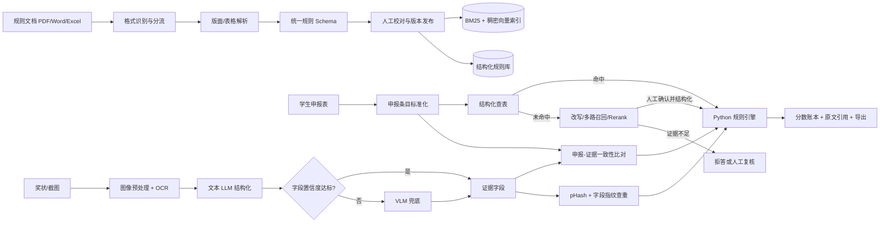

# 综测加分智能核算系统完整项目计划书

> 项目代号：ScoreProof  
> 文档版本：V1.0  
> 编制日期：2026-09-11  
> 计划周期：12 周（建议 2026-09-14 至 2026-12-06，可按实际启动日顺延）  
> 项目性质：个人主导的真实业务工具 / AI 应用开发作品  
> 文档状态：执行基线稿

---

## 0. 文档说明

本计划书依据以下材料编制：

1. 《综测加分智能核算系统·项目总结与规划》；
2. 简历中的四组项目要点：离线索引优化、多模态材料审核、在线检索与确定性计算、测评与工程优化；
3. 当前 `scoreproof` 仓库的代码、README、依赖与测试现状。

### 0.1 事实、目标与占位符的区分

为保证项目和简历可核验，本文统一使用以下标记：

- **当前事实**：已通过代码、测试或现有材料确认；
- **目标值**：项目完成前必须按本文口径实测，未实测前不能作为既成成果表述；
- **待回填**：依赖真实运营数据，当前不得虚构。

截至 2026-09-11，当前仓库基线为：

| 项目 | 状态 | 说明 |
|---|---|---|
| P0 方案设计 | 已完成 | 已形成总体架构、核心数据模型与指标框架 |
| P1 工程骨架 | 已完成 | 已有 Excel/PDF/Word 接入、规则存储、计算、检索、评测、API/CLI 等模块 |
| 自动化测试 | 已验证 | 全量 185 项通过；计算引擎测试文件收集到 41 项用例 |
| 静态检查 | 已验证 | `ruff check src tests` 通过 |
| P2 多模态闭环 | 待完成 | OCR、VLM 兜底、查重、一致性审核与人工复核仍需工程化 |
| 稠密向量、Rerank 与增量索引 | 待完成 | 当前以结构化检索/BM25 骨架为主 |
| Web 前端与真实运营 | 待完成 | 后端已具备基础接口，前端及班级实际使用待完成 |
| 91%、96%、96.2%、18→2 分钟 | 验收目标 | 必须按第 13 节定义的评测集和统计口径复现后才能写入最终成果 |
| 累计服务人数 | 待回填 | 以去重后的真实使用人员为准，记为 `N`，不得写“XX”或估算值 |

旧总结中的“代码尚未开始”已被当前仓库事实取代；本文以当前仓库为实施起点，但保留从零到结项的完整建设路线，便于复盘、答辩和后续重建。

---

## 1. 项目概述

### 1.1 项目背景

高校综合测评加分核算通常同时依赖学校细则、学院补充通知、认可赛事目录、学生申报 Excel、奖状照片与公示截图。现有人工流程存在四类核心问题：

1. 规则分散且格式复杂，跨页表格、多栏 PDF、Word 表格和 Excel 合并单元格容易造成漏读或错读；
2. 同一奖项存在别名、缩写和口径差异，人工匹配规则耗时且结果不稳定；
3. 证书内容、申报描述和适用规则需要反复核对，还需识别重复申报；
4. 大模型可以辅助理解文本，但直接让模型计算分数会引入不可复现、不可测试和无法审计的问题。

### 1.2 一句话定义

ScoreProof 是面向高校综测场景的异构文档智能核算系统：将 PDF、Word、Excel 与图片中的规则和材料结构化，采用“结构化查表优先 + 混合检索兜底 + 未命中拒答”定位规则，再由纯 Python 规则引擎完成确定性算分，并让每项结果可追溯至文档、页码、表格或条款。

### 1.3 核心原则

- 大模型只参与抽取、归一化建议、查询理解和条款定位；
- 所有分值、封顶、互斥、去重、折算、有效期判断均由代码执行；
- 结构化规则是唯一可自动计分的数据来源，检索兜底结果不得直接入分；
- 低置信结果进入人工复核，而不是以“全自动”为目标；
- 原始个人材料默认本地保存、最小化采集、脱敏使用、禁止进入公开仓库；
- 所有简历数字均由固定评测集或运营日志产生，可复跑、可解释。

---

## 2. 项目目标与边界

### 2.1 建设目标

1. 建立统一规则库，覆盖 PDF、Word、Excel 规则文档，并保留学年、学院、版本和原文定位；
2. 建立基于文档 Hash 的增量索引，使新增、修改、删除细则可快速同步；
3. 建立 OCR + 文本大模型结构化 + 低置信 VLM 兜底的证书理解链路；
4. 建立 pHash 与字段指纹联合查重，并自动核对申报描述和证书内容；
5. 建立结构化检索、BM25、稠密向量和 Rerank 组成的双通道检索链路；
6. 建立确定性规则引擎，完整覆盖同类取最高、封顶、团队折算、互斥和学年过滤；
7. 建立 RAGAS、MRR、Hit@K、字段 F1、查重召回和真实历史数据回测体系；
8. 建立面向学生自助申报与班委批量复核的 Web 服务和审计链路。

### 2.2 量化成功标准

| 维度 | 指标 | 结项目标 | 是否可直接写入简历 |
|---|---|---:|---|
| 规则抽取 | 规则字段完全正确率 | ≥ 96% | 通过冻结评测集后可以 |
| 图像抽取 | 奖状字段级 micro-F1 | ≥ 91% | 通过独立测试集后可以 |
| 查重 | 重复申报 Recall | ≥ 96% | 同时披露 Precision/F1 后可以 |
| 检索 | Hit@5 | 相对基线显著提升；目标 89% | 固定查询集复跑后可以 |
| 检索 | MRR@10 | ≥ 0.80，或较 BM25 基线提升 ≥ 10% | 复跑后可以 |
| 引用 | 引用定位正确率 | ≥ 95% | 复跑后可以 |
| 拒答 | 应拒答样本正确拒答率 | 100% 目标，最低验收 98% | 复跑后可以 |
| 计算 | 52 人往年数据逐项核算准确率 | ≥ 96.2% | 真实、脱敏数据回测后可以 |
| 效率 | 单人端到端核算时长 | 从约 18 分钟降至 ≤ 2 分钟 | 同口径计时后可以 |
| 质量 | 计算边界测试 | ≥ 40 项，且关键规则 100% 通过 | 当前已有 41 项，可表述 |
| 工程 | 全量测试、静态检查 | 主分支持续通过 | 当前 185 项与 Ruff 已通过 |
| 运营 | 累计服务人数 | `N` 名去重真实用户 | 仅上线后按日志回填 |

### 2.3 项目范围

范围内：

- 学校/学院综测加分规则的采集、解析、结构化、版本化和检索；
- 学生申报表解析、证书图片抽取、重复检测、一致性审核；
- 确定性核算、逐项解释、引用溯源、批量导入导出；
- 离线评测、历史回测、Web 服务、权限和审计；
- 单机或小规模服务器部署，适配班级/学院规模。

范围外：

- 自动替代辅导员或评审老师作出最终行政决定；
- 对细则未规定事项擅自推断分值；
- 对学生身份真实性、证书法律效力作司法级鉴定；
- 未经授权接入教务系统、公开真实学生数据或跨学院共享个人材料；
- 第一版即支持所有高校、所有表格模板和所有手写材料。

---

## 3. 角色与职责

| 角色 | 主要职责 | 关键产出 |
|---|---|---|
| 项目负责人/开发者 | 需求、架构、编码、评测、部署与文档 | 可运行系统、评测报告、演示材料 |
| 业务负责人（班委/辅导员） | 确认规则解释、优先级、异常处理口径 | 规则口径确认单、验收签字/记录 |
| 规则标注员 | 标注细则条款和规则字段 | 规则 Gold Set |
| 证书标注员 | 标注证书字段、重复对和一致性标签 | 多模态 Gold Set |
| 复核员 | 处理低置信、冲突和未命中条目 | 复核记录、修正数据 |
| 试用学生 | 验证上传、反馈和结果解释是否易用 | UAT 反馈、耗时数据 |

个人项目可一人兼任多个角色，但评测集至少应由另一名了解业务的人抽样复核，减少“开发者自己标、自己测”的偏差。

---

## 4. 总体业务流程

---

## 5. 功能需求

### 5.1 离线规则接入与统一结构化

#### PDF

- 判断文本型 PDF、扫描型 PDF 和混合型 PDF；
- 按页保留文字块坐标、页码、阅读顺序和表格区域；
- 针对多栏页面按版面坐标重排阅读顺序，避免跨栏串行；
- 针对跨页表格识别重复表头、续表标志和列结构，将连续页拼接为同一逻辑表；
- 同时保存原始文本、表格单元格、截图区域和解析器元数据；
- 低质量页触发 OCR 或人工复核，不静默丢失。

#### Word

- 保序解析段落、标题、编号列表和表格；
- 识别页眉页脚、批注/修订痕迹、合并单元格和嵌套表格；
- 保留章节、条款号、表格序号和文档名定位；
- 学院补充通知与校级规则发生冲突时，依据显式优先级规则处理。

#### Excel

- 识别标题行、空白分隔行、多工作表和隐藏列；
- 对合并单元格执行受控 fill-down，只填充合并区域或指定层级列，避免污染真实空值；
- 统一日期、百分比、数字、布尔值和中文等级格式；
- 对缺列、错列、重复表头和公式单元格输出校验报告；
- 学生申报数据只进入结构化存储，不进入向量索引。

#### 统一规则 Schema

每条规则至少包含：

| 字段组 | 字段 |
|---|---|
| 适用范围 | `academic_year`、`college`、`major`（可选）、`effective_from/to` |
| 规则主体 | `category`、`item_name`、`level`、`rank`、`score` |
| 约束 | `dedup_group`、`cap`、`team_factor`、`exclusive_group`、`require_catalog` |
| 归一化 | `synonyms`、规范化名称、枚举编码 |
| 来源 | `doc_id`、`doc_name`、`doc_hash`、`page`、`table`、`clause`、`bbox` |
| 版本 | `version`、`status`、`supersedes`、`created_at`、`reviewed_by` |
| 质量 | `parser`、`extract_confidence`、`manual_verified`、`validation_errors` |

### 5.2 基于文档 Hash 的增量索引

为避免细则每次修订都全量重建，建立“文档—逻辑块—索引条目”三级 Hash：

1. 对原始文件字节计算 `document_hash`，判断文件是否完全未变化；
2. 对规范化后的页/章节/表格计算 `chunk_hash`，忽略不影响语义的空白和页眉页脚变化；
3. 以 `doc_id + chunk_hash + embedding_model_version` 生成索引键；
4. 新增块执行插入，变更块执行替换，删除块写入 tombstone 并从在线索引移除；
5. 规则抽取结果、BM25 文档和向量记录在同一批次号下原子发布；
6. 发布失败时保留上一稳定版本，可一键回滚；
7. 记录新增、更新、删除、跳过数量以及耗时，形成同步报告。

增量同步验收：

- 相同文档重复导入不产生重复规则和重复向量；
- 修改单页时只重建受影响的逻辑块及其下游规则；
- 删除旧文档后线上不可再检索到旧条款；
- 新旧版本查询可按学年/学院隔离；
- 规则、BM25、向量索引之间不存在半发布状态。

### 5.3 多模态材料审核

处理链路：

1. 图像预处理：EXIF 旋转、清晰度评估、裁边、去噪、透视矫正、对比度增强；
2. OCR：输出文字、坐标、行块和字符/文本行置信度；
3. 文本大模型结构化：抽取姓名、赛事、级别、奖项/名次、日期、颁发单位、团队属性；
4. 字段级校验：日期范围、姓名匹配、词典映射、枚举合法性和字段间逻辑；
5. VLM 兜底：仅将低置信字段及必要图像区域发送给视觉模型；
6. 结果融合：规则校验优先，OCR 与 VLM 冲突时进入人工复核；
7. 人工校对：图片与字段并排展示，保留修改前后值和操作人；
8. 将人工修正回流为后续评测样本和词典候选，不自动污染生产规则。

字段置信度不能只采用模型自报分数，应组合：OCR 置信度、字段格式校验、词典匹配、OCR/VLM 一致性、历史纠错频率。阈值在验证集上选择，并固定到版本配置中。

### 5.4 重复申报检测

采用三层策略：

- 文件级：SHA-256 识别完全相同文件；
- 图像级：pHash/dHash 的汉明距离识别裁剪、压缩、亮度变化后的相似图片；
- 语义级：规范化后的“姓名 + 赛事 + 等级/名次 + 获奖时间”生成字段指纹。

输出分为“确定重复、疑似重复、非重复”，并展示触发原因。重复检测只拦截或送审，不自动删除材料。阈值必须同时评估 Recall、Precision 和误伤案例，避免为了 96% Recall 大量误报。

### 5.5 申报与证据一致性审核

至少比对：

- 申报人姓名与证书姓名；
- 赛事名称及规范化别名；
- 赛事级别、奖项等级或名次；
- 获奖日期是否落在申报学年；
- 个人/团队属性；
- 颁发单位与赛事目录要求；
- 申报类别与规则类别。

结果分为：一致、可归一化一致、不一致、信息不足。所有不一致项需给出字段级差异，不让 LLM 直接作最终通过/驳回决定。

### 5.6 在线检索

在线链路包括：

1. 查询清洗：去除无意义字符，提取学年、学院、赛事、奖项与意图；
2. 查询改写：生成规范化查询和有限数量同义表达，保留原查询；
3. 问题路由：区分确定性算分、规则解释、材料审核、系统帮助和无关请求；
4. 结构化通道：按学年、学院、类别、等级和目录约束精确查表；
5. 文本通道：BM25 与稠密向量并行召回原文块；
6. 融合：采用 RRF 或经验证的加权融合，不直接比较异构分数；
7. Rerank：对候选块精排，并保留模型版本与分数；
8. 引用核查：确认回答中的规则、数字和条件均能被引用片段支持；
9. 决策：结构化命中才可自动计分；仅文本命中时给出候选条款并要求确认；无充分证据时拒答。

### 5.7 确定性计算引擎

规则引擎采用纯函数和明确的数据输入输出，执行顺序固定为：

1. 学年、学院和规则版本过滤；
2. 申报与规则匹配；
3. 资格条件/认可目录验证；
4. 团队系数及其他折算；
5. 同类项目去重取最高；
6. 互斥组裁决；
7. 单项、单类与总分封顶；
8. 金额/分数精度与舍入；
9. 生成逐项账本、排除原因和原文引用。

任何计算都不得读取自然语言回答中的数字。输入必须是通过 Schema 校验且处于“已发布”状态的结构化规则。

### 5.8 服务端与前端

学生端：

- 上传申报表和证明材料；
- 查看自动抽取字段并确认/修改；
- 查看预计得分、未计分原因和规则引用；
- 对不确定项补充材料或发起复核。

审核端：

- 批量导入学生名单和申报；
- 查看低置信、疑似重复、不一致和未命中队列；
- 图片与抽取字段并排校对；
- 批量核算、锁定版本、导出结果；
- 查看规则版本、操作日志和回滚记录。

管理端：

- 上传和发布规则文档；
- 查看增量索引差异；
- 维护同义词、赛事目录和规则优先级；
- 查看评测报告、运行指标和审计日志。

---

## 6. 非功能需求

| 类别 | 要求 |
|---|---|
| 正确性 | 计算结果必须确定、可复跑；同输入、同规则版本得到同输出 |
| 可追溯 | 每个计分/不计分结论可定位到规则版本、文档、页码/条款及证据材料 |
| 性能 | 单条结构化查询 P95 < 300 ms；含 Rerank 的检索 P95 < 2 s（不含外部模型拥塞） |
| 批处理 | 52 人规模批量核算可在 5 分钟内完成，不含人工复核等待 |
| 可用性 | 生产演示期核心 API 可用性目标 ≥ 99%，失败任务可重试 |
| 可维护 | 解析器、模型、向量库和 LLM/VLM 通过接口解耦，可替换 |
| 安全 | 最小权限、密钥环境变量化、上传白名单、文件大小限制、审计日志 |
| 隐私 | 原图和身份数据不进入 Git；评测和演示使用脱敏或合成数据 |
| 成本 | OCR 优先本地执行；仅低置信样本调用 VLM；记录单文档/单图片调用成本 |
| 可观测 | 记录解析失败率、低置信率、召回结果、拒答率、耗时、模型版本和发布批次 |

---

## 7. 技术架构与选型

### 7.1 分层架构

| 层 | 主要组件 | 建议实现 |
|---|---|---|
| 接入层 | 文件类型检测、上传、任务队列 | FastAPI、MIME/魔数校验 |
| 解析层 | Excel/PDF/Word/Image 解析器 | pandas/openpyxl、PyMuPDF、pdfplumber、python-docx、OCR |
| 结构化层 | Schema、抽取、归一化、人工校对 | Pydantic、可配置 LLM/VLM、词典规则 |
| 存储层 | 规则、证据、申报、版本、审计 | SQLite（单机）或 PostgreSQL（多人） |
| 索引层 | BM25、向量、增量索引 | rank-bm25/FTS + Chroma/Qdrant/FAISS |
| 检索层 | 路由、召回、融合、Rerank、引用核查 | 独立 Python 服务模块 |
| 计算层 | 规则匹配、约束、账本 | 纯 Python 函数与不可变输入 |
| 服务层 | REST/SSE、批任务、导出 | FastAPI、Uvicorn |
| 表现层 | 学生端、审核端、管理端 | 轻量 Web 前端；优先完成审核工作台 |
| 评测层 | 数据集、离线实验、回归门禁 | pytest、自建评测脚本、RAGAS（生成类指标） |

### 7.2 存储建议

MVP 可使用 SQLite + 本地文件系统，结项演示或多人并发阶段再迁移 PostgreSQL + 对象存储。核心表建议包括：

- `documents`：文档身份、Hash、适用范围、版本、状态；
- `document_chunks`：逻辑块、定位、文本、chunk_hash；
- `rules`：结构化可执行规则；
- `rule_versions`：发布批次、差异、回滚信息；
- `claims`：学生申报条目；
- `evidence`：证据字段、OCR 文本、图片 Hash；
- `review_tasks`：低置信/冲突/未命中复核任务；
- `score_runs` 与 `score_items`：每次核算及逐项账本；
- `index_manifest`：索引键、模型版本、状态；
- `audit_logs`：关键操作、操作人、时间和前后值；
- `evaluation_runs`：数据集版本、配置、指标与产物地址。

### 7.3 关键设计决策

1. Excel 结构化数据不进入向量库；
2. 自动计分只接受已审核、已发布的结构化规则；
3. PDF 跨页表格先做逻辑拼接，再做规则抽取；
4. 文档版本优先级显式化：学院补充规则、校级通用规则、新旧版本不得靠检索分数隐式决定；
5. OCR/VLM 输出保留原值、置信度、定位和模型版本；
6. 人工校对是正式流程节点，修正必须审计；
7. 模型升级、提示词变化和索引参数变化都视为可追踪版本变更。

---

## 8. 数据准备与治理计划

### 8.1 数据清单

| 优先级 | 数据 | 最低数量/范围 | 用途 |
|---:|---|---|---|
| P0 | 当前学年校级与学院细则 | 全量 | 规则库主数据 |
| P0 | 加分矩阵、认可赛事目录 | 全量 | 精确匹配与资格校验 |
| P0 | 往年 52 人申报明细与最终结果 | 1 个完整学年 | 回测 ground truth |
| P1 | 真实规则问法 | 100～200 条 | Hit/MRR/拒答评测 |
| P1 | 真实奖状图片 | ≥ 100 张，覆盖常见噪声 | 字段 F1 评测 |
| P1 | 重复/近重复图片对 | ≥ 100 对，正负样本平衡 | 查重阈值评测 |
| P1 | 申报-证据一致性样本 | ≥ 100 条 | 一致性评测 |
| P2 | 扫描件、跨页表格、多栏 PDF | 每类 ≥ 10 份 | 复杂解析回归 |

### 8.2 数据划分

- 训练/开发集：用于词典、提示词和阈值调优；
- 验证集：用于选择 OCR/VLM 阈值、融合权重和 Rerank 参数；
- 测试集：冻结后只用于阶段验收，不针对测试错误反复调参；
- 历史回测集：52 人数据按真实业务口径逐人逐项对账；
- 负例集：专门覆盖规则不存在、学年不符、学院不符、材料缺失和对抗性问法。

同一证书的原图、裁剪图、压缩图必须进入同一数据划分，避免数据泄漏导致查重指标虚高。

### 8.3 标注规范

- 规则标注采用双人抽样复核，争议条目记录业务裁决；
- 奖状字段明确“原文值”和“规范值”，不把归一化正确当作 OCR 正确；
- 查重以“是否代表同一获奖事实”为标签，不只看图片是否相同；
- 回测按“学生—申报项”记录预期得分、实际得分和误差原因；
- 数据集、标注规范和规则版本一并编号，保证指标可复现。

### 8.4 隐私与留存

- 采集真实材料前取得授权，明确用途、保存期限和可撤回方式；
- 学号、姓名等标识字段以不可逆或受控映射脱敏；
- 原图与脱敏评测数据分目录保存，最小权限访问；
- 日志不记录证书全文、API 密钥和不必要的个人信息；
- 项目结束后按授权约定删除或归档真实材料，并保留删除记录。

---

## 9. 从零到结项的实施路线

### 阶段 0：立项与需求冻结（W1）

任务：

- 访谈班委/辅导员，梳理当前人工流程、输入输出和异常口径；
- 收集规则文档、申报模板、往年结果和典型证书；
- 明确学年、学院、规则优先级、计算顺序和人工裁决边界；
- 输出产品需求文档、数据字典、风险清单和验收标准；
- 建立代码规范、分支策略、Issue 模板和隐私红线。

交付物：需求基线、样本清单、规则口径确认单、项目排期。  
退出条件：所有必须字段、计算规则、评测口径均有负责人确认。

### 阶段 1：工程底座与统一 Schema（W1～W2）

任务：

- 初始化 Python 项目、配置、CLI/API、日志、异常和测试框架；
- 建立 Rule、Claim、Evidence、ScoreBreakdown、Document、Chunk 模型；
- 建立 SQLite 数据库、迁移策略和演示数据生成器；
- 完成隐私目录隔离、`.gitignore`、环境变量模板；
- 建立 CI：单测、静态检查、敏感信息扫描。

交付物：可安装工程、Schema、数据库、开发说明、CI。  
退出条件：示例数据可完整写入/读出，测试和静态检查通过。

### 阶段 2：异构文档解析与规则库（W2～W4）

任务：

- Excel：多表、表头识别、合并单元格 fill-down、类型规范化；
- PDF：文本块、多栏阅读顺序、表格抽取、跨页表格拼接、扫描页检测；
- Word：正文与表格保序、标题/条款定位；
- 建立规则抽取、同义词归一化、字段校验与人工确认清单；
- 建立文档/页码/表格/条款/bbox 多级溯源；
- 建立规则冲突检测和发布前校验。

交付物：统一规则库、解析报告、规则 Gold Set、复杂版面回归样本。  
退出条件：目标文档全部可导入；错误不会静默；规则抽取完全正确率达到阶段门槛。

### 阶段 3：增量索引与混合检索（W4～W6）

任务：

- 实现文档 Hash、逻辑块 Hash、索引 manifest 和差异计算；
- 建立 BM25 与稠密向量索引；
- 实现查询改写、意图/问题路由、结构化过滤；
- 实现 BM25/向量多路召回、RRF 融合和 Rerank；
- 实现引用核查、拒答阈值、索引原子发布与回滚；
- 用固定查询集比较切分策略、Top-K、融合权重和 Rerank 模型。

交付物：增量索引命令、同步报告、检索 API、离线实验表。  
退出条件：同文档幂等、变更局部更新、删除生效；Hit/MRR 达到验收目标且拒答无严重越界。

### 阶段 4：确定性计算与历史回测（W5～W7）

任务：

- 实现学年/学院过滤、目录资格、团队折算、同类取最高、互斥、封顶和舍入；
- 输出逐项账本、排除原因和引用；
- 补齐 40+ 边界用例及属性/组合测试；
- 对 52 人历史数据逐人逐项回测，形成误差分类；
- 修正规则抽取或业务口径问题，不使用 LLM 修改最终分数；
- 建立回归基线，规则或代码修改后自动复跑。

交付物：规则引擎、测试报告、52 人回测报告、误差清单。  
退出条件：计算准确率达到 ≥ 96.2%，剩余差异均能解释并有人工处理路径。

### 阶段 5：多模态证据链路（W6～W8）

任务：

- 建立清晰度检测、旋转/透视矫正、OCR 与坐标保留；
- 建立文本 LLM 结构化 Schema 和字段校验器；
- 设计字段级置信度与 VLM 触发阈值；
- 实现 VLM 区域兜底、结果融合和人工校对队列；
- 实现文件 Hash、pHash/dHash、字段指纹联合查重；
- 实现申报—证据字段差异展示；
- 在冻结测试集上测字段 F1、查重 Recall/Precision 和一致性准确率。

交付物：多模态流水线、复核队列、评测报告、失败案例集。  
退出条件：字段 F1 ≥ 91%，查重 Recall ≥ 96%，且误报率在业务可接受范围。

### 阶段 6：Web 产品化与批量工作流（W8～W10）

任务：

- 完成学生上传/确认、审核队列、规则管理和结果解释页面；
- 完成批量导入、任务状态、失败重试、SSE/轮询进度和导出；
- 增加角色权限、审计日志、文件校验和限流；
- 优化图片/字段并排校对与键盘操作；
- 建立本地/服务器部署脚本、备份恢复和运行手册。

交付物：可演示 Web 系统、部署包、用户手册、管理员手册。  
退出条件：核心流程可在无开发者介入的情况下由试用用户完成。

### 阶段 7：联合评测、UAT 与性能优化（W10～W11）

任务：

- 冻结候选版本和所有评测配置；
- 运行规则抽取、图像字段、查重、检索、引用、拒答和计算全量评测；
- 用 RAGAS 评估回答忠实性/上下文相关性，用 MRR/Hit 衡量排序与召回；
- 进行 52 人批量回测和端到端计时；
- 邀请小范围真实用户执行 UAT，记录操作错误和人工复核时间；
- 进行性能剖析、缓存、批量 embedding、数据库索引和 VLM 调用比例优化。

交付物：V1.0 评测报告、UAT 报告、性能报告、问题关闭清单。  
退出条件：所有 P0/P1 缺陷关闭，关键指标达到结项门槛。

### 阶段 8：上线、试运行与结项（W12）

任务：

- 备份数据，执行生产部署和烟雾测试；
- 导入已确认规则版本并锁定索引批次；
- 开展灰度试用，保留人工复核和回滚方案；
- 统计去重用户数、申报数、自动通过率、复核率和耗时；
- 完成项目总结、架构图、演示视频、答辩材料和简历表述；
- 整理已知限制、后续路线和运维交接。

交付物：V1.0 发布包、上线记录、运营数据、结项报告、演示材料。  
退出条件：验收清单签署、数据备份可恢复、文档齐全、指标可复跑。

---

## 10. 12 周进度表

| 周次 | 日期 | 主任务 | 里程碑/输出 |
|---:|---|---|---|
| W1 | 09-14～09-20 | 需求冻结、数据清单、Schema/工程基线 | M0 立项通过 |
| W2 | 09-21～09-27 | Excel/Word 解析、规则存储 | 基础规则可导入 |
| W3 | 09-28～10-04 | PDF 多栏、表格、跨页拼接 | 复杂 PDF 解析报告 |
| W4 | 10-05～10-11 | 规则抽取、校对、Hash/manifest | M1 统一规则库 |
| W5 | 10-12～10-18 | BM25/向量召回、查询路由 | 检索基线 |
| W6 | 10-19～10-25 | 融合、Rerank、引用核查、增量发布 | M2 混合检索 |
| W7 | 10-26～11-01 | 计算引擎补齐、52 人回测 | M3 确定性核算 |
| W8 | 11-02～11-08 | OCR、结构化、VLM 兜底 | 图像字段链路 |
| W9 | 11-09～11-15 | pHash/字段指纹、证据一致性、校对页 | M4 多模态审核 |
| W10 | 11-16～11-22 | Web 批量流程、权限、审计、导出 | M5 可用产品 |
| W11 | 11-23～11-29 | 联合评测、UAT、性能与成本优化 | RC 候选版本 |
| W12 | 11-30～12-06 | 灰度上线、验收、运营统计、结项 | V1.0 发布 |

关键依赖关系：规则口径冻结 → 规则库 → 结构化检索/计算；Gold Set → 阈值调优 → 冻结测试；多模态抽取 → 查重/一致性；稳定 API → 前端和 UAT。

---

## 11. 工作分解结构（WBS）

| 编号 | 工作包 | 主要产出 | 预计人日 |
|---|---|---|---:|
| 1.1 | 需求访谈与流程建模 | PRD、流程图、异常清单 | 2 |
| 1.2 | 数据收集与授权 | 数据台账、授权记录 | 2 |
| 2.1 | Schema/数据库/配置 | 模型、表结构、迁移 | 3 |
| 2.2 | 工程质量基线 | CI、日志、测试、规范 | 2 |
| 3.1 | Excel/Word 解析 | loader、回归样本 | 3 |
| 3.2 | PDF 版面与表格解析 | 多栏/跨页解析器 | 5 |
| 3.3 | 规则抽取与校对 | 规则库、校验报告 | 4 |
| 4.1 | Hash 增量管线 | manifest、diff、回滚 | 4 |
| 4.2 | BM25/向量/Rerank | 混合检索服务 | 5 |
| 4.3 | 路由/拒答/引用核查 | 在线链路 | 3 |
| 5.1 | 确定性计算引擎 | 规则函数、账本 | 4 |
| 5.2 | 回测与误差修复 | 52 人报告 | 3 |
| 6.1 | 图像预处理与 OCR | OCR 管线 | 3 |
| 6.2 | LLM/VLM 抽取与融合 | 字段抽取服务 | 5 |
| 6.3 | 查重与一致性 | 风险标签、差异报告 | 4 |
| 7.1 | Web 审核工作台 | 学生端/审核端 | 6 |
| 7.2 | 权限、审计、导出 | 管理功能 | 3 |
| 8.1 | 数据标注与评测 | Gold Set、评测报告 | 6 |
| 8.2 | UAT/部署/结项 | V1.0、手册、总结 | 5 |
|  | **合计** | 单人全职约 64 人日 | **64** |

若为课余兼职，应按每周 20～25 小时将周期扩展至约 16～20 周；不能在不减少范围的情况下简单压缩工期。

---

## 12. 测试计划

### 12.1 测试分层

| 层级 | 覆盖内容 | 示例 |
|---|---|---|
| 单元测试 | 归一化、Hash、计算函数、阈值判断 | 同类取最高、团队折算后封顶 |
| 解析回归 | 各格式与复杂版面固定样本 | 合并单元格、多栏、跨页表格 |
| 集成测试 | 导入→规则库→索引→检索→计算 | 修改细则后增量同步 |
| API 测试 | 鉴权、上传、错误码、幂等、SSE | 重复请求不重复入库 |
| 模型评测 | OCR/LLM/VLM 字段、引用、拒答 | 印章遮挡、模糊、别名 |
| 端到端测试 | 学生上传到结果导出 | 典型用户旅程 |
| 安全测试 | 文件类型、路径、敏感日志、越权 | 伪装扩展名、超大文件 |
| UAT | 真实用户任务完成度与耗时 | 班委批量复核 52 人 |

### 12.2 计算引擎必测边界

- 同类多个奖项只取最高；
- 不同类别可累加；
- 团队折算发生在封顶前；
- 单项封顶、单类封顶、总分封顶；
- 恰好等于上限、超过上限、小数舍入；
- 学年开始/结束边界、跨年日期；
- 学院规则覆盖校级规则；
- 新旧版本生效日切换；
- 互斥组内单条与组合的最优选择；
- 缺失目录资格、缺失证据、低置信证据；
- 同一证书多次申报；
- 未命中不得计分；
- 空输入、重复输入、非法分值和未知枚举；
- 输出顺序、账本总分与逐项求和一致。

当前 `tests/test_calc.py` 已收集 41 项用例，后续新增逻辑必须保持或提高覆盖，不能以总测试数量替代关键业务分支覆盖。

### 12.3 发布门禁

- 全量单测和静态检查通过；
- 关键计算分支测试 100% 通过；
- 数据迁移和索引回滚演练通过；
- 冻结评测集指标不得低于上一稳定版本设定的容差；
- P0/P1 缺陷为 0；
- 无高危隐私泄漏、越权和任意文件访问问题；
- 可从备份恢复规则库、索引 manifest 和核算账本。

---

## 13. 评测方案与指标口径

### 13.1 规则抽取

- 样本：人工标注 50～120 条规则，覆盖正文、矩阵表、跨页表和补充通知；
- 严格正确：适用范围、类别、等级、分值、约束和来源定位全部正确才计 1；
- 同时报告字段级 Precision/Recall/F1 与规则完全匹配率；
- 目标：规则完全正确率 ≥ 96%。

### 13.2 奖状字段抽取

- 字段：姓名、赛事、级别、奖项/名次、时间、颁发单位、团队属性；
- 主指标：字段级 micro-F1；辅指标：各字段 F1、整张证书完全正确率、VLM 触发率；
- 原文值和规范值分别评测；
- 目标：字段级 micro-F1 ≥ 91%；不得只挑容易字段报告。

### 13.3 重复申报

- 正样本包括完全重复、压缩、旋转、裁剪、截图和同一获奖事实的不同图片；
- 负样本包括同赛事不同人、同人不同届、同等级不同赛事等高难负例；
- 报告 Recall、Precision、F1、阈值和混淆矩阵；
- 目标：Recall ≥ 96%，同时确保 Precision 达到业务可接受阈值（建议 ≥ 95%）。

### 13.4 检索与生成

- Hit@K：前 K 个候选是否包含正确条款；
- MRR@10：正确条款首次出现位置的倒数均值；
- nDCG@10：存在多个相关条款时衡量整体排序；
- 引用正确率：回答所引用的页码/条款是否真正支撑结论；
- 拒答率：无答案问题是否拒答；有答案问题是否误拒答；
- RAGAS：用于上下文相关性、答案相关性、忠实性等生成质量，不替代确定性检索指标。

实验必须固定：数据集版本、切分策略、Embedding 版本、Top-K、融合方式、Reranker、提示词与随机参数。每次只改变一个主要变量，并保存实验表。

### 13.5 52 人真实数据回测

建议同时报告两个准确率：

1. **逐项准确率** = 得分完全一致的申报项 / 全部可判定申报项；
2. **逐人总分准确率** = 总分完全一致的学生数 / 52。

另报告平均绝对误差、最大误差、错误来源分布。不能只用“50/52 人一致”推导逐项准确率，也不能把人工原结果未经复核就视为绝对真值。争议规则应由业务负责人裁决后冻结 ground truth。

### 13.6 效率测量

人工与系统必须使用同一批材料、同一输出要求和同等复核标准。计时从材料齐备开始，到可提交的核算结果和引用完成为止：

- 人工组：查细则、核材料、计算、复核、汇总；
- 系统组：上传、自动处理、人工复核异常、导出；
- 报告中位数、P90 和样本量，目标为单人约 18 分钟降至 ≤ 2 分钟。

### 13.7 累计服务人数

定义：至少完成一次有效核算并生成结果的去重学生数。测试账号、重复提交和仅访问页面者不计入。最终简历将 `XX` 替换为系统日志统计的 `N`；在没有真实运营记录前删除该句，而不是保留占位符。

---

## 14. 风险与应对

| 风险 | 概率/影响 | 预警信号 | 应对措施 |
|---|---|---|---|
| 细则口径存在歧义 | 高/高 | 同一条款多人解释不同 | 建立业务裁决表；争议项不自动计分 |
| PDF 跨页表格解析错误 | 高/高 | 行列数突变、表头重复 | 结构校验、页面截图复核、失败转人工 |
| Excel fill-down 污染空值 | 中/高 | 非合并区域出现异常继承 | 仅在合并范围/层级列受控填充 |
| 规则版本冲突 | 中/高 | 同条件出现多个分值 | 显式优先级、生效日期、发布前冲突门禁 |
| OCR 对印章/反光不稳 | 高/中 | 低置信率升高 | 预处理、局部 VLM、重拍提示、人工校对 |
| VLM/LLM 幻觉 | 中/高 | 生成原文不存在字段 | Schema+原文证据校验；无法支持则置空 |
| 查重误伤 | 中/高 | 同赛事不同人被判重复 | 字段联合验证；疑似项只送审不自动拒绝 |
| 向量检索混淆数字等级 | 高/高 | 二等奖/三等奖互召回 | 结构化查表为主，数字条件过滤，文本结果不自动计分 |
| 测试集泄漏 | 中/中 | 指标高但真实样本下降 | 按证书族分组切分，冻结测试集 |
| 指标无法复现 | 中/高 | 配置/模型版本缺失 | 记录数据、代码、模型、提示词和索引版本 |
| 隐私泄漏 | 低/极高 | Git/日志出现姓名证书 | 本地隔离、脱敏、权限、扫描和删除机制 |
| 外部模型不可用/费用上涨 | 中/中 | 超时、配额不足 | 提供商适配层、重试/降级、VLM 只兜底、预算告警 |
| 单人开发延期 | 高/中 | 连续两周未达里程碑 | 先保核心审核闭环，延后美化和非核心格式 |

---

## 15. 安全、合规与审计

1. 上传文件按魔数和 MIME 双重检查，限制后缀、大小、页数和像素；
2. 文件名改为服务端生成 ID，禁止用户路径参与磁盘拼接；
3. 原始文件、数据库、导出文件和备份分权保存；
4. API 密钥仅从环境变量或秘密管理服务读取；
5. 关键操作记录用户、时间、对象、前后值和原因；
6. 核算批次锁定规则版本与索引版本，防止复核期间规则漂移；
7. 导出数据默认最小字段集，对公开演示数据做彻底脱敏；
8. 为数据访问、更正、撤回和删除建立流程；
9. 外部 LLM/VLM 调用前评估数据传输范围，优先发送裁剪后的必要区域和脱敏文本；
10. 真实上线前由业务负责人确认校内制度与个人信息处理要求。

---

## 16. 部署、运维与可观测性

### 16.1 环境

- 开发环境：本地 SQLite、本地文件、合成数据；
- 测试环境：脱敏数据、独立数据库和索引；
- 生产/演示环境：固定版本容器、持久卷、访问控制和定期备份；
- 模型与索引版本不得跨环境隐式共享。

### 16.2 监控指标

- 文档解析成功率、扫描页比例、结构校验失败率；
- 增量索引新增/更新/删除/跳过数及耗时；
- 结构化命中率、BM25/向量召回率、Rerank 延迟、拒答率；
- OCR 平均置信度、VLM 触发率、人工修正率；
- 重复/不一致告警率及人工确认率；
- 计算任务成功率、单人处理时长、批任务耗时；
- 外部模型调用量、失败率、重试次数和估算成本；
- 活跃用户、去重服务人数、申报数和复核积压量。

### 16.3 备份与恢复

- 每次规则发布前备份数据库和索引 manifest；
- 每日备份生产数据库，按授权期限保留；
- 原始文件备份加密并限制访问；
- 每个候选版本至少演练一次从备份恢复；
- 设定 RPO ≤ 24 小时、RTO ≤ 4 小时（班级规模目标）。

---

## 17. 成本与资源估算

成本分为：开发时间、存储、服务器、Embedding/Rerank、文本 LLM、VLM 和人工标注/复核。项目不预设未经询价的金额，执行时用下表记录：

| 成本项 | 计量单位 | 预算方法 | 优化手段 |
|---|---|---|---|
| OCR | 图片数 | 本地推理机器时间 | 批处理、分辨率上限 |
| 文本 LLM | 输入/输出 Token | 抽取样本数 × 单价 | Schema 压缩、缓存、只处理新增块 |
| VLM | 图片/Token | 低置信比例 × 单价 | 局部裁剪、阈值调优、人工优先级 |
| Embedding | 文本块数 | 新增/变更块 × 单价 | Hash 增量、批量请求、缓存 |
| Rerank | 候选对数 | 查询量 × 候选数 | 先过滤再精排、动态 Top-K |
| 存储 | GB/月 | 原图+索引+备份 | 生命周期管理、去重 |
| 人工复核 | 分钟/条 | 低置信与冲突数量 | 优化阈值、键盘工作流、批量确认 |

结项报告应给出“每 100 份材料的平均模型成本”和“每人平均人工复核时长”，比单纯报总费用更可比较。

---

## 18. 验收与完成定义（Definition of Done）

项目同时满足以下条件才视为 V1.0 完成：

- 目标 PDF/Word/Excel 规则文档可稳定导入，复杂版面失败可见且可复核；
- 规则库具备学年、学院、版本和文档/页码/条款定位；
- 文档 Hash 增量同步、删除和回滚测试通过；
- BM25 + 稠密向量 + Rerank 可运行，结构化通道优先，未命中能拒答；
- OCR + LLM + 低置信 VLM 兜底闭环可运行；
- pHash + 字段指纹查重和申报一致性审核可解释；
- 规则引擎不依赖模型计算，41 项及后续关键计算测试全部通过；
- 52 人回测、字段 F1、查重、检索、引用和效率报告可复跑；
- Web 核心流程通过 UAT，权限、审计、备份和恢复可用；
- P0/P1 缺陷关闭，已知限制写入发布说明；
- 真实数据不在公开仓库，简历指标与运营人数有证据来源；
- README、部署手册、用户手册、评测报告、演示视频和结项总结齐全。

---

## 19. 当前仓库承接计划

当前代码不需要从头重写，应在已有模块上迭代：

| 现有模块 | 当前作用 | 下一阶段重点 |
|---|---|---|
| `ingest/excel_loader.py` | Excel 导入与 fill-down 基础 | 加强真实模板、异常报告、回归样本 |
| `ingest/pdf_loader.py` | PDF 文本/表格解析基础 | 多栏阅读顺序、跨页表格、bbox 与扫描页 OCR |
| `ingest/docx_loader.py` | Word 正文/表格解析基础 | 保序、条款定位、修订/复杂表格 |
| `ingest/image_loader.py` | 多模态接口预留 | 图像预处理、OCR、字段置信度和 VLM 兜底 |
| `rules/extractor.py` | 规则抽取基础 | LLM Schema、批量校对、冲突检测 |
| `rules/store.py` | SQLite 规则存储 | 文档/规则版本、事务发布、回滚、审计 |
| `retrieval/router.py` | 结构化/BM25 路由基础 | 稠密向量、RRF、Rerank、引用核查、拒答评测 |
| `calc/engine.py` | 确定性计算核心 | 对齐真实细则、属性测试、回测误差修复 |
| `eval/backtest.py` | 回测骨架 | 逐项指标、误差分类、实验追踪 |
| `api/app.py` | FastAPI 接口基础 | 鉴权、任务队列、SSE、批量流程、审计 |
| `web/` | 前端占位 | 审核工作台优先，其次学生自助端 |

近期三个迭代建议：

1. **迭代 A（两周）**：真实规则样本 + PDF/Word/Excel 复杂解析 + 规则版本/Hash；
2. **迭代 B（两周）**：稠密检索/Rerank/引用核查 + 检索评测；
3. **迭代 C（两周）**：OCR/VLM/查重/一致性 + 校对工作台。

每个迭代都应产出可运行功能、固定测试和指标对比，不把评测集中拖到最后。

---

## 20. 最终交付物清单

### 代码与部署

- 完整源代码、锁定依赖、配置模板；
- 数据库 Schema 和迁移脚本；
- 本地/服务器部署说明；
- 示例数据和一键演示脚本；
- CI 配置、测试报告和发布包。

### 数据与评测

- 脱敏规则 Gold Set；
- 奖状字段、查重和一致性评测集；
- 检索查询集、负例集和相关性标注；
- 52 人脱敏回测集（不进入公开仓库）；
- 规则抽取、多模态、检索、计算和效率评测报告。

### 产品与文档

- 学生端、审核端和规则管理端；
- 用户手册、管理员手册、复核操作手册；
- 架构图、数据字典、API 文档、故障处理手册；
- 隐私说明、数据授权/删除记录模板；
- 演示视频、项目总结和答辩 PPT 素材。

---

## 21. 简历指标回填与最终表述模板

### 21.1 回填表

| 简历字段 | 数据来源 | 当前处理 |
|---|---|---|
| 字段级 F1 91% | 固定奖状测试集评测报告 | 达标后填写实测值 |
| 查重召回 96% | 重复对测试集与混淆矩阵 | 同时报 Precision/F1 |
| 计算准确率 96.2% | 52 人逐项/逐人回测报告 | 明确是哪一种准确率 |
| 18 分钟→2 分钟 | 同批材料对照计时 | 报样本量和中位数 |
| Hit@5 提升 | 固定检索集实验表 | 写基线、最终值和配置 |
| 40+ 边界用例 | 自动化测试收集结果 | 当前计算测试 41 项 |
| 累计服务 N 名 | 生产日志去重统计 | 上线后回填，不估算 |

### 21.2 达标后的简历版本

> 独立设计并实现高校综测加分智能核算系统：按格式分流解析复杂 PDF、Word 与 Excel 综测表，将规则统一抽取为带学年、学院、版本及文档/页码/条款定位的可执行规则库；基于文档与逻辑块 Hash 实现增量索引，支持细则修订的局部同步与回滚。
>
> 构建 OCR + 文本大模型结构化 + 低置信 VLM 兜底的证书审核链路，字段级 F1 达到 `[实测值]`；结合感知哈希与“赛事+等级+时间+姓名”字段指纹检测重复申报，Recall/Precision 分别达到 `[实测值]` / `[实测值]`，并自动标记申报描述与证书字段差异。
>
> 设计“结构化查表优先 + BM25/稠密向量混合召回兜底 + 未命中拒答”的在线链路，覆盖查询改写、问题路由、RRF 融合、Rerank 与引用核查；所有分值由纯 Python 规则引擎计算，覆盖同类取最高、封顶、团队折算、互斥和学年过滤，计算核心具备 40+ 边界测试。
>
> 基于 `[查询数]` 条检索集与 52 人往年真实数据完成联合回测，Hit@5/MRR@10 达到 `[实测值]` / `[实测值]`，逐项核算准确率 `[实测值]`，单人核算中位时长由 `[人工值]` 分钟降至 `[系统值]` 分钟；上线后累计服务 `[N]` 名同学。

若某项未完成或未复现，直接删除对应数字和成果句，不使用“目标值”冒充结果。

---

## 22. 项目结束后的复盘框架

结项后一周内完成复盘，回答：

1. 哪些错误来自解析、规则抽取、检索、证据识别、规则计算或业务口径？
2. 结构化通道覆盖了多少请求，多少请求需要向量兜底或人工复核？
3. VLM 实际触发比例、单位成本和带来的 F1 增益是多少？
4. 增量索引相较全量重建节省了多少时间和模型调用？
5. 52 人回测中剩余误差是否都可解释，人工原始结果是否也存在错误？
6. 查重 96% Recall 对应的 Precision 和复核负担是否可接受？
7. 用户最常卡在哪一步，2 分钟目标是否包含全部必要复核？
8. 哪些模块应保留自研，哪些可替换为成熟组件？
9. 真实服务人数、活跃率和复用率是否支持继续投入？
10. 下一版本应优先扩展学院规模、更多材料类型，还是提升规则运营效率？

复盘产出进入 V1.1 路线，而 V1.0 保持可重复部署、可复跑评测和可审计，不因继续开发而丢失稳定基线。

